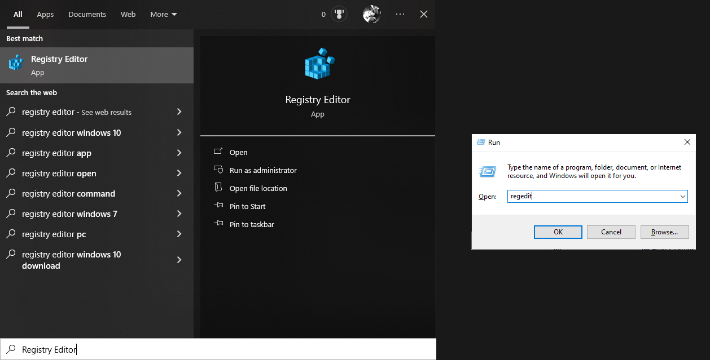
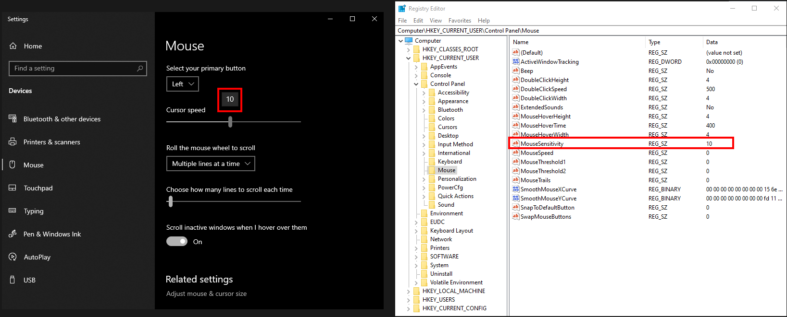
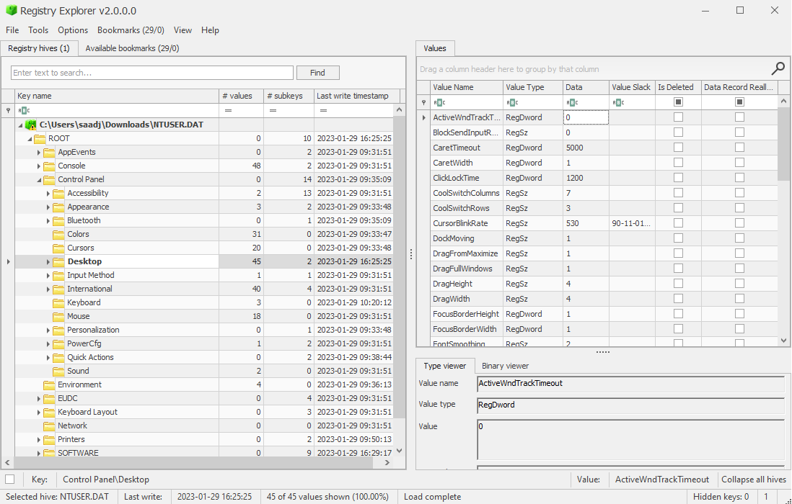
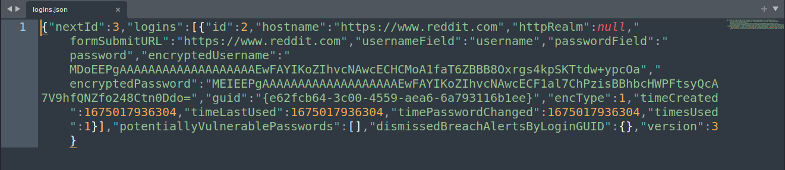
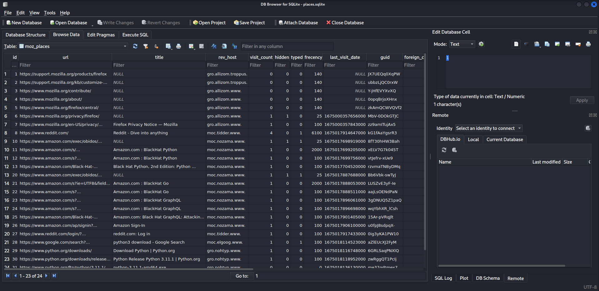
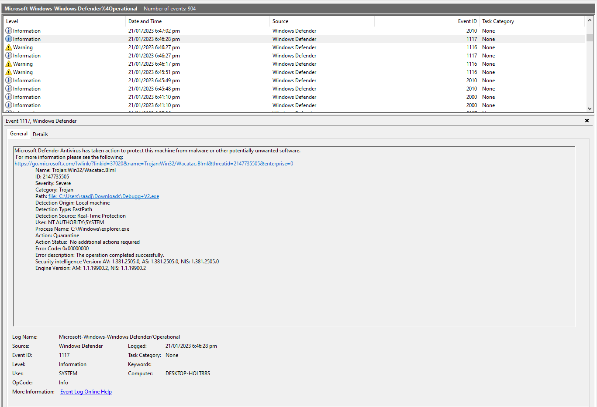

# Συνήθεις Τεκμήρια (Artifacts) στα Windows

> 🇬🇷 Ελληνική έκδοση του [Lab 02 — Common Windows Artifacts](../../Lab%2002/README.md)

Το λειτουργικό σύστημα Windows αποτελείται από έναν μεγάλο αριθμό τεκμηρίων (artifacts), συμπεριλαμβανομένων αρχείων, καταλόγων, αρχείων καταγραφής (logs), registry (μητρώο ρυθμίσεων), ιστορικού περιήγησης στον browser, λογαριασμών χρηστών και άλλων σημαντικών δεδομένων τα οποία είναι απαραίτητα για την σωστή λειτουργία του.

> **Τι είναι «artifacts»;** Τα τεκμήρια είναι δεδομένα που παράγονται **αυτόματα** από το σύστημα ή από τις εφαρμογές καθώς λειτουργούν. Κανένα από αυτά δεν δημιουργείται «για τον ερευνητή» — απλώς χρειάζονται στο Windows ή στις εφαρμογές για να δουλεύουν σωστά. Γι' αυτό και υπάρχουν: δεν μπορούν να μην υπάρχουν. Ο ερευνητής κάνει ακριβώς το αντίθετο από αυτό που έκανε ο δράστης — αντί να σβήσει ίχνη, τα ψάχνει και τα ερμηνεύει.

Σε αυτό το εργαστήριο, θα εξερευνήσουμε ορισμένα τέτοια τεκμήρια τα οποία είναι χρήσιμα κατά τη διεξαγωγή μιας ερευνητικής έρευνας (forensics investigation), θα μάθουμε πού τέτοια τεκμήρια τοποθετούνται, και πώς μπορούμε να εξαγάγουμε πολύτιμες πληροφορίες από αυτά.

> **Συμβουλή:** Όλες οι διαδρομές που αναφέρονται σε αυτό το εργαστήριο υποθέτουν ότι δουλεύετε σε ένα Windows σύστημα (ή αναλύετε ένα εικονικό μέσο από ένα Linux, π.χ. Kali). Οι διαδρομές με `%USERNAME%` πρέπει να αντικατασταθούν με το πραγματικό όνομα χρήστη του συστήματος που εξετάζετε.

# Windows Registry

Το Windows Registry είναι μια ιεραρχική βάση δεδομένων (hierarchical database) που αποθηκεύει ρυθμίσεις για χρήστες, εφαρμογές και συσκευές υλικού. Ακολουθεί πώς η Microsoft το περιγράφει:

> The Registry contains information that Windows continually references during operation, such as profiles for each user, the applications installed on the computer and the types of documents that each can create, property sheet settings for folders and application icons, what hardware exists on the system, and the ports that are being used.
> 

> **Γιατί μετράει στην πράξη:** Το Registry είναι ίσως το πιο πλούσιο μονοκόμματο αρχείο artifacts στα Windows. Επειδή σχεδόν κάθε ρύθμιση του συστήματος αποθηκεύεται εκεί, μπορεί να αποκαλύψει ποιες εφαρμογές εγκαταστάθηκαν, ποιος χρήστης συνδέθηκε, ακόμη και αν μια κακόβουλη εφαρμογή προσπάθησε να επιβάλλει την παρουσία της στο σύστημα. Οι δράστες συχνά τροποποιούν το registry για να «αντέξουν» μετά από επανεκκίνηση — αυτή η τροποποίηση είναι ένα artifact που μπορεί να τους εντοπίσει.

Το Windows Registry αποτελείται από πέντε κύριες ριζικές κλειδιά (root keys), γνωστά και ως hives («κυψέλες»), κάτω από το ριζικό κλειδί `Computer`, τα οποία είναι:

- `HKEY_CURRENT_USER (HKCU)` — περιέχει πληροφορίες σχετικά με τον συνδεδεμένο χρήστη, συμπεριλαμβανομένων των χρωμάτων οθόνης και των ρυθμίσεων του πίνακα ελέγχου (control panel).
- `HKEY_USERS (HKU)` — περιέχει πληροφορίες σχετικά με τα ενεργά φορτωμένα προφίλ χρηστών στο σύστημα, συμπεριλαμβανομένων προφίλ και ρυθμίσεων.
- `HKEY_LOCAL_MACHINE (HKLM)` — περιέχει πληροφορίες σχετικά με τη διαμόρφωση του συστήματος (για οποιονδήποτε χρήστη).
- `HKEY_CLASSES_ROOT (HKCR)` — περιέχει πληροφορίες σχετικά με τους τύπους αρχείων και τα σχετικά τους προγράμματα.
- `HKEY_CURRENT_CONFIG (HKCC)` — περιέχει πληροφορίες σχετικά το προφίλ υλικού του συστήματος.

Καθένα από αυτά τα κλειδιά περιέχει μια ιεραρχία υποκλειδιών (subkeys) και τιμών (values) που αποθηκεύουν συγκεκριμένες πληροφορίες για το σύστημα και τη διαμόρφωσή του. Παραδείγματος χάριν, η διαμόρφωση του ποντικιού, όπως η ευαισθησία και η ταχύτητα διπλού κλικ, αποθηκεύεται στο `Computer\HKEY_CURRENT_USER\Control Panel\Mouse`. Μπορούμε επίσης να το απεικονίσουμε ως ένα δέντρο όπου κάθε κλάδος αντιπροσωπεύει ένα υποκλειδί:

```
Computer
|__ HKEY_CURRENT_USER
	|__ Control Panel
		|__ Mouse
```

Τα κλειδιά registry μπορούν να προβληθούν και να τροποποιηθούν χρησιμοποιώντας τον ενσωματωμένο Επεξεργαστή Registry (Registry Editor). Ακολουθούν δύο τρόποι για να το ανοίξετε, μέσω της μπάρας αναζήτησης ή χρησιμοποιώντας την εντολή Run (Win + R).



Για να το δοκιμάσουμε, μπορούμε να τροποποιήσουμε την ευαισθησία του ποντικιού στις ρυθμίσεις και να δούμε τις αλλαγές να αντικατοπτρίζονται στα κλειδιά registry.



Ένα εναλλακτικό σενάριο είναι να το κάνουμε το αντίθετο, δηλαδή να τροποποιήσουμε πρώτα τα κλειδιά registry, και στη συνέχεια να δούμε τις αλλαγές αφού επανεκκινήσουμε τον υπολογιστή ή αποσυνδεθούμε και συνδεθούμε ξανά.

> **Προσοχή:** Οι αλλαγές στο registry είναι άμεσες και δεν έχουν «ανίσχυρο». Σε ένα πραγματικό σύστημα-στόχο, ο ερευνητής δεν τροποποιεί τίποτα — δουλεύει πάντα σε **αντίγραφο** του αρχείου ή ανοίγει το registry σε read-only mode, για να διατηρηθεί η ακεραιότητα του στοιχείου. Εδώ το κάνουμε μόνο για εκπαιδευτικούς λόγους, στο δικό μας σύστημα.

## NTUSER.DAT

Το αρχείο `NTUSER.DAT` είναι μια «κυψέλη» προφίλ χρήστη (user profile hive) η οποία αποτελεί μέρος του registry. Οι ρυθμίσεις ανά χρήστη αποθηκεύονται στο `C:\Users\%USERNAME%\NTUSER.DAT`. 

Τα περιεχόμενα του αρχείου `NTUSER.DAT` μπορούν να αποκτηθούν πρόσβασης χρησιμοποιώντας το Registry Explorer της Eric Zimmerman, όπως φαίνεται στην εικόνα παρακάτω.



> **Γιατί μετράει στην πράξη:** Το `NTUSER.DAT` είναι ιδιαίτερα σημαντικό επειδή ανήκει σε **συγκεκριμένο χρήστη**. Ενώ τα κλειδιά του HKLM αφορούν όλο το σύστημα, το `NTUSER.DAT` μας λέει τι έκανε ή τι ρύθμισε ένας συγκεκριμένος χρήστης — π.χ. ποια εφαρμογά άνοιξε τελευταία, ποια συντομεύση δημιούργησε, αν πρόσθεσε εκκίνηση αυτόματης εκκίνησης για κάποιο πρόγραμμα.

Το εργαλείο μπορεί να κατεβαστεί από [https://f001.backblazeb2.com/file/EricZimmermanTools/net6/RegistryExplorer.zip](https://f001.backblazeb2.com/file/EricZimmermanTools/net6/RegistryExplorer.zip).

> **Συμβουλή:** Το Registry Explorer σάς επιτρέπει να ανοίξετε αρχεία registry (όπως `NTUSER.DAT` ή `SOFTWARE`) ως αντίγραφα, χωρίς να αγγίξετε το αρχικό σύστημα. Μπορεί επίσης να κάνει αναζήτηση σε όλα τα κλειδιά και να δείχνει συσχετίσεις — ιδιαίτερα χρήσιμο όταν ψάχνετε ένα συγκεκριμένο artifact μέσα σε εκατομμύρια καταχωρήσεις.

# Αρχεία LNK

Τα αρχεία LNK είναι αρχεία συντομεύσεων (shortcuts) τα οποία λειτουργούν ως γρήγορη πρόσβαση σε συχνά χρησιμοποιούμενα αρχεία, φακέλους ή προγράμματα στο σύστημα. Αυτά τα αρχεία έχουν συνήθως μια επέκταση αρχείου `.lnk` και μπορούν να βρεθούν σε τοποθεσίες όπως η επιφάνεια εργασίας (desktop), το μενού έναρξης (start menu) και ο φάκελος πρόσφατων εγγραφών (recent documents).

Κάθε φορά που ένα αρχείο αποκτά πρόσβαση για πρώτη φορά, δημιουργείται ένα αρχείο `.lnk` στον φάκελο Recents. Αυτή η πληροφορία είναι ιδιαίτερα χρήσιμη για τον εντοπισμό του πότε αποκτήθηκε για πρώτη φορά πρόσβαση σε ένα αρχείο.

> **Τι είναι τα LNK files και γιατί υπάρχουν;** Τα LNK δεν είναι τα ίδια τα αρχεία-στόχοι, αλλά «δείκτες» που κρατούν μια συντομευτική για πρόσβαση σε αυτά. Όταν δημιουργείται μια συντομευτική, το Windows καταγράφει πού βρισκόταν το αρχικό αρχείο, πότε δημιουργήθηκε, τροποποιήθηκε και αποκτήθηκε πρόσβαση, ακόμη και στοιχεία του δίσκου και του συστήματος όπου βρισκόταν. Αυτό καθιστά τα LNK ένα ισχυρό artifact: μπορούν να αποκαλύψουν ότι ένα αρχείο **υπήρχε** σε ένα σύστημα ακόμη κι αν έχει διαγραφεί από εκεί, γιατί η συντομευτική παραμένει.

Αυτά τα αρχεία βρίσκονται συνήθως σε: 

- `C:\Users\%USERNAME%\Recent`
- `C:\Users\%USERNAME%\AppData\Roaming\Microsoft\Windows\Recent`
- `C:\Users\%USERNAME%\AppData\Roaming\Microsoft\Office\Recent`
- `C:\Users\%USERNAME%\Desktop`

Ένας τρόπος για να εξερευνήσουμε αρχεία LNK και να εξαγάγουμε χρήσιμες πληροφορίες από αυτά είναι χρησιμοποιώντας ένα εργαλείο που ονομάζεται LECmd. Μπορούμε να το χρησιμοποιήσουμε για να εξαγάγουμε το αρχικό πλήρες μονοπάτι του αρχείου, την ημερομηνία και την ώρα δημιουργίας, της τελευταίας τροποποίησης και της τελευταίας πρόσβασης, το όνομα του υπολογιστή (desktop name), και τη διεύθυνση MAC του συστήματος όπου δημιουργήθηκε το αρχείο. 

Το εργαλείο μπορεί να κατεβαστεί από [https://github.com/EricZimmerman/LECmd](https://github.com/EricZimmerman/LECmd) και ακολουθεί πώς μπορείτε να το χρησιμοποιήσετε για να εξαγάγετε χρήσιμες πληροφορίες από ένα αρχείο `.lnk`:

```
PS C:\Tools\LECmd> LECmd.exe -f passwd.lnk
LECmd version 1.5.0.0

Author: Eric Zimmerman (saericzimmerman@gmail.com)
https://github.com/EricZimmerman/LECmd

Command line: -f .\passwd.lnk

Warning: Administrator privileges not found!

Processing C:\Tools\LECmd\passwd.lnk

Source file: C:\Tools\LECmd\passwd.lnk
  Source created:  2021-03-15 08:25:27
  Source modified: 2021-03-15 10:36:47
  Source accessed: 2023-01-28 16:24:36

--- Header ---
  Target created:  2021-03-15 08:25:07
  Target modified: 2021-03-15 08:26:59
  Target accessed: 2021-03-15 08:27:07

  File size: 13
  Flags: HasTargetIdList, HasLinkInfo, HasRelativePath, HasWorkingDir, IsUnicode, DisableKnownFolderTracking
  File attributes: FileAttributeArchive
  Icon index: 0
  Show window: SwNormal (Activates and displays the window. The window is restored to its original size and position if the window is minimized or maximized.)

Relative Path: ..\..\..\..\..\Desktop\passwd.txt
Working Directory: C:\Users\Challenger\Desktop

--- Link information ---
Flags: VolumeIdAndLocalBasePath

>> Volume information
  Drive type: Fixed storage media (Hard drive)
  Serial number: 02916957
  Label: (No label)
  Local path: C:\Users\Challenger\Desktop\passwd.txt

--- Target ID information (Format: Type ==> Value) ---

  Absolute path:

  -File ==> (None)
    Short name: passwd.txt
    Modified:    2021-03-15 08:27:00
    Extension block count: 1

<SNIP>

--- End Target ID information ---

--- Extra blocks information ---

>> Tracker database block
   Machine ID:  desktop-rsrl4hd
   MAC Address: 08:00:27:2a:dc:e0
   MAC Vendor:  PCS SYSTEMTECHNIK
   Creation:    2021-03-11 06:29:01

   Volume Droid:       c2c1754c-762e-4361-8c04-e690782765de
   Volume Droid Birth: c2c1754c-762e-4361-8c04-e690782765de
   File Droid:         119740ae-8233-11eb-9779-0800272adce0
   File Droid birth:   119740ae-8233-11eb-9779-0800272adce0

<SNIP>

---------- Processed C:\Tools\LECmd\passwd.lnk in 0.25970300 seconds ----------
```

> **Τι μας λέει αυτή η έξοδος;** Προσέξτε ότι το ίδιο το LNK κρατάει **δύο σύνολα** χρονικών στιγμιοτύπων: τα «Source» timestamps αφορούν το ίδιο το αρχείο συντομευτικής, ενώ τα «Target» timestamps αφορούν το αρχικό αρχείο-στόχο. Επιπλέον, το «Tracker database block» αποκαλύπτει το όνομα μηχανήματος (`Machine ID`), τη διεύθυνση MAC και ακόμη και μοναδικά identifiers («Droid») που βοηθούν να δείξετε ότι το αρχείο δημιουργήθηκε σε **συγκεκριμένο φυσικό μηχάνημα** — ένα κλασικό βήμα για τη σύνδεση ενός ψηφιακού στοιχείου με μια συγκεκριμένη μηχανή.

# Περιηγητές Ιστού (Web Browsers)

Οι περιηγητές ιστού χρησιμοποιούνται παγκοσμίως για την πρόσβαση σε ιστοτόπους. Στο πλαίσιο της ψηφιακής ερευνητικής εμπειρογνωμοσύνης, οι περιηγητές ιστού μπορούν να παρέχουν μεγάλη ποσότητα πληροφοριών σχετικά με το ιστορικό περιήγησης ενός χρήστη, τα cookies, τα αρχεία που κατέβασε, τους αποθηκευμένους κωδικούς πρόσβασης, και πολλά άλλα. Αυτές οι πληροφορίες μπορούν να χρησιμοποιηθούν για να καθοριστεί τι μπορεί να έκανε ένας χρήστης, και για τον εντοπισμό τυχόν ύποπτης δραστηριότητας.

> **Προσοχή:** Το ιστορικό περιήγησης δείχνει τι **προσπάθησε** να δει ο χρήστης, όχι απαραίτητα τι έκανε. Σε μια έρευνα, μια επίσκεψη σε έναν ιστοτόπο μπορεί να σημαίνει ενδιαφέρον, διαβάσματισμα ή απλώς κάποιο λάθος κλικ. Οι ερευνητές συνδυάζουν πάντα το ιστορικό με άλλα artifacts (αρχεία καταγραφής, downloads, artifacts δικτύου) πριν βγάλουν συμπέρασμα.

Υπάρχουν πολλοί διαθέσιμοι περιηγητές στο διαδίκτυο, όμως θα εξερευνήσουμε μόνο τους δύο πιο συχνά χρησιμοποιούμενους, το Firefox και το Chrome.

## Firefox

Το Firefox αποθηκεύει τα δεδομένα του που μπορεί να αποδειχθούν πολύτιμα κατά τη διάρκεια μιας έρευνας ψηφιακής ερευνητικής εμπειρογνωμοσύνης κάτω από τον κατάλογο `C:\Users\%USERNAME%\AppData\Roaming\Mozilla\Firefox\Profiles`. Αυτό περιλαμβάνει cookies, αποθηκευμένες συνδέσεις, ιστορικό περιήγησης, σελιδοδείκτες (bookmarks), και ορισμένες άλλες χρήσιμες πληροφορίες που αποθηκεύονται σε αρχεία `.sqlite` και `.json`. 

Για να προβάλουμε τα αρχεία `.json`, μπορούμε να χρησιμοποιήσουμε οποιονδήποτε επεξεργαστή κειμένου όπως φαίνεται στην εικόνα παρακάτω.



Ωστόσο τα αρχεία `.sqlite` απαιτούν έναν περιηγητή βάσεων δεδομένων (DB Browser) όπως το `sqlitebrowser` το οποίο έρχεται ενσωματωμένο με το Kali Linux. Ακολουθεί πώς μπορούμε να χρησιμοποιήσουμε το `sqlitebrowser` για να προβάλουμε αρχεία `.sqlite`:

```
$ sqlitebrowser places.sqlite
```



> **Συμβουλή:** Το `places.sqlite` είναι από τα πιο ενδιαφέροντα αρχεία του Firefox: περιέχει τόσο το ιστορικό περιήγησης όσο και τους σελιδοδείκτες. Συχνά θα βρείτε και μια στήλη με τον αριθμό των επισκέψεων ανά σελίδα, που σας λέει αμέσως ποιος ιστοτόπος επισκέπτονταν πιο συχνά.

### Αποθηκευμένες συνδέσεις (Saved Logins)

Το Firefox κρυπτογραφεί τις αποθηκευμένες συνδέσεις χρησιμοποιώντας ένα κύριο κλειδί (master key) στο αρχείο `key4.db` που βρίσκεται στον κατάλογο του προφίλ. Για να εξαγάγουμε ονόματα χρηστών και κωδικούς πρόσβασης, μπορούμε να χρησιμοποιήσουμε ένα εργαλείο που ονομάζεται `firefox_decrypt` το οποίο μπορεί να κατεβαστεί από [https://github.com/unode/firefox_decrypt](https://github.com/unode/firefox_decrypt). 

Οι ακόλουθες εντολές δείχνουν πώς μπορείτε να κατεβάσετε και να χρησιμοποιήσετε αυτό το εργαλείο.

```
$ git clone https://github.com/unode/firefox_decrypt 
Cloning into 'firefox_decrypt'...
remote: Enumerating objects: 1163, done.
remote: Counting objects: 100% (275/275), done.
remote: Compressing objects: 100% (40/40), done.
remote: Total 1163 (delta 250), reused 238 (delta 233), pack-reused 888
Receiving objects: 100% (1163/1163), 414.55 KiB | 1.14 MiB/s, done.
Resolving deltas: 100% (732/732), done.
```

```
$ python3 firefox_decrypt.py hxdvwqnb.default-release 

Website:   https://www.facebook.com
Username: 'john.doe@example.com'
Password: 'my_password123'

Website:   https://twitter.com
Username: 'john_doe'
Password: 'my_twitter_password123'

Website:   https://google.com
Username: 'john.doe@gmail.com'
Password: 'some_random_p4ssw0rd'
```

> **Προσοχή:** Αυτό που βλέπουμε εδώ είναι εκπαιδευτικό παράδειγμα. Σε μια πραγματική έρευνα, η απόκτηση αποθηκευμένων κωδικών υπόκειται σε αυστηρούς νομικούς κανόνες — απαιτείται εξουσιοδότηση, και η χρήση τέτοιων δεδομένων ρυθμίζεται από την ισχύουσα νομοθεσία προστασίας δεδομένων. Στο εργαστήριο δουλεύουμε αποκλειστικά με δικά μας ή εκπαιδευτικά δεδομένα.

## Chrome

Ενώ καλύψαμε λεπτομερώς πώς εξάγονται οι αποθηκευμένοι κωδικοί από το Firefox χρησιμοποιώντας το εργαλείο `firefox_decrypt`, δεν θα εμβαθύνουμε στη διαδικασία εξαγωγής αποθηκευμένων κωδικών από το Chrome. Ωστόσο, αξίζει να σημειωθεί ότι το Chrome αποθηκεύει τα δεδομένα του συμπεριλαμβανομένων των αποθηκευμένων κωδικών, των cookies και άλλων χρήσιμων πληροφοριών κάτω από τον κατάλογο `C:\Users\%USERNAME%\AppData\Local\Google\Chrome\User Data\Default`. Αυτά τα δεδομένα είναι κρυπτογραφημένα εξ ορισμού, αλλά το κλειδί μπορεί να βρεθεί στον κατάλογο `C:\Users\%USERNAME%\AppData\Local\Google\Chrome\User Data\Local State`. 

> **Συμκριτική σημείωση:** Και Firefox και Chrome αποθηκεύουν δεδομένα σε καταλόγους προφίλ χρήστη, και και οι δύο κρυπτογραφούν τους αποθηκευμένους κωδικούς. Η διαφορά βρίσκεται στο πού βρίσκεται το κλειδί και πόσο εύκολο είναι να το χρησιμοποιήσει κανείς. Η λογική όμως παραμένει ίδια: **δεδομένα + κλειδί = προσβάσιμες πληροφορίες**, γι' αυτό ο ερευνητής ψάχνει πάντα και τα δύο.

# Αρχεία καταγραφής γεγονότων (Event Logs)

Τα αρχεία καταγραφής γεγονότων παρέχουν εγγραφές σημαντικών γεγονότων συστήματος, ασφαλείας και εφαρμογών. Αυτά τα αρχεία καταγραφής δημιουργούνται αυτόματα από τα Windows, και μπορούν να παρέχουν πολύτιμες πληροφορίες κατά τη διάρκεια μιας έρευνας ψηφιακής ερευνητικής εμπειρογνωμοσύνης.

> **Τι είναι ένα event log;** Το Windows καταγράφει «γεγονότα» (events) — δηλαδή συμβάντα όπως μια σύνδεση χρήστη, μια αποτυχία σύνδεσης, η εγκατάσταση λογισμικού ή η εντολή ενός antivirus — με βάση τον χρόνο. Κάθε γεγονός έχει έναν αριθμό (Event ID), ώστε να μπορεί κανείς να φιλτράρει τα γεγονότα που τον ενδιαφέρουν. Τα logs υπάρχουν επειδή χωρίς αυτά θα ήταν αδύνατο να ξανακτιστεί τι συνέβη σε ένα σύστημα — γι' αυτό και οι δράστες συχνά προσπαθούν να τα σβήσουν, και γι' αυτό η σβήση τους είναι ένα ίδιο σημαντικό artifact.

Τα αρχεία καταγραφής γεγονότων αποθηκεύονται στο `C:\Windows\System32\winevt\Logs` και μπορούν να προβληθούν και να αναλυθούν χρησιμοποιώντας τον Προβολέα Γεγονότων (Event Viewer), ένα ενσωματωμένο εργαλείο στα Windows.

Από τους τρεις τύπους αρχείων καταγραφής γεγονότων, δηλαδή τα αρχεία συστήματος (system), ασφαλείας (security) και εφαρμογών (application logs), μόνο τα αρχεία καταγραφής ασφαλείας θα είναι ενδιαφέροντα για εμάς. Τα αρχεία καταγραφής που μπορεί να περιέχουν γεγονότα σχετικά με την ασφάλεια περιλαμβάνουν:

- `Security.evtx`
- `Microsoft-Windows-Windows Defender%4Operational.evtx`
- `Microsoft-Windows-Windows Firewall With Advanced Security%4Firewall.evtx`
- `Microsoft-Windows-PowerShell%4Operational.evtx`

Ωστόσο, αξίζει να σημειωθεί ότι αυτά δεν είναι τα μόνα αρχεία που μπορεί να αποδειχθούν χρήσιμα κατά τη διάρκεια μιας έρευνας ψηφιακής ερευνητικής εμπειρογνωμοσύνης, αλλά για αυτό το εργαστήριο, ενδιαφερόμαστε μόνο για αυτά τα αρχεία.

Κάθε ένα από τα γεγονότα έχει έναν συγκεκριμένο αριθμό id (Event ID) που συνδέεται με αυτό, το οποίο μπορεί να χρησιμοποιηθεί για την ταυτοποίηση και το φιλτράρισμα συγκεκριμένων γεγονότων ενδιαφέροντος. Παραδείγματος χάριν, το Event ID για τη σύνδεση ενός χρήστη θα ήταν `4624`, ενώ το Event ID για την αποσύνδεση ενός χρήστη θα ήταν `4634`. Ο ακόλουθος πίνακας απαριθμεί ορισμένα συνήθη Event ID που σχετίζονται με την ασφάλεια και παρέχει μια συνοπτική περιγραφή των πληροφοριών που μπορούν να συλληφθούν από κάθε γεγονός:

| Event ID | Event Summary |
| --- | --- |
| 1006 | The antimalware engine found malware or other potentially unwanted software. |
| 1007 | The antimalware platform performed an action to protect your system from malware or other potentially unwanted software. |
| 1015 | The antimalware platform detected suspicious behavior. |
| 1116 | The antimalware platform detected malware or other potentially unwanted software. |
| 1117 | The antimalware platform performed an action to protect your system from malware or other potentially unwanted software. |
| 1100 | The event logging service has shut down. |
| 1102 | The audit log was cleared. |
| 4624 | An account was successfully logged on. |
| 4625 | An account failed to log on. |
| 4634 | An account was logged off. |
| 4648 | A logon was attempted using explicit credentials. |
| 4720 | A user account was created. |
| 4722 | A user account was enabled. |
| 4723 | An attempt was made to change an account's password. |
| 4724 | An attempt was made to reset an account's password. |

> **Συμβουλή:** Δύο Event ID από αυτόν τον πίνακα αξίζουν ιδιαίτερη προσοχή σε κάθε έρευνα: το `1102` σημαίνει ότι τα logs ελέγχου (audit logs) **σβήστηκαν** — αυτό δεν είναι κάτι που γίνεται συχνά τυχαία και συχνά υποδηλώνει ότι κάποιος προσπάθησε να κρύψει τη δραστηριότητά του. Το `4625` (αποτυχία σύνδεσης) μπορεί να αποκαλύψει προσπάθειες brute force, δηλαδή δοκιμή πολλών κωδικών μέχρι να βρεθεί ο σωστός.

Ακολουθεί ένα παράδειγμα του Event ID `1117` στο αρχείο `Microsoft-Windows-Windows Defender%4Operational.evtx`, όπως προβάλλεται χρησιμοποιώντας τον ενσωματωμένο Προβολέα Γεγονότων.



# Ασκήσεις

> **Οδηγίες για τις ασκήσεις:** Για κάθε άσκηση, θα χρειαστεί να κατεβάσετε το αρχείο-δείγμα (registry, προφίλ Firefox, logs) από τους συνδέσμους που δίνονται, να το αναλύσετε με τα εργαλεία που περιγράφηκαν παραπάνω (Registry Explorer, `firefox_decrypt`, Event Viewer κ.ά.) και να απαντήσετε στα ερωτήματα. Θυμηθείτε: στην ερευνητική εμπειρογνωμοσύνη δουλεύουμε πάντα σε **αντίγραφα** των αρχείων, ποτέ στα αρχικά.

1. Δεδομένου το αρχείο registry ενός συστήματος που έχει παραβιαστεί, απαντήστε στα εξής:
    1. Ποια είναι η ταχύτητα διπλού κλικ του ποντικιού;
    2. Ποιο είναι το πιο πρόσφατο μονοπάτι που πληκτρολογήθηκε και αποκτήθηκε πρόσβαση όπως καταγράφεται στο registry;
    3. Ποια νέα τιμή προστέθηκε στο registry από το κακόβουλο λογισμικό προκειμένου να επιβληθεί μόνιμα (persistence) στο σύστημα;
    
    Το αρχείο registry μπορεί να κατεβαστεί από [https://github.com/vonderchild/digital-forensics-lab/blob/main/Lab 02/files/NTUSER.DAT](https://github.com/vonderchild/digital-forensics-lab/blob/main/Lab%2002/files/NTUSER.DAT)
    
2. Δεδομένου το προφίλ Firefox ενός υπόπτου, απαντήστε στα εξής:
    1. Ποιο είναι το όνομα χρήστη και ο κωδικός πρόσβασης που αποθηκεύονται στις αποθηκευμένες συνδέσεις (saved logins);
    2. Ποιος είναι ο ιστοτόπος που επισκέπτεται πιο συχνά;
    3. Ποιο είναι το όνομα του αρχείου που κατέβασε ο ύποπτος;
    
    Το προφίλ Firefox μπορεί να κατεβαστεί από [https://github.com/vonderchild/digital-forensics-lab/blob/main/Lab 02/files/Firefox.zip](https://github.com/vonderchild/digital-forensics-lab/blob/main/Lab%2002/files/Firefox.zip)
    
3. Δεδομένα τα αρχεία καταγραφής γεγονότων PowerShell ενός παραβιασμένου συστήματος, απαντήστε στα εξής:
    1. Ποια είναι η εντολή που εκτέλεσε ο επιτιθέμενος για να κατεβάσει ένα αρχείο στο σύστημα;
    2. Μπορείτε να αναλύσετε το κατεβασμένο αρχείο και να καταλάβετε ποιος είναι ο σκοπός του;
    
    Το αρχείο event logs μπορεί να κατεβαστεί από [https://github.com/vonderchild/digital-forensics-lab/blob/main/Lab 02/files/Microsoft-Windows-PowerShell%254Operational.evtx](https://github.com/vonderchild/digital-forensics-lab/blob/main/Lab%2002/files/Microsoft-Windows-PowerShell%254Operational.evtx)
