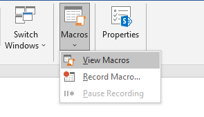
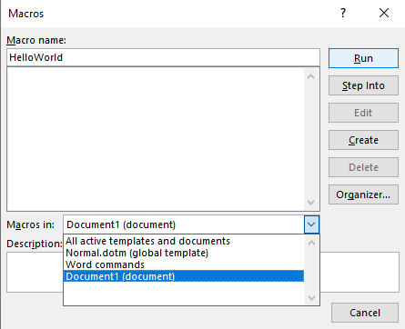
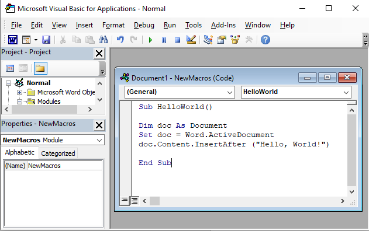
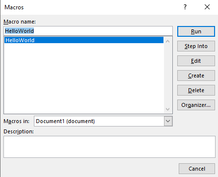
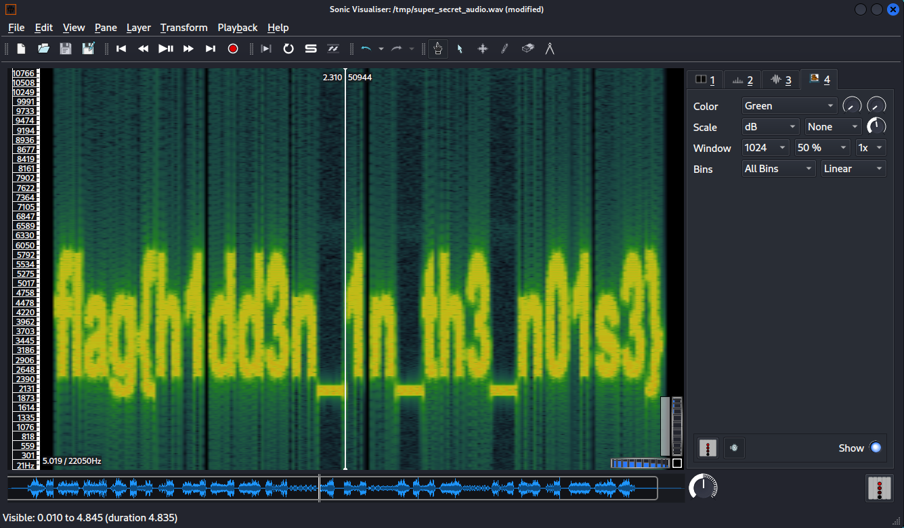

# Ανάλυση Εγγράφων και Steganography

> 🇬🇷 Ελληνική έκδοση του [Lab 03 — Document Analysis and Steganography](../../Lab%2003/README.md)

Τα έγγραφα είναι ένας κοινός τρόπος αποστολής ή αποθήκευσης πληροφοριών, όπως μηνυμάτων, αναφορών, βίντεο ή ιδεών. Έγγραφα MS Office, εικόνες και αρχεία ήχου είναι μερικά από τα πιο συχνά μορφές αρχείων που συναντάμε στην καθημερινότητά μας. Ωστόσο, πέρα από ό,τι βλέπουμε γραμμένο σε ένα έγγραφο Word ή ακούμε σε ένα αρχείο ήχου, τα έγγραφα αυτά μπορεί επίσης να περιέχουν κρυφά μηνύματα ή κακόβουλο κώδικα (malicious code) που μπορεί να εκτελεστεί όταν τα ανοίγουμε. Σε αυτό το εργαστήριο, θα εξερευνήσουμε ορισμένες τεχνικές για να αναλύσουμε και να εξετάσουμε αυτά τα έγγραφα.

> **Συμβουλή:** Η ανάλυση εγγράφων (document analysis) αποτελεί βασικό βήμα σε κάθε ερευνητική διαδικασία ψηφιακής εγκληματολογίας (digital forensics). Ένα έγγραφο μπορεί να αποκαλύψει ποιος το δημιούργησε, πότε, με ποια εφαρμογή και τι περιείχε πριν από τυχόν αλλοιώσεις — στοιχεία που συχνά δίνουν την πρώτη κατεύθυνση σε μια έρευνα.

# Έγγραφα Microsoft Office

Υπάρχουν δύο κύριες μορφές αρχείων που χρησιμοποιούνται από τα έγγραφα Microsoft Office:

- OLE (Object Linking and Embedding)
- OOXML (Office Open XML)

> **Σημασία για τις έρευνες:** Η γνώση της μορφής αρχείου είναι καθοριστική, διότι καθορίζει ποια εργαλεία θα χρησιμοποιήσουμε και τι είναι δυνατόν να ανακτήσουμε. Ένα παλιό `.doc` (OLE) και ένα σύγχρονο `.docx` (OOXML) αποθηκεύονται εντελώς διαφορετικά, οπότε και η μέθοδος εξαγωγής κειμένου ή μεταδεδομένων (metadata) διαφέρει.

### OLE

Το OLE (Object Linking and Embedding) ήταν η μορφή αρχείου που χρησιμοποιούνταν στις πρώτες εκδόσεις του Microsoft Office μεταξύ 1997 και 2003. Ορίζει μια δομή «αρχείο μέσα σε αρχείο» (file within a file) που επέτρεπε την ενσωμάτωση άλλων αρχείων μέσα σε ένα αρχείο. Για παράδειγμα, ένα φύλλο εργασίας Excel μπορούσε να ενσωματωθεί μέσα σε ένα έγγραφο Microsoft Word.

Υποστήριζε επεκτάσεις αρχείων όπως `.rtf`, `.doc`, `.ppt`, και `.xls`, μεταξύ άλλων.

> **Προσοχή:** Τα παλιά μορφές OLE έχουν αρκετά ευρύτερη επιφάνεια επίθεσης και είναι συχνός φορέας κακόβουλου εξοπλισμού (malware) σε παλιότερα συστήματα. Σε μια έρευνα, μην υποτιμάτε ένα παλιό έγγραφο μόνο επειδή «φαίνεται παλιό».

### OOXML

Το OOXML (Office Open XML) είναι η τρέχουσα μορφή αρχείου που χρησιμοποιείται στο Microsoft Office, η οποία βασίζεται σε μια μορφή εγγράφων γραμματοσειρών βάσει XML.

Οι επεκτάσεις αυτών των εγγράφων περιλαμβάνουν `.docx`, `.pptx`, και `.xlsx`, μεταξύ άλλων.

Η μορφή OOXML αποθηκεύει τα έγγραφα Office ως κοντέινερ ZIP. Αυτό σημαίνει ότι τα έγγραφα, όπως αρχεία Word, Excel και PowerPoint, στην πραγματικότητα είναι απλά αρχεία ZIP. Μετονομάζοντας την επέκταση από `.docx`, `.xlsx` ή `.pptx` σε `.zip`, μπορείτε να εξαγάγετε το περιεχόμενο του αρχείου και να δείτε τα ξεχωριστά αρχεία XML. Αυτή είναι μια χρήσιμη λειτουργία για την ψηφιακή εγκληματολογία, καθώς επιτρέπει στους ερευνητές να εξετάσουν το περιεχόμενο ενός εγγράφου χωρίς να το τροποποιήσουν.

> **Συμβουλή:** Το γεγονός ότι ένα `.docx` είναι ουσιαστικά ZIP σημαίνει ότι μπορείτε να «δείτε μέσα» στο έγγραφο με το `unzip` χωρίς να χρειαστείτε το ίδιο το Microsoft Word. Ειδικά για να αποφύγετε ενέργειες που αλλοιώνουν το αρχείο (χρήσιμο όταν πρόκειται να κατασχεθεί ως απόδειξη), πάντα δουλεύετε σε αντίγραφο και εξάγετε το περιεχόμενο χωρίς επεξεργασία.

## Ανατομία ενός εγγράφου OOXML

Για παράδειγμα, ας δημιουργήσουμε ένα έγγραφο Word με το κείμενο `Hello World!` μέσα του, να το μεταφέρουμε στο μηχάνημά μας Kali και έπειτα να το αποσυμπιέσουμε.

```
$ unzip Doc1.docx                       
Archive:  Doc1.docx
  inflating: [Content_Types].xml     
  inflating: _rels/.rels             
  inflating: word/document.xml       
  inflating: word/_rels/document.xml.rels  
  inflating: word/theme/theme1.xml   
  inflating: word/settings.xml       
  inflating: word/styles.xml         
  inflating: word/webSettings.xml    
  inflating: word/fontTable.xml      
  inflating: docProps/core.xml       
  inflating: docProps/app.xml
```

Έτσι φαίνεται η δομή αρχείων ενός εγγράφου Word:

```
.
├── [Content_Types].xml
├── docProps
│   ├── app.xml
│   └── core.xml
├── _rels
│   └── .rels
└── word
    ├── document.xml
    ├── fontTable.xml
    ├── _rels
    │   └── document.xml.rels
    ├── settings.xml
    ├── styles.xml
    ├── theme
    │   └── theme1.xml
    └── webSettings.xml
```

> **Σημείωση:** Προσέξτε ότι το αρχείο `word/document.xml` είναι εκεί που κρύβεται το κείμενο του εγγράφου. Αν κάποιος ζητήσει «πού γράφεται το κείμενο;», η απάντηση βρίσκεται πάντα εκεί — όχι σε κάποιο μυστικό μέρος του αρχείου.

### **[Content_Types].xml**

Αυτό το αρχείο περιέχει πληροφορίες για τους τύπους περιεχομένου (content types) που υπάρχουν στο έγγραφο και τις αντίστοιχες επεκτάσεις αρχείων τους.

### 📂 docProps

Αυτός ο φάκελος περιέχει δύο αρχεία, το `app.xml` και το `core.xml`.

- `app.xml` — περιέχει πληροφορίες για την εφαρμογή που χρησιμοποιήθηκε για τη δημιουργία του εγγράφου.
    
    ```xml
    <?xml version="1.0" encoding="UTF-8" standalone="yes"?>
    <Properties xmlns="http://schemas.openxmlformats.org/officeDocument/2006/extended-properties" xmlns:vt="http://schemas.openxmlformats.org/officeDocument/2006/docPropsVTypes">
      <Template>Normal.dotm</Template>
      <TotalTime>0</TotalTime>
      <Pages>1</Pages>
      <Words>1</Words>
      <Characters>12</Characters>
      <Application>Microsoft Office Word</Application>
      <DocSecurity>0</DocSecurity>
      <Lines>1</Lines>
      <Paragraphs>1</Paragraphs>
      <ScaleCrop>false</ScaleCrop>
      <Company/>
      <LinksUpToDate>false</LinksUpToDate>
      <CharactersWithSpaces>12</CharactersWithSpaces>
      <SharedDoc>false</SharedDoc>
      <HyperlinksChanged>false</HyperlinksChanged>
      <AppVersion>16.0000</AppVersion>
    </Properties>
    ```
    
    Παρατηρήστε ότι πεδία όπως `<Application>Microsoft Office Word</Application>` και `<AppVersion>16.0000</AppVersion>` μας λένε ποια εφαρμογή και ποια έκδοση δημιούργησε το έγγραφο — στοιχεία που βοηθούν στον χρονολογικό εντοπισμό (timeline) μιας έρευνας.
    
- `core.xml` — περιέχει τα μεταδεδομένα (metadata) του εγγράφου, όπως το όνομα του συντάκτη, την ημερομηνία δημιουργίας και την ημερομηνία τροποποίησης.
    
    ```xml
    <?xml version="1.0" encoding="UTF-8" standalone="yes"?>
    <cp:coreProperties xmlns:cp="http://schemas.openxmlformats.org/package/2006/metadata/core-properties" xmlns:dc="http://purl.org/dc/elements/1.1/" xmlns:dcterms="http://purl.org/dc/terms/" xmlns:dcmitype="http://purl.org/dc/dcmitype/" xmlns:xsi="http://www.w3.org/2001/XMLSchema-instance">
      <dc:title/>
      <dc:subject/>
      <dc:creator>Saad Javed</dc:creator>
      <cp:keywords/>
      <dc:description/>
      <cp:lastModifiedBy>Saad Javed</cp:lastModifiedBy>
      <cp:revision>2</cp:revision>
      <dcterms:created xsi:type="dcterms:W3CDTF">2023-02-04T15:44:00Z</dcterms:created>
      <dcterms:modified xsi:type="dcterms:W3CDTF">2023-02-04T15:44:00Z</dcterms:modified>
    </cp:coreProperties>
    ```
    
    Ας εξηγήσουμε τα πιο σημαντικά πεδία: ο `<dc:creator>` είναι ο δημιουργός, ο `<cp:lastModifiedBy>` είναι ο τελευταίος που επεξεργάστηκε το έγγραφο (πολύτιμο για να δούμε αν υπήρξαν πολλοί συντάκτες), ο `<cp:revision>` μετρά πόσες φορές αποθηκεύτηκε, ενώ τα `<dcterms:created>` και `<dcterms:modified>` δίνουν τις χρονικές στιγμές δημιουργίας και τελευταίας αλλοίωσης σε μορφή ISO 8601 (π.χ. `2023-02-04T15:44:00Z` = 4 Φεβρουαρίου 2023, 15:44 UTC).
    
    > **Προσοχή:** Τα μεταδεδομένα μπορούν να αποκαλύψουν την ταυτότητα του συντάκτη, αλλά μπορούν εύκολα και να παραπλανήσουν — οποιοσδήποτε μπορεί να αλλάξει το πεδίο `creator`. Σε πραγματική έρευνα, τα μεταδεδομένα θεωρούνται ένδειξη (lead) και όχι απόδειξη (proof)· πάντα επιβεβαιώνονται με άλλα στοιχεία.
    

### 📂 _rels

Αυτός ο φάκελος περιέχει ένα αρχείο με όνομα `.rels`.

- `.rels` — περιέχει πληροφορίες για τις σχέσεις (relationships) μεταξύ των διαφόρων τμημάτων του εγγράφου, όπως τα `app.xml` και `core.xml`.

### 📂 word

Αυτός ο φάκελος περιέχει το πραγματικό περιεχόμενο του εγγράφου.

- `document.xml` — περιέχει το ίδιο το κείμενο του εγγράφου.
    
    ```xml
    <!-- SNIP -->
      <w:body>
        <w:p w14:paraId="68F74602" w14:textId="442B891B" w:rsidR="00D473D4" w:rsidRPr="00B20485" w:rsidRDefault="00B20485">
          <w:pPr>
            <w:rPr>
              <w:lang w:val="en-US"/>
            </w:rPr>
          </w:pPr>
          <w:r>
            <w:rPr>
              <w:lang w:val="en-US"/>
            </w:rPr>
            <w:t>Hello World!</w:t>
          </w:r>
        </w:p>
        <w:sectPr w:rsidR="00D473D4" w:rsidRPr="00B20485">
          <w:pgSz w:w="11906" w:h="16838"/>
          <w:pgMar w:top="1440" w:right="1440" w:bottom="1440" w:left="1440" w:header="708" w:footer="708" w:gutter="0"/>
          <w:cols w:space="708"/>
          <w:docGrid w:linePitch="360"/>
        </w:sectPr>
      </w:body>
    </w:document>
    ```
    
    Το κείμενο μας βρίσκεται μέσα στην ετικέτα `<w:t>Hello World!</w:t>`. Σημειώστε επίσης τα πεδία `rsidR` και `paraId` — είναι μοναδικά αναγνωριστικά που βοηθούν το Word να παρακολουθεί τις αλλαγές και συχνά αποκαλύπτουν ποιο μέρος του εγγράφου τροποποιήθηκε.
    
- `fontTable.xml` — περιέχει πληροφορίες για τις γραμματοσειρές που χρησιμοποιήθηκαν στο έγγραφο.
- 📂 **_rels —** περιέχει ένα αρχείο `document.xml.rels`.
    - `document.xml.rels` — περιέχει πληροφορίες για τις σχέσεις μεταξύ των διαφόρων τμημάτων του εγγράφου, όπως στυλ, θέματα (themes), ρυθμίσεις, καθώς και τα URI για εξωτερικούς συνδέσμους.
- `settings.xml` — περιέχει τις ρυθμίσεις και τις πληροφορίες διαμόρφωσης του εγγράφου.
- `styles.xml` — περιέχει πληροφορίες για τα στυλ που χρησιμοποιήθηκαν στο έγγραφο.
- 📂 **theme** — περιέχει αρχεία για το θέμα που χρησιμοποιήθηκε στο έγγραφο.
    - `theme1.xml` — περιέχει το πραγματικό περιεχόμενο του θέματος.
- `webSettings.xml` — περιέχει πληροφορίες για τις ρυθμίσεις σχετικά με τον Web του εγγράφου, όπως οι ρυθμίσεις frameset HTML καθώς και ο τρόπος με τον οποίο το έγγραφο διαχειρίζεται όταν αποθηκεύεται ως HTML.

Πληροφορίες για τυχόν επιπλέον αρχεία που μπορεί να υπάρχουν σε ένα έγγραφο μπορείτε να βρείτε στον σύνδεσμο [http://officeopenxml.com/anatomyofOOXML.php](http://officeopenxml.com/anatomyofOOXML.php).

## Έγγραφα με Macros

Τα έγγραφα με macros (macro-enabled documents) είναι έγγραφα που περιέχουν macros, δηλαδή σύνολα οδηγιών που αυτοματοποιούν εργασίες. Τα macros γράφονται συνήθως σε Visual Basic for Applications (VBA) και μπορούν να χρησιμοποιηθούν για να εκτελέσουν ένα ευρύ φάσμα εργασιών, όπως μορφοποίηση κειμένου, εκτέλεση υπολογισμών και αυτοματοποίηση σύνθετων διαδικασιών. Ωστόσο, οι επιτιθέμενοι χρησιμοποιούν συχνά αυτή τη λειτουργικότητα των εγγράφων Office σε συνδυασμό με επιθέσεις phishing (κοινοποίηση ψευδώνυμων μηνυμάτων για απόκτηση εμπιστοσύνης) και ενσωματώνουν κακόβουλα macros για να εκτελέσουν επιζήμιες ενέργειες και να εγκαταστήσουν malware στο σύστημα.

Οι επεκτάσεις αυτών των εγγράφων περιλαμβάνουν `.docm`, `.pptm`, και `.xlsm`, μεταξύ άλλων.

> **Γιατί μετράει σε πραγματικές έρευνες:** Τα μακροχρόνια επιτυχίες των επιθέσεων phishing βασίζονται συχνά στον χρήστη που «πατά Enable Content». Από άποψη forensics, η παρουσία macro σε ένα έγγραφο που έφτασε μέσω email είναι συχνά ίδιο με την παρουσία εγκληματικής προθέσης — και ο κώδικας του macro συχνά αποκαλύπτει το τελικό στάδιο (payload) της επίθεσης.

Για παράδειγμα, ας δημιουργήσουμε ένα κενό έγγραφο Word και να ακολουθήσουμε τα παρακάτω βήματα:

1. Πατήστε View → Macros → View Macros.
    
    
    
2. πληκτρολογήστε ένα όνομα όπως HelloWorld, επιλέξτε Document1 (το τρέχον έγγραφο) στο πεδίο Macros in και πατήστε create.
    
    
    
3. Επικολλήστε τον παρακάτω κώδικα στο πλαίσιο κειμένου.
    
    ```visual-basic
    Sub HelloWorld()
    
    Dim doc As Document
    Set doc = Word.ActiveDocument
    doc.Content.InsertAfter ("Hello, World!")
    
    End Sub
    ```
    
    
    
4. Κλείστε την καρτέλα Microsoft Visual Basic for Application.
5. Επαναλάβετε το βήμα 1, επιλέξτε το macro HelloWorld και πατήστε Run.
    
    
    
6. Παρατηρήστε ότι το `Hello, World!` γράφεται πλέον στο έγγραφο.
7. Αποθηκεύστε το έγγραφο ως `.docm`.

Σύμφωνα με την ανατομία των αρχείων OOXML, το macro αποθηκεύεται πλέον μέσα στο `word/vbaProject.bin`, ωστόσο δεν θα μπορούμε να το διαβάσουμε καθώς βρίσκεται σε μορφή δυαδική (binary). Μπορούμε όμως να χρησιμοποιήσουμε ένα σύνολο εργαλείων που ονομάζεται `oletools` για να αναλύσουμε και να εξαγάγουμε macros από αρχεία OLE, όπως τα έγγραφα Microsoft Office.

Για να εγκαταστήσετε τα `oletools`, χρησιμοποιήστε την εντολή: `sudo -H pip install -U oletools`.

Ας χρησιμοποιήσουμε το `oleid` για να εντοπίσουμε αν το έγγραφό μας έχει ενσωματωμένα macros.

```
$ oleid HelloWorld.docm   
XLMMacroDeobfuscator: pywin32 is not installed (only is required if you want to use MS Excel)
oleid 0.60.1 - http://decalage.info/oletools
THIS IS WORK IN PROGRESS - Check updates regularly!
Please report any issue at https://github.com/decalage2/oletools/issues

Filename: HelloWorld.docm
WARNING  For now, VBA stomping cannot be detected for files in memory
--------------------+--------------------+----------+--------------------------
Indicator           |Value               |Risk      |Description               
--------------------+--------------------+----------+--------------------------
File format         |MS Word 2007+ Macro-|info      |                          
                    |Enabled Document    |          |                          
                    |(.docm)             |          |                          
--------------------+--------------------+----------+--------------------------
Container format    |OpenXML             |info      |Container type            
--------------------+--------------------+----------+--------------------------
Encrypted           |False               |none      |The file is not encrypted 
--------------------+--------------------+----------+--------------------------
VBA Macros          |Yes                 |Medium    |This file contains VBA    
                    |                    |          |macros. No suspicious     
                    |                    |          |keyword was found. Use    
                    |                    |          |olevba and mraptor for    
                    |                    |          |more info.                
--------------------+--------------------+----------+--------------------------
XLM Macros          |No                  |none      |This file does not contain
                    |                    |          |Excel 4/XLM macros.       
--------------------+--------------------+----------+--------------------------
External            |0                   |none      |External relationships    
Relationships       |                    |          |such as remote templates, 
                    |                    |          |remote OLE objects, etc   
--------------------+--------------------+----------+--------------------------
```

Ας εξηγήσουμε τι σημαίνουν οι στήλες της εξόδου: το **Indicator** είναι η ένδειξη που ελέγχθηκε, το **Value** η τιμή που βρέθηκε, το **Risk** η αξιολόγηση κινδύνου (`none` / `info` / `Medium` / κλπ.) και η **Description** σύντομη εξήγηση. Το αποτέλεσμα δείχνει ότι το εργαλείο εντόπισε VBA Macros και αξιολόγησε τον κίνδυνο ως μεσαίο. Μπορούμε τώρα να προχωρήσουμε με τη χρήση του `olevba` για να εξαγάγουμε τα macros από το έγγραφο.

```
$ olevba HelloWorld.docm
XLMMacroDeobfuscator: pywin32 is not installed (only is required if you want to use MS Excel)
olevba 0.60.1 on Python 3.10.8 - http://decalage.info/python/oletools
===============================================================================
FILE: HelloWorld.docm
Type: OpenXML
WARNING  For now, VBA stomping cannot be detected for files in memory
-------------------------------------------------------------------------------
VBA MACRO ThisDocument.cls 
in file: word/vbaProject.bin - OLE stream: 'VBA/ThisDocument'
- - - - - - - - - - - - - - - - - - - - - - - - - - - - - - - - - - - - - - - 
(empty macro)
-------------------------------------------------------------------------------
VBA MACRO NewMacros.bas 
in file: word/vbaProject.bin - OLE stream: 'VBA/NewMacros'
- - - - - - - - - - - - - - - - - - - - - - - - - - - - - - - - - - - - - - - 
Sub HelloWorld()

Dim doc As Document
Set doc = Word.ActiveDocument
doc.Content.InsertAfter ("Hello, World!")

End Sub
No suspicious keyword or IOC found.
```

Η έξοδος παραπάνω δείχνει ότι το εξαγόμενο macro είναι ακριβώς το ίδιο με αυτό που εισήλθε στο έγγραφο.

> **Συμβουλή:** Σε πραγματική έρευνα, μην σταματάτε στο «υπάρχει macro». Εξάγετε πάντα τον κώδικα και αναλύστε τον: ποια εντολή καλείται; Στέλνει δεδομένα σε εξωτερικό διακομιστή; Κατεβάζει και εκτελεί εξωτερικά αρχεία; Αυτές οι ερωτήσεις μετατρέπουν ένα «ναι, υπάρχει macro» σε χρήσιμα στοιχεία για την έρευνα.

> **Προσοχή:** Πολλά κακόβουλα macros χρησιμοποιούν τεχνικές παραπλάνησης, όπως κενός κώδικας για να «ξεπεράσουν» τα εργαλεία ανίχνευσης ή κωδικοποίηση (obfuscation). Αν η έξοδος του `olevba` φαίνεται «καθαρή» αλλά το έγγραφο συμπεριφέρεται ύποπτα, δοκιμάστε επιπλέον εργαλεία όπως `mraptor` και εξετάστε και άλλα τμήματα του OOXML.

# Steganography

Η λέξη steganography προέρχεται από την ελληνική λέξη Στεγανογραφία, που αποτελείται από τις λέξεις «στεγανός», δηλαδή «καλυμμένος ή κρυμμένος», και «γραφία», δηλαδή «να γράφεις». Πρόκειται για την τέχνη της απόκρυψης μυστικών εντός μιας εν τέλει αθώας εννοιολογικά πληροφορίας. Ένα πρώιμο παράδειγμα στεγανογραφίας είναι η χρήση αόρατου μελάνιος από χυμό λεμονιού ή ξύδι για να γράψει κανείς σε χαρτί και στη συνέχεια να αποκαλύψει τη γραφή θερμαίνοντας το χαρτί.

Στον σημερινό ψηφιακό κόσμο, η steganography (στεγανογραφία) χρησιμοποιείται για να κρυφτεί ένα μήνυμα μέσα σε ένα άλλο αρχείο, όπως μια εικόνα ή ένα αρχείο ήχου, με τρόπο ώστε να μην μπορεί να δει ή να ακούσε κανείς που δεν γνωρίζει ότι υπάρχει. Αυτή η τεχνική μπορεί να χρησιμοποιηθεί τόσο για αθώους σκοπούς, όπως η αποστολή ενός μυστικού μηνύματος σε φίλο, όσο και για επιζήμιους λόγους, όπως η απόκρυψη στοιχείων ή η επικοινωνία χωρίς εντοπισμό.

> **Διαφορά από την κρυπτογράφηση:** Στην κρυπτογράφηση (encryption) το μήνυμα παραμένει ορατό ως κρυπτογραφημένο, απλώς ακατανόητο. Στη στεγανογραφία, το μήνυμα είναι εντελώς αόρατο — κανείς δεν ξέρει ότι υπάρχει. Οι δύο τεχνικές συχνά συνδυάζονται: πρώτα κρυπτογραφείται το μήνυμα και μετά κρύβεται μέσα στο φορέα.

> Today, digital steganography is one of the important components in the toolboxes of spies and malicious hackers, as well as human rights activists and political dissidents.
>  
> — Ben Dickson

Οι πρώτες καταγεγραμμένες χρήσεις της στεγανογραφίας ανάγονται στο 440 π.Χ. στην Ελλάδα, όταν ο Ηρόδοτος αναφέρει δύο παραδείγματα στις Ιστορίες του. Ο Ιστιαίος έστειλε μήνυμα στον υποτελή του, Αρισταγόρα, ξυρίζοντας το κεφάλι του πιο εμπιστευόμενου δούλου του, «χαράσσοντας» το μήνυμα στο τριχωτό του της κεφαλής, και στη συνέχεια στέλνοντάς τον καθώς θα είχε ξαναγίνει η τρίχα του, με την οδηγία: «Όταν φτάσεις στη Μίλετο, πρόστεψε τον Αρισταγόρα να ξυρίσει το κεφάλι σου και να δει εκεί το μήνυμα».

Source: Wikipedia

Μερικά πρόσφατα παραδείγματα περιλαμβάνουν:

- Κακόβουλα memes στο Twitter — [Link to blog](https://www.trendmicro.com/en_us/research/18/l/cybercriminals-use-malicious-memes-that-communicate-with-malware.html).
- PDF με κακόβουλο κώδικα JavaScript — [Link to article](https://securityaffairs.co/80342/hacking/steganography-obfuscate-pdf.html).

> **Συμβουλή:** Παρά τη φαινομερική «παλαιοτητα» της ιδέας, η στεγανογραφία παραμένει επίκαιρη στην κυβερνοεγκληματολογία. Επειδή δεν προκαλεί καμία αλλαγή στην εμφάνιση του αρχείου, δεν εντοπίζεται από απλούς ελέγχους ακεραιότητας — γι' αυτό απαιτεί ειδικά εργαλεία και εξειδίκευση από τον ερευνητή.

## Στεγανογραφία σε Εικόνες

Τα PNG και JPEG είναι δύο κοινές μορφές εικόνων. Μπορούν επίσης να χρησιμοποιηθούν ως κανάλια για την απόκρυψη μηνυμάτων μέσα τους. Και οι δύο αυτές μορφές βασίζονται σε διαφορετικές δομές για την κατασκευή μιας εικόνας και, συνεπώς, χρησιμοποιούνται διαφορετικές τεχνικές για την απόκρυψη μηνυμάτων μέσα τους.

### PNG

Για τα αρχεία PNG, μία από τις συχνά χρησιμοποιούμενες τεχνικές απόκρυψης μηνυμάτων είναι η τροποποίηση των λιγότερο σημαντικών ψηφίων (LSBs — Least Significant Bits) ορισμένων πιξέλων, όπως εκείνων που έχουν ελάχιστο αντίκτυπο στην ποιότητα της εικόνας. Ο αλγόριθμος ξέρει στη συνέχεια από ποια πιξέλα πρέπει να εξαχθεί το ενσωματωμένο μήνυμα.

Για παράδειγμα, εξετάστε την παρακάτω εικόνα του πίνακα «Άστρωτη Νύχτα» του Van Gogh με ένα μήνυμα που έχει ήδη ενσωματωθεί σε αυτήν.


Η εικόνα μπορεί να ληφθεί από το [https://github.com/vonderchild/digital-forensics-lab/blob/main/Lab 03/files/starry_night.png](https://github.com/vonderchild/digital-forensics-lab/blob/main/Lab%2003/files/starry_night.png).

Ένα εργαλείο που χρησιμοποιείται για την ανίχνευση στεγανογραφίας PNG είναι το `zsteg`, το οποίο μπορεί να εγκατασταθεί με την εντολή `sudo gem install zsteg`. 

Έτσι μπορούμε να χρησιμοποιήσουμε το εργαλείο για να εξαγάγουμε το κρυφό μήνυμα:

```
$ zsteg starry_night.png           
b1,rgb,lsb,xy       .. text: "148:The fishermen know that the sea is dangerous and the storm terrible, but they have never found these dangers sufficient reason for remaining ashore."
b2,r,lsb,xy         .. file: OpenPGP Public Key
b4,g,lsb,xy         .. text: "*e~_^u|["
```

> **Πώς διαβάζουμε την έξοδο του zsteg:** Κάθε γραμμή περιγράφει μια διαφορετική «διαδρομή» εξαγωγής — π.χ. `b1,rgb,lsb,xy` σημαίνει ότι ελέγχθηκε το 1ο bit (b1), τα κανάλια RGB, τα λιγότερο σημαντικά ψηφία (lsb), σε διασταύρωση x/y. Οι ετικέτες `text:` και `file:` μας λένε τι τύπο δεδομένων βρέθηκε. Σημειώστε ότι όχι όλες οι εξόδοι είναι αληθινά μηνύματα — πολλές φορές εμφανίζονται τυχαία παραγόμενες συμβολοσειρές. Η εμπειρία κρίνει ποια είναι το αληθινό κρυμμένο περιεχόμενο.

### JPEG

Για τα αρχεία JPEG, μια συχνά χρησιμοποιούμενη μέθοδος στεγανογραφίας περιλαμβάνει την εύρεση ζευγαριών θέσεων μέσα σε μια εικόνα έτσι ώστε η ανταλλαγή των τιμών τους να έχει ως αποτέλεσμα την ενσωμάτωση του αντίστοιχου τμήματος του μυστικού μηνύματος. Αν δεν βρεθούν τέτοια ζεύγη, οι πιξέλες στις υπόλοιπες θέσεις απλώς αντικαθίστανται.

Με το εργαλείο `steghide`, μπορούμε να κρύψουμε και να εξαγάγουμε μηνύματα από αρχεία JPEG.


> 💡 Ένα ακόμη εργαλείο που αξίζει να προσθέσετε στο εκστρατευτικό σας σετ ψηφιακής εγκληματολογίας είναι το `exiftool`, το οποίο μπορεί να χρησιμοποιηθεί για την εξαγωγή μεταδεδομένων (metadata) από αρχεία όπως μια εικόνα ή ένα αρχείο ήχου, τα οποία περιλαμβάνουν πληροφορίες όπως οι ημερομηνίες δημιουργίας και τροποποίησης, ο συντάκτης, καθώς και η τοποθεσία λήψης της εικόνας (γεωγραφικό πλάτος και μήκος).

# Στεγανογραφία σε Ήχο

Στη στεγανογραφία ήχου, η πιο κοινή μέθοδος είναι η ενσωμάτωση του μηνύματος μέσα στο φάσμα του ήχου (audio spectrum). Ωστόσο, αυτή η μέθοδος κάνει τον ήχο θορυβώδη. Μια άλλη μέθοδος είναι η ενσωμάτωση του μηνύματος μέσα στα λιγότερο σημαντικά ψηφία (LSBs).

Για την ανίχνευση στεγανογραφίας ήχου, μπορούν να χρησιμοποιηθούν εργαλεία όπως το Sonic Visualizer ή το Audacity.

Για να το δοκιμάσετε, κατεβάστε το αρχείο ήχου από το [https://github.com/vonderchild/digital-forensics-lab/blob/main/Lab 03/files/super_secret_audio.wav](https://github.com/vonderchild/digital-forensics-lab/blob/main/Lab%2003/files/super_secret_audio.wav). 

Στη συνέχεια, ανοίξτε το αρχείο στο Sonic Visualizer και πατήστε Layer → Add Spectogram.



> **Συμβουλή:** Το φάσμα (spectrogram) είναι μια «εικόνα» του ήχου: οι άξονες είναι ο χρόνος και η συχνότητα, ενώ το φωτεινότητα/χρώμα δείχνει την ένταση. Τα κρυφά μηνύματα εμφανίζονται συχνά ως καθαρά γεωμετρικά μοτίβα (γράμματα, γραμμές) που ξεχωρίζουν από τον τυχαίο θόρυβο του ήχου. Στο Audacity, μπορείτε να δείτε το φάσμα μέσω Track → Spectrogram → Spectrogram Settings.

> **Προσοχή:** Ορισμένα κρυφά μηνύματα σε ήχο μπορεί να είναι αόρατα ακόμη και στο φάσμα, ειδικά αν χρησιμοποιούν LSB. Σε τέτοες περιπτώσεις χρειάζονται εξειδικευμένα εργαλεία ανάλυσης ήχου. Ξεκινήστε πάντα από την οπτική εξέταση και προχωρήστε σε πιο σύνθετες μεθόδους μόνο αν χρειαστεί.

# Ασκήσεις

1. Έχει αναφερθεί μια επίθεση phishing στον οργανισμό σας, στην οποία ένας υπάλληλος έλαβε ένα κακόβουλο έγγραφο Word σε email που φαινόταν να προέρχεται από αξιόπιστη πηγή. Ο υπάλληλος άνοιξε το έγγραφο που περιείχε macros, με αποτέλεσμα ο επιτιθέμενος να αποκτήσει πρόσβαση στον υπολογιστή του υπαλλήλου. Ένα μυστικό που θα αποκαλύψει την ταυτότητα του επιτιθεμένου είναι ενσωματωμένο μέσα στον κώδικα του macro. Η εργασία σας είναι να αναλύσετε τον κώδικα του macro και να εξαγάγετε το ενσωματωμένο μυστικό. Το μυστικό έχει τη μορφή `flag{s0me_str1ng}`.

    Το έγγραφο Word μπορεί να ληφθεί από το [https://github.com/vonderchild/digital-forensics-lab/blob/main/Lab 03/files/YearlyBonus.docm](https://github.com/vonderchild/digital-forensics-lab/blob/main/Lab%2003/files/YearlyBonus.docm).

2. Ένας μάρτυρας μέσα στην κυβέρνηση έχει διαρρεύσει εμπιστευτικές πληροφορίες υψηλού βαθμού ασφαλείας σε έναν κατάσκοπο. Ο μάρτυρας, γνωρίζοντας τις τεχνικές κατασκοπείας, χρησιμοποίησε στεγανογραφία για να κρύψει τις πληροφορίες μέσα σε μια εικόνα, την οποία στη συνέχεια παρέδωσε στον υπεύθυνό του. Ο κατάσκοπος έλαβε την εικόνα και την επικόλλησε σε ένα έγγραφο PowerPoint, καλύπτοντάς τη με πολλές τυχαίες εικόνες για να την αποκρύψει. Ένας από τους κατασκόπους μας έχει αποκτήσει πρόσβαση στον υπολογιστή του εχθρικού κατασκόπου και ανέκτησε το έγγραφο PowerPoint. Η αποστολή σας είναι να εξαγάγετε την πρώτη εικόνα, να εξαγάγετε τις εμπιστευτικές πληροφορίες καθώς και το όνομα και την τοποθεσία της πηγής του μέσα στην κυβέρνηση.

    Το έγγραφο PowerPoint μπορεί να ληφθεί από το [https://github.com/vonderchild/digital-forensics-lab/blob/main/Lab 03/files/Presentation.pptx](https://github.com/vonderchild/digital-forensics-lab/blob/main/Lab%2003/files/Presentation.pptx).

3. Δεδομένου του αρχείου ήχου από την ενότητα «Στεγανογραφία σε Ήχο», διερευνήστε πώς μπορείτε να δείτε το φάσμα (spectogram) και να ανακτήσετε τη σημαία (flag) χρησιμοποιώντας το Audacity. Υποβάλετε στιγμιότυπο οθόνης.

    Το αρχείο ήχου μπορεί να ληφθεί από το [https://github.com/vonderchild/digital-forensics-lab/blob/main/Lab 03/files/super_secret_audio.wav](https://github.com/vonderchild/digital-forensics-lab/blob/main/Lab%2003/files/super_secret_audio.wav).
