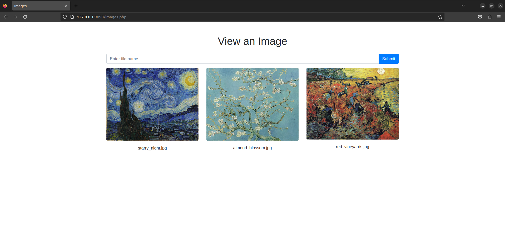
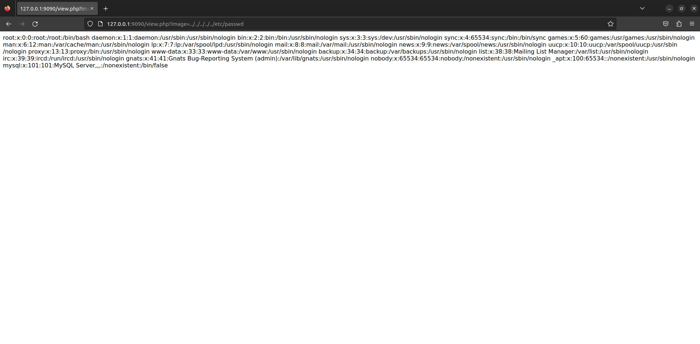
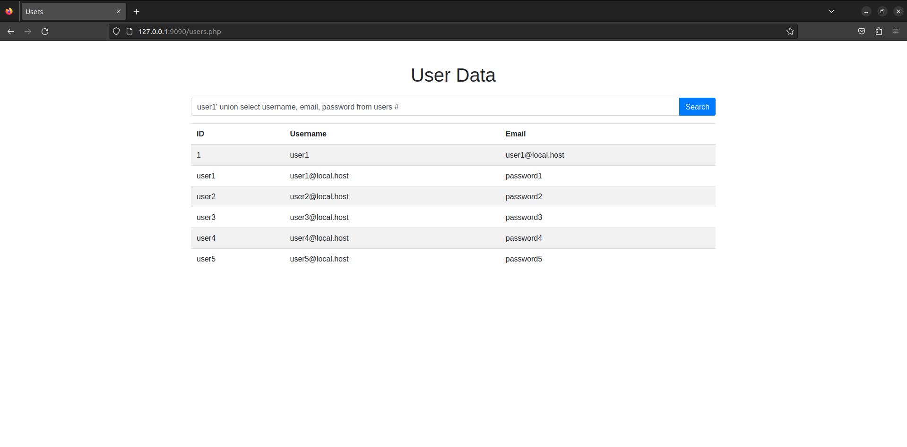

# Forensics Επιθέσεων Web

> 🇬🇷 Ελληνική έκδοση του [Lab 04 — Web Attack Forensics](../../Lab%2004/README.md)

Οι εφαρμογές Web αποτελούν αναπόσπαστο μέρος της καθημερινής μας ζωής και χρησιμοποιούνται για ένα ευρύ φάσμα δραστηριοτήτων, από διαδικτυακές αγορές μέχρι τραπεζικές συναλλαγές και μέσα κοινωνικής δικτύωσης. Ωστόσο, η ευρεία χρήση τους δημιουργεί μια μεγάλη επιφάνεια επίθεσης (attack surface) για κακόβουλους παράγοντες που μπορούν να την εκμεταλλευτούν και να αποκτήσουν πρώτο σημείο εισβολής στο σύστημα.

Σε αυτό το εργαστήριο, θα μάθουμε για τις διαφορετικούς τύπους επιθέσεων που είναι κοινές εναντίον εφαρμογών Web και θα εξερευνήσουμε διάφορες τεχνικές που χρησιμοποιούνται για την ανίχνευσή τους αναλύοντας αρχεία καταγραφής (logs) εφαρμογών Web και αρχεία καταγραφής του τείχους προστασίας εφαρμογών Web (WAF), για να βρούμε το σημείο της επίθεσης και να ανιχνεύσουμε τη ρίζα του προβλήματος (root cause) εντοπίζοντας την ευπάθεια που εκμεταλλεύτηκε.

> **Γιατί μετράει σε πραγματικές έρευνες:** Σε μια πραγματική διάρρηξη, η απάντηση στο «τι έγινε;» δεν προκύπτει από μια εντολή, αλλά από τη σύνθεση δεκάδων μικρών στοιχείων στα logs: μια διεύθυνση IP, ένα όνομα αρχείου στο URL, ένας κωδικός σφάλματος. Η ικανότητα να διαβάζετε logs με σύστημα είναι ίσως η πιο εφαρμόσιμη δεξιότητα του forensics επιθέσεων Web.

## Ρύθμιση Περιβάλλοντος

Πριν περάσουμε στο θέμα των επιθέσεων Web και της forensics, ας δημιουργήσουμε ένα περιβάλλον τοπικά χρησιμοποιώντας το Docker. Αυτό θα επιτρέψει μια πιο πρακτική και ολοκληρωμένη κατανόηση του υλικού που καλύπτεται.

> **Συμβουλή:** Πάντα εκτελέστε τις εντολές στη σειρά που δίνονται. Το `docker build` χτίζει την εικόνα της εφαρμογής (με Apache, ModSecurity και τον κώδικα PHP), ενώ το `docker run` ξεκινά ένα κοντέινερ που εκτίθεται στη θύρα 9090. Αν η εφαρμογή δεν απαντάει στο [http://127.0.0.1:9090/](http://127.0.0.1:9090/), ελέγξτε πρώτα αν το Docker τρέχει (`sudo service docker status`).

### Αντιγραφή αποθητηρίου (repository)

```
git clone https://github.com/vonderchild/digital-forensics-lab && cd digital-forensics-lab/Lab\ 4/files/app
```

### Εγκατάσταση Docker

```
sudo apt-get update
sudo apt-get install -y docker.io
sudo service docker start
```

### Χτίσιμο και εκκίνηση εικόνας Docker

```
docker build -t app:latest .
docker run -p 9090:80 app:latest
```

# Επιθέσεις Web & Forensics

### Αρχεία Καταγραφής Εφαρμογών Web & WAF

Τα αρχεία καταγραφής (logs) των εφαρμογών Web διαδραματίζουν σημαντικό ρόλο στην ψηφιακή εγκληματολογία, καθώς βοηθούν στην παρακολούθηση της δραστηριότητας των χρηστών, την ανίχνευση πιθανών επιθέσεων, την ανίχνευση της προέλευσης μιας επίθεσης και τον καθορισμό της έκτασης των συνεπειών της. Σε αυτό το εργαστήριο, θα εστιάσουμε στον Apache, έναν διαδεδομένο διακομιστή Web για τη φιλοξενία εφαρμογών Web. Τα αρχεία που παράγει ο Apache περιλαμβάνουν access logs και error logs. Τα access logs περιέχουν πληροφορίες για τις εισερχόμενες αιτήσεις, όπως η διεύθυνση IP του πελάτη, η ημερομηνία και η ώρα της αίτησης, η μέθοδος αίτησης (π.χ. GET, POST), το ζητούμενο URI, ο κωδικός κατάστασης απόκρισης (π.χ. 200, 403, 404) και ο user agent. Τα error logs, από την άλλη πλευρά, περιέχουν πληροφορίες για σφάλματα που συνάντησε ο διακομιστής, όπως αποτυχημένες αιτήσεις και απροσδόκητα γεγονότα που συνέβησαν κατά την επεξεργασία της αίτησης. Αυτά τα αρχεία μπορούν να βρεθούν στο `/var/log/apache2` σε συστήματα Linux.

> **Εξήγηση των πεδίων ενός access log:** Ας διαβάσουμε μια τυπική γραμμή:
> `172.17.0.1 - - [14/Feb/2023:04:09:47 +0500] "GET /images.php HTTP/1.1" 200 1114 "-" "Mozilla/5.0 ..."`
> — Το `172.17.0.1` είναι η IP του πελάτη· τα δύο `-` είναι το προαιρετικό πεδίο ταυτοποίησης χρήστη (identd) και του συνδεδεμένου χρήστη· η τιμές στις αγκύλες είναι η ώρα με ζώνη ώρας· το `GET` είναι η μέθοδος HTTP· το `/images.php` το ζητούμενο resource· το `200` ο κωδικός επιτυχίας· το `1114` το μέγεθος της απόκρισης σε bytes· το πρώτο `"-"` ο παραπέμπων σελίδας (Referer) και το τελευταίο `"Mozilla/5.0 ..."` ο browser του χρήστη (user agent).
>
> **Χρήσιμοι κωδικοί κατάστασης:** `200` = επιτυχία· `302` = προσωρινή ανακατεύθυνση (redirect)· `403` = απαγόρευση πρόσβασης· `404` = δεν βρέθηκε· `500` = εσωτερικό σφάλμα διακομιστή.

Τα τείχη προστασίας εφαρμογών Web (WAF — Web Application Firewalls) αποτελούν σημαντικό στοιχείο της ασφάλειας εφαρμογών Web. Ένα WAF παρέχει ένα επίπεδο ασφάλειας για την εφαρμογή, μπλοκάροντας κακόβουλη κίνηση πριν φτάσει στην εφαρμογή. Σε αυτό το εργαστήριο θα χρησιμοποιήσουμε τον Modsecurity ως τείχος προστασίας εφαρμογών Web. Η προεπιλεγμένη τοποθεσία για τα audit logs του είναι το `/var/log/apache2/modsec_audit.log`. Όταν συναντά ένα σφάλμα ή οποιαδήποτε κακόβουλη προσπάθεια στον διακομιστή, καταγράφεται επίσης μέσα στο `/var/log/apache2/error.log`.

> **Διαφορά access vs. audit logs:** Τα access logs σας λένε *τι* ζητήθηκε· τα audit logs του WAF σας λένε επιπλέον *πώς* η αίτηση αξιολογήθηκε και αν θεωρήθηκε επικίνδυνη, με το πλήρες σώμα της αίτησης και της απόκρισης. Σε μια έρευνα, συνήθως ξεκινάτε από τα access logs για να χτίσετε το χρονολόγιο και μετά μεταβαίνετε στα WAF logs για τη λεπτομερή ανάλυση της επίθεσης.

Η δομή καταλόγου για αυτά τα αρχεία φαίνεται ως εξής:

```
var
└── log
    └── apache2
        ├── access.log
        ├── error.log
        ├── modsec_audit.log
        └── other_vhosts_access.log
```

## Κοινές Επιθέσεις Web & Logs

Για να διεξαχθεί αποτελεσματικά forensics επιθέσεων Web, είναι σημαντικό να υπάρχει κατανόηση των κοινών τύπων επιθέσεων Web. Αυτές οι επιθέσεις εκμεταλλεύονται ευπάθειες σε εφαρμογές Web και η γνώση του τρόπου λειτουργίας τους είναι απαραίτητη για να συναρμολογηθούν τα γεγονότα που οδήγησαν στην επίθεση.

Υπάρχει πληθώρα ευπαθειών που μπορούν να εκμεταλλευτούν σε μια εφαρμογή Web, από ευπάθειες χωρίς πραγματικό αντίκτυπο έως κρίσιμες ευπάθειες που μπορούν να έχουν τεράστιο αντίκτυπο σε έναν οργανισμό όταν εκμεταλλευτούν. Ωστόσο, σε αυτή την ενότητα θα εστιάσουμε σε ορισμένες κρίσιμες, οι οποίες περιλαμβάνουν το Path Traversal, την Remote Command Execution και το SQL Injection.

- **Path Traversal** (περιήγηση διαδρομών) — ανάγνωση αρχείων εκτός του επιτρεπόμενου καταλόγου.
- **Remote Command Execution (RCE)** — εκτέλεση εντολών του συστήματος από τον επιτιθέμενο.
- **SQL Injection (SQLi)** — εισαγωγή επιζήμιου κώδικα SQL μέσω πεδίων εισόδου της εφαρμογής.

Για να συμμετάσχετε πλήρως στην πρακτική εμπειρία, βεβαιωθείτε ότι έχετε ακολουθήσει τα βήματα στη ρύθμιση περιβάλλοντος. Για επαλήθευση, η αρχική σελίδα πρέπει να είναι προσβάσιμη στο [http://127.0.0.1:9090/](http://127.0.0.1:9090/).

> **Προσοχή:** Το περιβάλλον του εργαστηρίου προορίζεται μόνο για εκπαιδευτικούς σκοπούς και τρέχει τοπικά. Μην εκτίθετε ποτέ εφαρμογές με γνωστές ευπάθειες σε δίκτυα ή συστήματα που δεν σας ανήκουν — οι εντολές που δίνονται σε αυτό το εργαστήριο είναι εγκληματικές αν εκτελεστούν χωρίς άδεια.

### Path Traversal

Γνωστό και ως «directory traversal» (περιήγηση καταλόγων), αυτή η ευπάθεια επιτρέπει σε επιτιθέμενους να αποκτήσουν πρόσβαση σε αρχεία και καταλόγους σε έναν διακομιστή που βρίσκονται εκτός του root καταλόγου. Συχνά επιτυγχάνεται με τον χειρισμό πεδίων εισόδου διαδρομής αρχείου (file path) σε μια εφαρμογή Web για να αποκτηθεί πρόσβαση σε αρχεία στα οποία η εφαρμογή έχει άδεια πρόσβασης, αλλά ο επιτιθέμενος δεν θα έπρεπε. Αυτός ο τύπος επίθεσης μπορεί να οδηγήσει σε διαρροή ευαίσθητων πληροφοριών, όπως αρχεία διαμόρφωσης (configuration files) και πηγαίος κώδικας.

Για παράδειγμα, ας υποθέσουμε ότι βρίσκεστε αυτή τη στιγμή στον κατάλογο αρχικοποίησης `/home/kali/`. Για να μεταβείτε σε γονικό κατάλογο, στο `/home`, θα πληκτρολογούσατε `cd ../`. Για να φτάσετε στον root κατάλογο, θα πληκτρολογούσατε `cd ../../`. Ίδια η ιδέα εφαρμόζεται σε μια επίθεση path traversal, όπου ένας ιστότοπος επιτρέπει την πρόσβαση σε αρχεία εκτός του root καταλόγου του ιστοτόπου.

> Note: The term path traversal is often used interchangeably with Local File Inclusion (LFI), however, both are different vulnerabilities; Path traversal is limited to reading files on the server, while Local File Inclusion refers to the additional ability to execute that file on the server.
> 

> **Σημασία για τις έρευνες:** Το path traversal είναι συχνά το πρώτο «δοκιμαστικό βήμα» ενός επιτιθεμένου — η απλούστερη δοκιμή για να δει αν μπορεί να βγει έξω από τον κατάλογο του site. Αν το δείτε στα logs, μην το θεωρείτε αθώο «λάθος»· συχνά προηγείται πιο σοβαρών επιθέσεων.

Δοκιμάστε το, πηγαίνετε στο [http://127.0.0.1/images.php](http://127.0.0.1/images.php) και θα πρέπει να εμφανίσει ορισμένες εικόνες μαζί με ένα πεδίο εισόδου.



Αν εισαγάγετε το σωστό όνομα της εικόνας, η εφαρμογή Web θα την εμφανίσει πίσω σε εσάς. Αλλά τι γίνεται αν δοκιμάσουμε να εισαγάγουμε ένα όνομα αρχείου που δεν είναι εικόνα, όπως το `/etc/passwd`; Στην έκπληξή μας, θα εκτυπώσει το περιεχόμενό του. Ωστόσο, χρειαζόμαστε απλώς να προσθέσουμε κάποια αρχικά `../` πριν από το όνομα αρχείου μας `/etc/passwd`.



> **Γιατί δουλεύει:** Η εφαρμογή περιμένει ένα όνομα αρχείου μέσα σε έναν συγκεκριμένο κατάλογο (π.χ. `images/`). Τα `../` λένε στο σύστημα «βγες ένα επίπεδο πάνω». Πέντε `../` σημαίνουν «βγες πέντε επίπεδα πάνω», οπότε από τον κατάλογο της εφαρμογής φτάνουμε στη ρίζα του συστήματος και μετά κατεβαίνουμε στο `/etc/passwd`. Το URL-encoding `..%2F` είναι απλώς το `../` σε μορφή που αποδέχεται το πρωτόκολλο HTTP.

Τώρα που εξοικειωθήκαμε με τη μέθοδο εκμετάλλευσης αυτής της ευπάθειας, ας προχωρήσουμε στο να μάθουμε πώς να την εντοπίσουμε στα αρχεία καταγραφής μας. Για να αποκτήσουμε πρόσβαση στα logs, πρέπει πρώτα να αποκτήσουμε shell μέσα στο κοντέινερ docker όπου τρέχει η εφαρμογή μας. Το κάνουμε πρώτα απογραφοποιώντας το ID του κοντέινερ με την `docker ps -q` και έπειτα εκτελώντας `docker exec` για να δημιουργήσουμε ένα shell:

```
$ docker ps -q
18c7468edbe7

$ docker exec -it 18c7468edbe7 bash
root@18c7468edbe7:/#
```

> **Συμβουλή:** Η `docker ps -q` επιστρέφει μόνο τα IDs των κοντέινερ που εκτελούνται, κάτι ιδιαίτερα χρήσιμο όταν τρέχουν πολλά κοντέινερ και θέλετε να αποφύγετε τον θόρυβο της πλήρους εξόδου της `docker ps`.

Ας πάμε τώρα στον κατάλογο που περιέχει τα access logs και να τα εκτυπώσουμε:

```
root@18c7468edbe7:/# cd /var/log/apache2/
root@18c7468edbe7:/var/log/apache2# cat access.log 
172.17.0.1 - - [14/Feb/2023:04:09:47 +0500] "GET /images.php HTTP/1.1" 200 1114 "-" "Mozilla/5.0 (X11; Ubuntu; Linux x86_64; rv:109.0) Gecko/20100101 Firefox/109.0"
172.17.0.1 - - [14/Feb/2023:04:09:53 +0500] "GET /images.php?file=starry_night.jpg HTTP/1.1" 302 2423 "http://127.0.0.1:9090/images.php" "Mozilla/5.0 (X11; Ubuntu; Linux x86_64; rv:109.0) Gecko/20100101 Firefox/109.0"
172.17.0.1 - - [14/Feb/2023:04:09:53 +0500] "GET /view.php?image=starry_night.jpg HTTP/1.1" 200 613774 "http://127.0.0.1:9090/images.php" "Mozilla/5.0 (X11; Ubuntu; Linux x86_64; rv:109.0) Gecko/20100101 Firefox/109.0"
172.17.0.1 - - [14/Feb/2023:04:10:02 +0500] "GET /images.php?file=..%2F..%2F..%2F..%2F..%2Fetc%2Fpasswd HTTP/1.1" 302 2432 "http://127.0.0.1:9090/images.php" "Mozilla/5.0 (X11; Ubuntu; Linux x86_64; rv:109.0) Gecko/20100101 Firefox/109.0"
172.17.0.1 - - [14/Feb/2023:04:10:02 +0500] "GET /view.php?image=../../../../../etc/passwd HTTP/1.1" 200 650 "http://127.0.0.1:9090/images.php" "Mozilla/5.0 (X11; Ubuntu; Linux x86_64; rv:109.0) Gecko/20100101 Firefox/109.0"
```

Όπως μπορεί να παρατηρηθεί, τα αρχεία καταγραφής δείχνουν αιτήσεις που έγιναν στον διακομιστή από τη διεύθυνση IP `172.17.0.1` χρησιμοποιώντας τον browser Firefox στα `/images.php` και `/view.php`. Οι δύο τελευταίες εγγραφές δείχνουν τις προσπάθειές μας να εκμεταλλευτούμε την ευπάθεια path traversal αποκτώντας πρόσβαση στο αρχείο `/etc/passwd`.

Ως επόμενο βήμα, ας εξετάσουμε τα αρχεία καταγραφής που παρήγαγε το Modsecurity WAF:

```
root@18c7468edbe7:/var/log/apache2# cat modsec_audit.log
<SNIP>
--412fc70c-A--
[14/Feb/2023:04:10:02.199419 +0500] Y-rDSoUvR2SaOiwbiHSndQAAAAI 172.17.0.1 35308 172.17.0.2 80
--412fc70c-B--
GET /view.php?image=../../../../../etc/passwd HTTP/1.1
Host: 127.0.0.1:9090
User-Agent: Mozilla/5.0 (X11; Ubuntu; Linux x86_64; rv:109.0) Gecko/20100101 Firefox/109.0
Accept: text/html,application/xhtml+xml,application/xml;q=0.9,image/avif,image/webp,*/*;q=0.8
Accept-Language: en-US,en;q=0.5
Accept-Encoding: gzip, deflate, br
Referer: http://127.0.0.1:9090/images.php
Connection: keep-alive
Upgrade-Insecure-Requests: 1
Sec-Fetch-Dest: document
Sec-Fetch-Mode: navigate
Sec-Fetch-Site: same-origin
Sec-Fetch-User: ?1

--412fc70c-F--
HTTP/1.1 200 OK
Vary: Accept-Encoding
Content-Encoding: gzip
Content-Length: 399
Keep-Alive: timeout=5, max=99
Connection: Keep-Alive
Content-Type: text/html; charset=UTF-8

--412fc70c-E--
root:x:0:0:root:/root:/bin/bash
daemon:x:1:1:daemon:/usr/sbin:/usr/sbin/nologin
bin:x:2:2:bin:/bin:/usr/sbin/nologin
sys:x:3:3:sys:/dev:/usr/sbin/nologin
sync:x:4:65534:sync:/bin:/bin/sync
games:x:5:60:games:/usr/games:/usr/sbin/nologin
man:x:6:12:man:/var/cache/man:/usr/sbin/nologin
lp:x:7:7:lp:/var/spool/lpd:/usr/sbin/nologin
mail:x:8:8:mail:/var/mail:/usr/sbin/nologin
news:x:9:9:news:/var/spool/news:/usr/sbin/nologin
uucp:x:10:10:uucp:/var/spool/uucp:/usr/sbin/nologin
proxy:x:13:13:proxy:/bin:/usr/sbin/nologin
www-data:x:33:33:www-data:/var/www:/usr/sbin/nologin
backup:x:34:34:backup:/var/backups:/usr/sbin/nologin
list:x:38:38:Mailing List Manager:/var/list:/usr/sbin/nologin
irc:x:39:39:ircd:/run/ircd:/usr/sbin/nologin
gnats:x:41:41:Gnats Bug-Reporting System (admin):/var/lib/gnats:/usr/sbin/nologin
nobody:x:65534:65534:nobody:/nonexistent:/usr/sbin/nologin
_apt:x:100:65534::/nonexistent:/usr/sbin/nologin
mysql:x:101:101:MySQL Server,,,:/nonexistent:/bin/false

--412fc70c-H--

<SNIP>

Message: Warning. Pattern match "(?i)(?:\\x5c|(?:%(?:c(?:0%(?:[2aq]f|5c|9v)|1%(?:[19p]c|8s|af))|2(?:5(?:c(?:0%25af|1%259c)|2f|5c)|%46|f)|(?:(?:f(?:8%8)?0%8|e)0%80%a|bg%q)f|%3(?:2(?:%(?:%6|4)6|F)|5%%63)|u(?:221[56]|002f|EFC8|F025)|1u|5c)|0x(?:2f|5c)|\\/))(?:%(?:(?:f(?:(?:c%80|8)%8)?0%8 ..." at REQUEST_URI_RAW. [file "/usr/share/modsecurity-crs/rules/REQUEST-930-APPLICATION-ATTACK-LFI.conf"] [line "47"] [id "930100"] [msg "Path Traversal Attack (/../)"] [data "Matched Data: /../ found within REQUEST_URI_RAW: /view.php?image=../../../../../etc/passwd"] [severity "CRITICAL"] [ver "OWASP_CRS/3.3.2"] [tag "application-multi"] [tag "language-multi"] [tag "platform-multi"] [tag "attack-lfi"] [tag "paranoia-level/1"] [tag "OWASP_CRS"] [tag "capec/1000/255/153/126"]

<SNIP>

Apache-Error: [file "apache2_util.c"] [line 271] [level 3] [client 172.17.0.1] ModSecurity: Warning. Pattern match "(?:^|[\\\\\\\\/])\\\\\\\\.\\\\\\\\.(?:[\\\\\\\\/]|$)" at REQUEST_URI. [file "/usr/share/modsecurity-crs/rules/REQUEST-930-APPLICATION-ATTACK-LFI.conf"] [line "71"] [id "930110"] [msg "Path Traversal Attack (/../)"] [data "Matched Data: /../ found within REQUEST_URI: /view.php?image=../../../../../etc/passwd"] [severity "CRITICAL"] [ver "OWASP_CRS/3.3.2"] [tag "application-multi"] [tag "language-multi"] [tag "platform-multi"] [tag "attack-lfi"] [tag "paranoia-level/1"] [tag "OWASP_CRS"] [tag "capec/1000/255/153/126"] [hostname "127.0.0.1"] [uri "/view.php"] [unique_id "Y-rDSoUvR2SaOiwbiHSndQAAAAI"]

<SNIP>

Apache-Error: [file "apache2_util.c"] [line 271] [level 3] [client 172.17.0.1] ModSecurity: Warning. Operator GE matched 5 at TX:inbound_anomaly_score. [file "/usr/share/modsecurity-crs/rules/RESPONSE-980-CORRELATION.conf"] [line "91"] [id "980130"] [msg "Inbound Anomaly Score Exceeded (Total Inbound Score: 43 - SQLI=0,XSS=0,RFI=0,LFI=35,RCE=5,PHPI=0,HTTP=0,SESS=0): individual paranoia level scores: 43, 0, 0, 0"] [ver "OWASP_CRS/3.3.2"] [tag "event-correlation"] [hostname "127.0.0.1"] [uri "/view.php"] [unique_id "Y-rDSoUvR2SaOiwbiHSndQAAAAI"]
Apache-Handler: application/x-httpd-php
Stopwatch: 1676329802195680 3808 (- - -)
Stopwatch2: 1676329802195680 3808; combined=2356, p1=492, p2=1461, p3=41, p4=177, p5=185, sr=74, sw=0, l=0, gc=0
Response-Body-Transformed: Dechunked
Producer: ModSecurity for Apache/2.9.5 (http://www.modsecurity.org/); OWASP_CRS/3.3.2.
Server: Apache/2.4.52 (Ubuntu)
Engine-Mode: "DETECTION_ONLY"

--412fc70c-Z--
```

> **Δομή ενός WAF audit log:** Οι ετικέτες `--412fc70c-A--` κ.λπ. χωρίζουν την καταγραφή σε ενότητες: **A** = κεφαλίδα αίτησης (χρόνος, IP, θύρα), **B** = σώμα της αίτησης (μέθοδος, headers), **F** = κεφαλίδες απόκρισης, **E** = σώμα της απόκρισης, **H** = περίληψη κανόνων που πυροδοτήθηκαν, **Z** = τέλος καταγραφής. Η ενότητα **E** είναι ιδιαίτερα σημαντική γιατί σας δείχνει ακριβώς τι «έβγαλε» ο διακομιστής στον επιτιθέμενο.

Όπως φαίνεται, αυτό εμφανίζει μάλλον αναλυτικό έλεγχο των access logs που περιλαμβάνει τόσο την αίτηση όσο και το σώμα της απόκρισης, πιθανώς υποδεικνύοντας τυχόν κακόβουλες δραστηριότητες.

Το πρώτο μήνυμα υποδεικνύει μια προειδοποίηση σχετικά με την αντιστοίχιση μοτίβου που σχετίζεται με το Path Traversal. Τονίζει ότι βρέθηκε μια κακόβουλη συμβολοσειρά που αντιστοιχεί στο μοτίβο στο `REQUEST_URI_RAW` και ότι πρόκειται για κρίσιμο ζήτημα.

Επιπλέον, εμφανίζονται δύο σφάλματα τύπου `Apache-Error`, το ένα είναι άλλη προειδοποίηση μιας επίθεσης Path Traversal, αλλά αυτή τη φορά αντιστοιχίζεται ελαφρώς διαφορετικό μοτίβο. Το άλλο `Apache-Error` είναι μια προειδοποίηση ότι ο εισερχόμενος anomaly score (βαθμός απόκλισης) υπερβαίνει το καθορισμένο όριο, υποδεικνύοντας μια πιθανή επίθεση. Ο συνολικός εισερχόμενος βαθμός, ο τύπος των επιθέσεων και οι βαθμοί paranoia level καταγράφονται όλοι, παρέχοντας εικόνα του επιπέδου απειλής.

> **Τι σημαίνουν οι βαθμοί:** Το ModSecurity με το OWASP CRS δίνει βαθμούς σε κάθε πυροδοτημένο κανόνα και όταν ο συνολικός βαθμός υπερβεί το κατώφλι (δηλ. 5), καταγράφεται ειδοποίηση. Στο παράδειγμά μας βλέπουμε `Total Inbound Score: 43` με `LFI=35` και `RCE=5` — δηλαδή η πλειονότητα του σκορ προήλθε από κανόνες LFI, πράγμα που επιβεβαιώνει ότι η επίθεση είναι κυρίως path traversal. Ο όρος «paranoia level» αναφέρεται στο πόσο αυστηρή είναι η σύνολος των κανόνων: όσο υψηλότερο, τόσο περισσότερες ειδοποιήσεις (αλλά και περισσότερα ψευδή θετικά αποτελέσματα).

> Note: To make sense of log data in a forensics investigation, filtering through irrelevant details and retaining only the essential data is crucial. This is why I snipped some information from the above logs since it was just redundant information and only presented what's important to us.

> **Συμβουλή:** Η ανάγνωση των WAF logs μπορεί να φαίνεται αποθαρρυντική λόγω του μεγέθους τους. Χρησιμοποιήστε πάντα `grep` για να φιλτράρετε συγκεκριμένες λέξεις-κλειδιά (π.χ. `grep "930100"` για συγκεκριμένο κανόνα path traversal ή `grep "CRITICAL"`) και εστιάστε στα ενδιαφέροντα περιστατικά. Πάντα κρατήστε το μοναδικό `unique_id` κάθε συμβάντος — με αυτό μπορείτε να συνδέσετε την αίτηση, την απόκριση και τις ειδοποιήσεις που αφορούν την ίδια στιγμή.

### Remote Command Execution

Σε μια επίθεση RCE (Remote Command Execution — απομακρυσμένη εκτέλεση εντολών), ο επιτιθέμενος μπορεί να εκτελέσει κακόβουλες εντολές στον διακομιστή, παρόμοια με την εκτέλεση εντολών στο terminal. Σε ορισμένες περιστάσεις, αυτό μπορεί να αναφερθεί και ως ευπάθεια Command Injection (εγκλήματος εντολών).

Για παράδειγμα, αν ένας ιστότοπος επιτρέπει στους χρήστες να εισαγάγουν μια εντολή για αναζήτηση αρχείων, ένας επιτιθέμενος θα μπορούσε να εισαγάγει μια εντολή που διαγράφει όλα τα αρχεία στον διακομιστή εισάγοντας πρόσθετες εντολές όπως `; rm -rf /` στο πεδίο εισόδου. Αυτό θα μπορούσε ενδεχομένως να παραβιάσει ολόκληρο το σύστημα αν ο ιστότοπος έχει τις απαραίτητες άδειες για να εκτελέσει αυτές τις εντολές.

> Note: The term RCE is used interchangeably between Remote Command Execution and Remote Code Execution, but, both refer to a vulnerability that allows an attacker to execute code and/or commands remotely.

Για να το δοκιμάσετε, πηγαίνετε στο [http://127.0.0.1:9090/command.php](http://127.0.0.1:9090/command.php). Η εφαρμογή Web μας επιτρέπει να εισάγουμε εντολές, τις εκτελεί και επιστρέφει την έξοδο. Σε απουσία σωστών ελέγχων ασφαλείας, αυτό μπορεί να εκμεταλλευτεί για να παραβιαστεί και να διαγραφεί ολόκληρο το σύστημα.

> **Προσοχή:** Μια σελίδα που εκτελεί ό,τι πληκτρολογήσετε είναι ουσιαστικά ένα remote shell για όποιον τη βρει. Σε πραγματικές έρευνες, η παρουσία τέτοιας σελίδας σημαίνει ότι ο επιτιθέμενος πιθανότατα απέκτησε πλήρη έλεγχο του διακομιστή — η εκτίμηση ζημιών πρέπει να γίνει ανάλογα.

Για να δημιουργήσουμε logs στον διακομιστή, ας εκτελέσουμε τις ακόλουθες εντολές με τη σειρά:

1. `id`
2. `cat /etc/passwd`
3. `cat /etc/shadow`

Ας ελέγξουμε τώρα τα access logs:

```
root@18c7468edbe7:/var/log/apache2# cat access.log 
172.17.0.1 - - [14/Feb/2023:05:20:59 +0500] "GET /command.php HTTP/1.1" 200 1020 "-" "Mozilla/5.0 (X11; Ubuntu; Linux x86_64; rv:109.0) Gecko/20100101 Firefox/109.0"
172.17.0.1 - - [14/Feb/2023:05:21:06 +0500] "POST /command.php HTTP/1.1" 200 1052 "http://127.0.0.1:9090/command.php" "Mozilla/5.0 (X11; Ubuntu; Linux x86_64; rv:109.0) Gecko/20100101 Firefox/109.0"
172.17.0.1 - - [14/Feb/2023:05:21:12 +0500] "POST /command.php HTTP/1.1" 200 1395 "http://127.0.0.1:9090/command.php" "Mozilla/5.0 (X11; Ubuntu; Linux x86_64; rv:109.0) Gecko/20100101 Firefox/109.0"
172.17.0.1 - - [14/Feb/2023:05:21:17 +0500] "POST /command.php HTTP/1.1" 200 1020 "http://127.0.0.1:9090/command.php" "Mozilla/5.0 (X11; Ubuntu; Linux x86_64; rv:109.0) Gecko/20100101 Firefox/109.0"
```

Όπως μπορεί να παρατηρηθεί, τα logs παραπάνω δείχνουν μόνο εισερχόμενες αιτήσεις και δεν αποκαλύπτουν τις εντολές που εισήλθαν από τον χρήστη, καθώς αυτές είναι αιτήσεις POST. Εδώ μπαίνει στο παιχνίδι το WAF, καθώς εμφανίζει τόσο το σώμα της αίτησης όσο και της απόκρισης. Ως εκ τούτου, για να δούμε τι εντολές εισήλθαν από τον χρήστη και πώς απάντησε η εφαρμογή Web, ας εξετάσουμε τα WAF logs.

> **Γιατί τα POST δεν φαίνονται στα access logs:** Οι αιτήσεις GET μεταφέρουν τα δεδομένα τους στο URL (οπότε τα βλέπετε στο access log), ενώ οι POST τα μεταφέρουν στο σώμα (body) της αίτησης, το οποίο τα προεπιλεγμένα access logs του Apache δεν καταγράφουν. Αυτή είναι η κρίσιμη διαφορά που κάνει τα WAF logs απαραίτητα σε τέτοιες έρευνες.

Παρατηρώντας τα logs για την αίτηση όπου εισήλθε η εντολή `id`, μπορούμε να δούμε ότι σχεδόν δεν εγείρει κόκκινες σημαίες, καθώς η εντολή είναι πολύ σύντομη για να αντιστοιχιστεί σε οποιοδήποτε σύνολο μοτίβων.

Ωστόσο, για την εντολή `cat /etc/passwd`, εντοπίζει μια προσπάθεια για LFI (Local File Inclusion — τοπική συμπερίληψη αρχείου) και RCE (Remote Command Execution):

```
<SNIP>

Message: Warning. Matched phrase "etc/passwd" at ARGS:cmd. [file "/usr/share/modsecurity-crs/rules/REQUEST-930-APPLICATION-ATTACK-LFI.conf"] [line "97"] [id "930120"] [msg "OS File Access Attempt"] [data "Matched Data: etc/passwd found within ARGS:cmd: cat /etc/passwd"] [severity "CRITICAL"] [ver "OWASP_CRS/3.3.2"] [tag "application-multi"] [tag "language-multi"] [tag "platform-multi"] [tag "attack-lfi"] [tag "paranoia-level/1"] [tag "OWASP_CRS"] [tag "capec/1000/255/153/126"] [tag "PCI/6.5.4"]
Message: Warning. Matched phrase "etc/passwd" at ARGS:cmd. [file "/usr/share/modsecurity-crs/rules/REQUEST-932-APPLICATION-ATTACK-RCE.conf"] [line "500"] [id "932160"] [msg "Remote Command Execution: Unix Shell Code Found"] [data "Matched Data: etc/passwd found within ARGS:cmd: cat/etc/passwd"] [severity "CRITICAL"] [ver "OWASP_CRS/3.3.2"] [tag "application-multi"] [tag "language-shell"] [tag "platform-unix"] [tag "attack-rce"] [tag "paranoia-level/1"] [tag "OWASP_CRS"] [tag "capec/1000/152/248/88"] [tag "PCI/6.5.2"]

<SNIP>

Apache-Error: [file "apache2_util.c"] [line 271] [level 3] [client 172.17.0.1] ModSecurity: Warning. Matched phrase "etc/passwd" at ARGS:cmd. [file "/usr/share/modsecurity-crs/rules/REQUEST-930-APPLICATION-ATTACK-LFI.conf"] [line "97"] [id "930120"] [msg "OS File Access Attempt"] [data "Matched Data: etc/passwd found within ARGS:cmd: cat /etc/passwd"] [severity "CRITICAL"] [ver "OWASP_CRS/3.3.2"] [tag "application-multi"] [tag "language-multi"] [tag "platform-multi"] [tag "attack-lfi"] [tag "paranoia-level/1"] [tag "OWASP_CRS"] [tag "capec/1000/255/153/126"] [tag "PCI/6.5.4"] [hostname "127.0.0.1"] [uri "/command.php"] [unique_id "Y-rT-PsFa_lKkx8ckcXpMAAAAAQ"]
Apache-Error: [file "apache2_util.c"] [line 271] [level 3] [client 172.17.0.1] ModSecurity: Warning. Matched phrase "etc/passwd" at ARGS:cmd. [file "/usr/share/modsecurity-crs/rules/REQUEST-932-APPLICATION-ATTACK-RCE.conf"] [line "500"] [id "932160"] [msg "Remote Command Execution: Unix Shell Code Found"] [data "Matched Data: etc/passwd found within ARGS:cmd: cat/etc/passwd"] [severity "CRITICAL"] [ver "OWASP_CRS/3.3.2"] [tag "application-multi"] [tag "language-shell"] [tag "platform-unix"] [tag "attack-rce"] [tag "paranoia-level/1"] [tag "OWASP_CRS"] [tag "capec/1000/152/248/88"] [tag "PCI/6.5.2"] [hostname "127.0.0.1"] [uri "/command.php"] [unique_id "Y-rT-PsFa_lKkx8ckcXpMAAAAAQ"]

<SNIP>

Apache-Error: [file "apache2_util.c"] [line 271] [level 3] [client 172.17.0.1] ModSecurity: Warning. Operator GE matched 5 at TX:inbound_anomaly_score. [file "/usr/share/modsecurity-crs/rules/RESPONSE-980-CORRELATION.conf"] [line "91"] [id "980130"] [msg "Inbound Anomaly Score Exceeded (Total Inbound Score: 13 - SQLI=0,XSS=0,RFI=0,LFI=5,RCE=5,PHPI=0,HTTP=0,SESS=0): individual paranoia level scores: 13, 0, 0, 0"] [ver "OWASP_CRS/3.3.2"] [tag "event-correlation"] [hostname "127.0.0.1"] [uri "/command.php"] [unique_id "Y-rT-PsFa_lKkx8ckcXpMAAAAAQ"]

<SNIP>
```

> **Τι σημαίνει `ARGS:cmd`:** Το WAF αναφέρεται στην τιμή της παραμέτρου `cmd` (args = arguments, παράμετροι) που έστειλε ο χρήστης. Η ένδειξη `Matched phrase "etc/passwd"` σημαίνει ότι η συγκεκριμένη συμβολοσειρά βρέθηκε μέσα στην είσοδο — δηλαδή κάποιος προσπαθεί να διαβάσει το `/etc/passwd`, ένα αρχείο που περιέχει τους λογαριασμούς χρηστών του συστήματος.

Παρόμοια, για την εντολή `cat /etc/shadow`, μπορούμε να δούμε ότι ο διακομιστής δεν απαντά με το περιεχόμενο του αρχείου επειδή ο διακομιστής τρέχει ως μη προνομιούχος χρήστης `www-data` και δεν έχει την απαραίτητη πρόσβαση για να διαβάσει το αρχείο `/etc/shadow`. Μπορούμε να το επιβεβαιώσουμε από τα error logs:

```
root@18c7468edbe7:/var/log/apache2# cat error.log | grep "Permission denied"
cat: /etc/shadow: Permission denied
```

> **Σημασία για τις έρευνες:** Ακόμη κι αν μια επίθεση «απέτυχε» (εδώ δεν αποκαλύφθηκε το `/etc/shadow`), η προσπάθεια καταγράφεται πάντα. Η αποτυχία δεν σημαίνει ασφάλεια: ο επιτιθέμενος μπορεί να δοκιμάσει ξανά με διαφορετική εντολή ή διαφορετικό προνόμιο. Στην αναφορά μιας έρευνας, καταγράφετε τόσο τις επιτυχείς όσο και τις αποτυχημένες προσπάθειες.

Ωστόσο, ο διακομιστής το εντοπίζει παρ' όλα αυτά ως προσπάθεια για LFI (Local File Inclusion) και RCE (Remote Command Execution):

```
<SNIP>

Message: Warning. Matched phrase "etc/shadow" at ARGS:cmd. [file "/usr/share/modsecurity-crs/rules/REQUEST-930-APPLICATION-ATTACK-LFI.conf"] [line "97"] [id "930120"] [msg "OS File Access Attempt"] [data "Matched Data: etc/shadow found within ARGS:cmd: cat /etc/shadow"] [severity "CRITICAL"] [ver "OWASP_CRS/3.3.2"] [tag "application-multi"] [tag "language-multi"] [tag "platform-multi"] [tag "attack-lfi"] [tag "paranoia-level/1"] [tag "OWASP_CRS"] [tag "capec/1000/255/153/126"] [tag "PCI/6.5.4"]
Message: Warning. Matched phrase "etc/shadow" at ARGS:cmd. [file "/usr/share/modsecurity-crs/rules/REQUEST-932-APPLICATION-ATTACK-RCE.conf"] [line "500"] [id "932160"] [msg "Remote Command Execution: Unix Shell Code Found"] [data "Matched Data: etc/shadow found within ARGS:cmd: cat/etc/shadow"] [severity "CRITICAL"] [ver "OWASP_CRS/3.3.2"] [tag "application-multi"] [tag "language-shell"] [tag "platform-unix"] [tag "attack-rce"] [tag "paranoia-level/1"] [tag "OWASP_CRS"] [tag "capec/1000/152/248/88"] [tag "PCI/6.5.2"]

<SNIP> 

Apache-Error: [file "apache2_util.c"] [line 271] [level 3] [client 172.17.0.1] ModSecurity: Warning. Matched phrase "etc/shadow" at ARGS:cmd. [file "/usr/share/modsecurity-crs/rules/REQUEST-930-APPLICATION-ATTACK-LFI.conf"] [line "97"] [id "930120"] [msg "OS File Access Attempt"] [data "Matched Data: etc/shadow found within ARGS:cmd: cat /etc/shadow"] [severity "CRITICAL"] [ver "OWASP_CRS/3.3.2"] [tag "application-multi"] [tag "language-multi"] [tag "platform-multi"] [tag "attack-lfi"] [tag "paranoia-level/1"] [tag "OWASP_CRS"] [tag "capec/1000/255/153/126"] [tag "PCI/6.5.4"] [hostname "127.0.0.1"] [uri "/command.php"] [unique_id "Y-rT_V10ftOo0AKdI-JC2gAAAAU"]
Apache-Error: [file "apache2_util.c"] [line 271] [level 3] [client 172.17.0.1] ModSecurity: Warning. Matched phrase "etc/shadow" at ARGS:cmd. [file "/usr/share/modsecurity-crs/rules/REQUEST-932-APPLICATION-ATTACK-RCE.conf"] [line "500"] [id "932160"] [msg "Remote Command Execution: Unix Shell Code Found"] [data "Matched Data: etc/shadow found within ARGS:cmd: cat/etc/shadow"] [severity "CRITICAL"] [ver "OWASP_CRS/3.3.2"] [tag "application-multi"] [tag "language-shell"] [tag "platform-unix"] [tag "attack-rce"] [tag "paranoia-level/1"] [tag "OWASP_CRS"] [tag "capec/1000/152/248/88"] [tag "PCI/6.5.2"] [hostname "127.0.0.1"] [uri "/command.php"] [unique_id "Y-rT_V10ftOo0AKdI-JC2gAAAAU"]

<SNIP>

Apache-Error: [file "apache2_util.c"] [line 271] [level 3] [client 172.17.0.1] ModSecurity: Warning. Operator GE matched 5 at TX:inbound_anomaly_score. [file "/usr/share/modsecurity-crs/rules/RESPONSE-980-CORRELATION.conf"] [line "91"] [id "980130"] [msg "Inbound Anomaly Score Exceeded (Total Inbound Score: 13 - SQLI=0,XSS=0,RFI=0,LFI=5,RCE=5,PHPI=0,HTTP=0,SESS=0): individual paranoia level scores: 13, 0, 0, 0"] [ver "OWASP_CRS/3.3.2"] [tag "event-correlation"] [hostname "127.0.0.1"] [uri "/command.php"] [unique_id "Y-rT_V10ftOo0AKdI-JC2gAAAAU"

<SNIP>
```

> Note: The `error.log` file may contain additional information about the malicious requests processed by the server, however, I leave that for you to explore.

### SQL Injection

Σε μια επίθεση SQL Injection (SQLi — εισαγωγή SQL), οι επιτιθέμενοι χειρίζονται τα πεδία εισόδου του ιστοτόπου για να υποβάλουν κακόβουλο κώδικα SQL, ο οποίος στη συνέχεια εκτελείται στον διακομιστή.

Για παράδειγμα, ας εξετάσουμε έναν ιστότοπο με σελίδα σύνδεσης που δέχεται ένα όνομα χρήστη και κωδικό. Κανονικά, ο ιστότοπος θα συγκρίνει τα διαπιστευτήρια που εισήλθαν με αυτά που είναι αποθηκευμένα σε μια βάση δεδομένων για να καθορίσει αν πρέπει να χορηγηθεί πρόσβαση στον χρήστη. Αν ο κώδικας του ιστοτόπου είναι ευπαθής σε SQL injection, ένας επιτιθέμενος θα μπορούσε να εισαγάγει το `' OR 1=1--` ως όνομα χρήστη, το οποίο ουσιαστικά θα ξεγελάσει τη βάση δεδομένων να επιστρέψει όλα τα records, παρακάμπτοντας οποιοδήποτε έλεγχο ταυτοποίησης.

> **Γιατί μετράει σε πραγματικές έρευνες:** Το SQL injection είναι μια από τις πιο διαδεδομένες ευπάθειες στον κόσμο (παραμένει στην κορυφή των λιστών OWASP). Μπορεί να οδηγήσει σε μαζική διαρροή προσωπικών δεδομένων, κωδικών και εμπιστευτικών εγγράφων — γι' αυτό η ανίχνευσή του στα logs είναι ζωτικής σημασίας.

Πηγαίνετε στο [http://127.0.0.1:9090/users.php](http://127.0.0.1:9090/users.php) και θα πρέπει να εμφανίσει μια λίστα χρηστών μαζί με ένα πεδίο εισόδου που μας επιτρέπει να αναζητήσουμε χρήστες με βάση το όνομα χρήστη τους.

Για να ξεκινήσουμε την επίθεση και να δημιουργήσουμε logs στον διακομιστή, εισαγάγετε τα ακόλουθα payloads με τη σειρά:

1. `user1' and 1=1 #`
2. `user1' union select username, email, password from users #`

Χρησιμοποιούμε το πρώτο ερώτημα για να ελέγξουμε αν η εφαρμογή Web είναι ευπαθής σε SQL injection, και το δεύτερο ερώτημα για να εξαγάγουμε τους κωδικούς πρόσβασης των χρηστών από τη βάση δεδομένων.

- Το `'` κλείνει την αρχική διάλεκτο και μας επιτρέπει να «μπούμε» στο ερώτημα της εφαρμογής.
- Το `and 1=1 #` είναι μια απλή συνθήκη που είναι πάντα αληθής· αν η εφαρμογή απαντά φυσιολογικά, το ερώτημα είναι πιθανώς ευπαθές. Το `#` είναι σχόλιο στο SQL που «αχρηστεύει» το υπόλοιπο ερώτημα της εφαρμογής.
- Το `union select ...` ζητά από τη βάση να επιστρέψει επιπλέον στήλες (username, email, password) από τον πίνακα `users`.



Καθώς και οι δύο είναι αιτήσεις POST, μπορούμε να ελέγξουμε για logs μέσα στο αρχείο `error.log`:

```
root@18c7468edbe7:/var/log/apache2# cat error.log | grep SQLi
[Tue Feb 14 07:06:08.179011 2023] [:error] [pid 283] [client 172.17.0.1:46534] [client 172.17.0.1] ModSecurity: Warning. detected SQLi using libinjection with fingerprint 's&1c' [file "/usr/share/modsecurity-crs/rules/REQUEST-942-APPLICATION-ATTACK-SQLI.conf"] [line "65"] [id "942100"] [msg "SQL Injection Attack Detected via libinjection"] [data "Matched Data: s&1c found within ARGS:search: user1' and 1=1 #"] [severity "CRITICAL"] [ver "OWASP_CRS/3.3.2"] [tag "application-multi"] [tag "language-multi"] [tag "platform-multi"] [tag "attack-sqli"] [tag "paranoia-level/1"] [tag "OWASP_CRS"] [tag "capec/1000/152/248/66"] [tag "PCI/6.5.2"] [hostname "127.0.0.1"] [uri "/users.php"] [unique_id "Y-rskPjbDGrOk3ohd6V4HQAAAAQ"], referer: http://127.0.0.1:9090/users.php
[Tue Feb 14 07:06:30.457523 2023] [:error] [pid 284] [client 172.17.0.1:43214] [client 172.17.0.1] ModSecurity: Warning. detected SQLi using libinjection with fingerprint 'sUEnk' [file "/usr/share/modsecurity-crs/rules/REQUEST-942-APPLICATION-ATTACK-SQLI.conf"] [line "65"] [id "942100"] [msg "SQL Injection Attack Detected via libinjection"] [data "Matched Data: sUEnk found within ARGS:search: user1' union select username, email, password from users #"] [severity "CRITICAL"] [ver "OWASP_CRS/3.3.2"] [tag "application-multi"] [tag "language-multi"] [tag "platform-multi"] [tag "attack-sqli"] [tag "paranoia-level/1"] [tag "OWASP_CRS"] [tag "capec/1000/152/248/66"] [tag "PCI/6.5.2"] [hostname "127.0.0.1"] [uri "/users.php"] [unique_id "Y-rspuEICGjDc-9y71EemAAAAAU"], referer: http://127.0.0.1:9090/users.php
```

> **Τι είναι το libinjection:** Αντί για απλή αναζήτηση λέξεων-κλειδιών (όπως `union select`), το libinjection μετατρέπει την είσοδο σε ένα «αποτύπωμα» (fingerprint) και το συγκρίνει με γνωστά μοτίβα κακόβουλου SQL. Η υπογραφή `s&1c` που βλέπουμε στην έξοδο είναι ακριβώς αυτό: το αποτύπωμα του πρώτου payload. Αυτό καθιστά την ανίχνευση πιο ανθεκτική από απλές μετατροπές από τον επιτιθέμενο.

Όπως μπορεί να παρατηρηθεί, η εκτέλεση της εντολής `cat` με `grep` μας επιτρέπει να δούμε αμέσως τις δύο εμφανίσεις της ανίχνευσης SQLi από το WAF. Τα αναλυτικά audit logs για αυτές τις ανιχνεύσεις μπορούν να βρεθούν μέσα στο αρχείο `modsec_audit.log` και σας προτείνω να τα εξερευνήσετε και να πειραματιστείτε με αυτά μόνοι σας.

> **Συμβουλή:** Συνδυάστε πάντα `cat ... | grep ...` με συγκεκριμένα κλειδιά που αφορούν τη δική σας υπόθεση — όνομα ευπάθειας (SQLi, LFI, RCE), κωδικό κανόνα (`942100`), IP πελάτη ή URI. Έτσι μετατρέπετε εκατοντάδες γραμμές σε λίγες σχετικές, χωρίς να χάνετε την εικόνα συνολικού χρονολογίου.

# Ασκήσεις

Είστε ειδικός ασφαλείας κυβερνοχώρου που κλήθηκε να ερευνήσει μια σοβαρή παραβίαση ασφαλείας κυβερνοχώρου. Ο διακομιστής Web της εταιρείας έχει παραβιαστεί και ο επιτιθέμενος έχει προσπαθήσει να εκμεταλλευτεί πολλαπλές ευπάθειες. Σας έχει ανατεθεί η αποστολή να συναρμολογήσετε τις προθέσεις του επιτιθεμένου και να αποκαλύψετε την έκταση της ζημιάς. Με αυτό το μυαλό, η πρόκλησή σας είναι να απαντήσετε στις ακόλουθες ερωτήσεις:

1. Από ποια διεύθυνση IP φαίνεται να προέρχεται η επίθεση;
2. Ποιες ευπάθειες πιστεύετε ότι εκμεταλλεύονται, και ποια στοιχεία έχετε για να υποστηρίξετε τα ευρήματά σας;
3. Πώς μπορούμε να καθορίσουμε ποιον περιηγητή Web χρησιμοποιεί ο επιτιθέμενος;
4. Χρησιμοποίησε ο επιτιθέμενος εργαλεία αυτοματοποίησης κατά τη διάρκεια της επίθεσης; Αν ναι, μπορείτε να ταυτοποιήσετε το όνομα του εργαλείου και τον σκοπό του;
5. Ποιο αρχείο προσπαθούσε ο επιτιθέμενος να αποκτήσει αλλά δεν μπόρεσε λόγω περιορισμένης πρόσβασης στον διακομιστή;
6. Απέκτησε πρόσβαση ο επιτιθέμενος σε εμπιστευτικά δεδομένα; Αν ναι, πόσα δεδομένα παραβιάστηκαν;
7. Παραβιάστηκε ένα σημαντικό μυστικό. Μπορείτε να το εντοπίσετε;
    Υπόδειξη: Το μυστικό που ψάχνετε δεν βρίσκεται σε κάποιο αρχείο `.sql` ή `.php`.
8. Ο επιτιθέμενος άφησε ένα μήνυμα για τον διαχειριστή του διακομιστή. Βρείτε τι έλεγε το μήνυμα, και αναφέρετε επίσης πώς καταφέρατε να το βρείτε.
9. Ποιες ήταν κάποιες ενδείξεις που επιβεβαίωσαν ότι είχε συμβεί επίθεση; Ποια ήταν τα βασικά συμπεράσματά σας από αυτή την επίθεση;
10. Με βάση αυτή την επίθεση, ποιες ενδείξεις παραβίασης (indicators of compromise) μπορούν να χρησιμοποιηθούν για την ανίχνευση μελλοντικών επιθέσεων;

Τα αρχεία καταγραφής μπορούν να ληφθούν από το [https://github.com/vonderchild/digital-forensics-lab/tree/main/Lab%2004/files/logs.zip](https://github.com/vonderchild/digital-forensics-lab/tree/main/Lab%2004/files/logs.zip).

> **Συμβουλή για τις ασκήσεις:** Ξεκινήστε πάντα φτιάχνοντας ένα χρονολόγιο (timeline) από τα access logs — ποιες σελίδες επισκέφτηκε η IP του επιτιθεμένου, τι ευπάθειες δοκίμασε και με ποια σειρά. Στη συνέχεια, συγκρίνετε κάθε ενότητα με τα WAF logs για να επιβεβαιώσετε τι πραγματικά εκτελέστηκε. Τέλος, ψάξτε για μη αναμενόμενα αρχεία ή μηνύματα — συχνά οι επιτιθέμενοι αφήνουν «υπογραφές» που αποκαλύπτουν τις προθέσεις τους.
