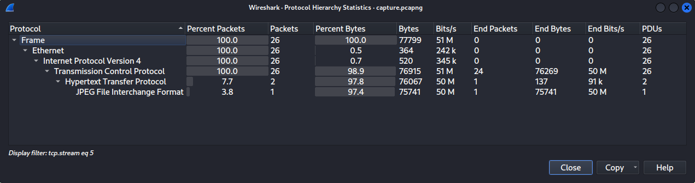
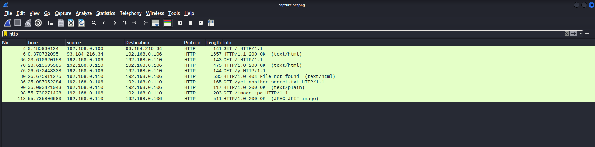
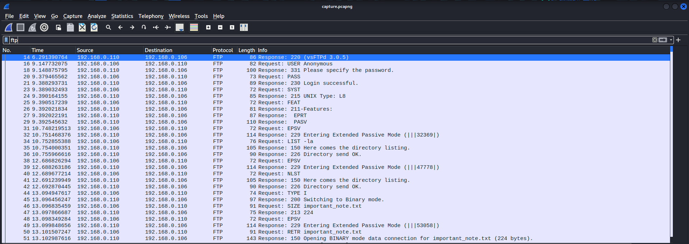
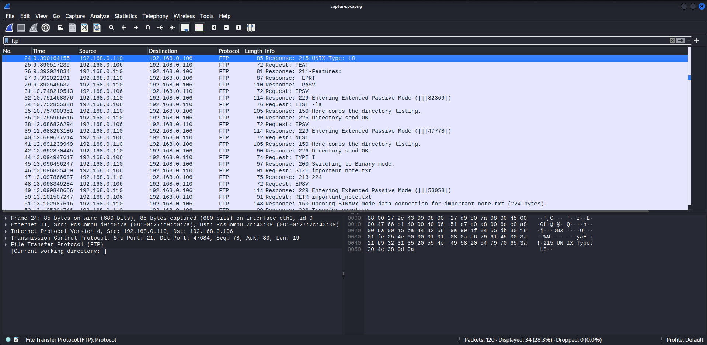
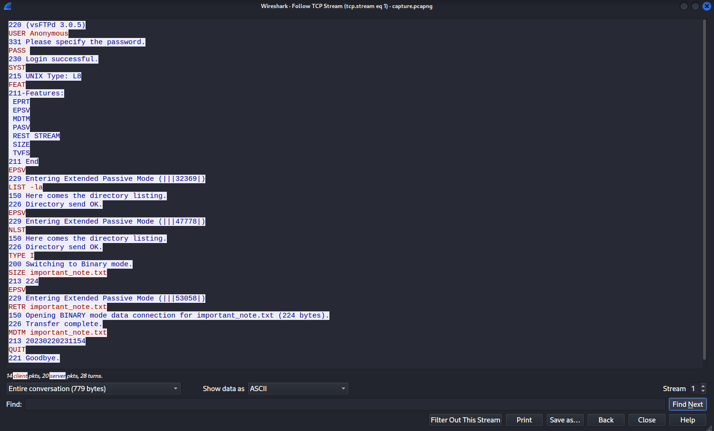
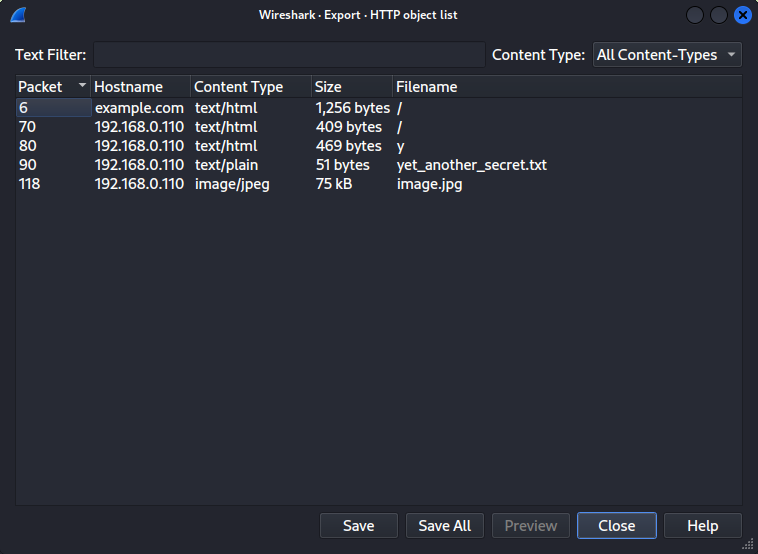

# Κακοβούλια Επικοινωνία & Ανάλυση Κίνησης Δικτύου (Network Traffic Forensics)

> 🇬🇷 Ελληνική έκδοση του [Lab 05 — Network Traffic Forensics](../../Lab%2005/README.md)

Στον σύγχρονο κόσμο, τα δίκτυα αποτελούν θεμελιώδη μέρος της καθημερινής μας ζωής, καθιστώντας δυνατή την επικοινωνία μας, την πρόσβαση σε πληροφορίες και την εκτέλεση διαφόρων δραστηριοτήτων στο διαδίκτυο. Ωστόσο, τα δίκτυα αποτελούν επίσης πρωταρχικό στόχο κακόβουλων παραγόντων (bad actors) που επιδιώκουν να προκαλέσουν ζημιά εκμεταλλευόμενοι ευπάθειες.

Σε αυτό το εργαστήριο (lab), θα ξεκινήσουμε με μια ανασκόπηση των βασικών εννοιών των δικτύων, συμπεριλαμβανομένων των διευθύνσεων IP (IP addresses), των πρωτοκόλλων (protocols) και των θυρών (ports). Θα δούμε πώς αυτά τα στοιχεία συνεργάζονται μεταξύ τους για να διευκολύνουν την επικοινωνία μεταξύ συσκευών.

Στη συνέχεια, θα προχωρήσουμε στην εντοπιστική (forensic) ανάλυση της κίνησης δικτύου. Θα αναλύσουμε καταγεγραμμένη κίνηση (capture) ζητώντας να εντοπίσουμε ύποπτη ή κακόβουλη δραστηριότητα — αυτό περιλαμβάνει την αναζήτηση ανωμαλιών στα μοτίβα κίνησης, τον εντοπισμό προσπαθειών μη εξουσιοδοτημένης πρόσβασης και την εντοπισμό της πηγής τυχόν επιθέσεων.

> **Συμβουλή:** Η κίνηση δικτύου είναι ένα από τα πιο «αξιόπιστα» είδη ενδείξεων (evidence) στην εντοπιστική, επειδή είναι δύσκολο για έναν επιτιθέμενο να την αλλάξει *αφού* έχει καταγραφεί. Σε αντίθεση με αρχεία σε δίσκο που μπορούν να διαγραφούν ή να τροποποιηθούν, μια αποθηκευμένη καταγραφή (pcap) είναι ένα στιγμιότυπο του δικτύου που παραμένει αμετάβλητο.

# Ανασκόπηση Βασικών Εννοιών Δικτύου

Απλά εκφραζόμενοι, ένα δίκτυο (network) είναι μια ομάδα συσκευών που είναι συνδεδεμένες μεταξύ τους για να επικοινωνούν, να μοιράζονται πληροφορίες, αρχεία και πόρους. Για να επικοινωνήσουν μεταξύ τους, αυτές οι συσκευές πρέπει να διαθέτουν μια διεύθυνση IP, ένα πρωτόκολλο και μια θύρα — και η κατανόησή τους είναι ζωτικής σημασίας για κάθε ειδικό εντοπιστικής (digital forensics analyst), διότι αυτές οι βάσεις αποτελούν τα θεμέλια για την έρευνα οποιασδήποτε κακόβουλης δραστηριότητας σε ένα δίκτυο.

## Διευθύνσεις IP (IP Addresses)

Μια διεύθυνση IP είναι ένα μοναδικό αναγνωριστικό που αποδίδεται σε κάθε συσκευή σε ένα δίκτυο. Χρησιμοποιείται για να ταυτοποιήσει τη θέση της συσκευής και να διευκολύνει την επικοινωνία με άλλες συσκευές. Παράδειγμα διεύθυνσης IP είναι η «192.168.1.1».

> **Συμβουλή:** Σκεφτείτε τη διεύθυνση IP σαν την «ταχυδρομική διεύθυνση» ενός συσκευαστή στο δίκτυο: χωρίς αυτήν, τα πακέτα (packets) δεν γνωρίζουν πού να πάνε. Στην εντοπιστική, οι διευθύνσεις IP της πηγής (source) και του προορισμού (destination) είναι συνήθως το πρώτο πράγμα που καταγράφουμε, γιατί μας δείχνουν *ποιος* μίλησε με *ποιον*.

## Πρωτόκολλα (Protocols)

Ένα πρωτόκολλο είναι ένα σύνολο κανόνων που διέπουν την επικοινωνία μεταξύ συσκευών σε ένα δίκτυο. Κοινά πρωτόκολλα περιλαμβάνουν τα HTTP, SSH και FTP.

Για παράδειγμα, όταν περιηγείστε σε μια ιστοσελίδα, ο υπολογιστής σας στέλνει ένα αίτημα HTTP (request) προς τον διακομιστή ιστοσελίδων (web server), ο οποίος απαντά με μια απάντηση HTTP (response) που περιέχει την ιστοσελίδα που ζητήσατε.

> **Τι πρέπει να βλέπετε και γιατί:** Κάθε πρωτόκολλο έχει «υπογραφή» — συγκεκριμένο τρόπο να ξεκινά και να τερματιστεί μια επικοινωνία. Όταν εξετάζετε μια καταγραφή, το πρωτόκολλο σας λέει *τι είδους συνομιλία* βλέπετε: μια μεταφορά αρχείων (FTP), μια σύνδεση τερματικού (SSH), ένα αίτημα ιστοσελίδας (HTTP). Αυτό καθοδηγεί όλη την υπόλοιπη ανάλυση.

## Θύρες (Ports)

Μια θύρα είναι ένας αριθμός που χρησιμοποιείται για να ταυτοποιήσει μια συγκεκριμένη εφαρμογή ή υπηρεσία σε μια συσκευή. Όταν μια συσκευή λαμβάνει κίνηση δικτύου, χρησιμοποιεί τον αριθμό της θύρας για να καθορίσει σε ποια εφαρμογή ή υπηρεσία απευθύνεται η κίνηση.

Για παράδειγμα, όταν απευθύνεστε σε μια ιστοσελίδα χρησιμοποιώντας HTTP, ο περιηγητής σας στέλνει το αίτημα στη θύρα 80 του διακομιστή ιστοσελίδων.

> **Προσοχή:** Οι περισσότερες επιθέσεις εντοπίζονται τελικά σε *ασυνήθιστες* συνδυασμούς πρωτοκόλλου και θύρας — για παράδειγμα κίνηση SSH που εξέρχεται από έναν διακομιστή ιστοσελίδων ή ένα αίτημα στη θύρα 445 από μια δημόσια συσκευή. Η απόκλιση από το «αναμενόμενο» είναι το πρώτο σημάδι που ψάχνουμε.

Η ακόλουθη πίνακας παρουσιάζει την αντιστοίχιση μεταξύ ορισμένων συχνά χρησιμοποιούμενων πρωτοκόλλων και των αριθμών θυρών τους:

| Protocol | Port |
| --- | --- |
| FTP (File Transfer Protocol) | 21 |
| SSH (Secure Shell) | 22 |
| Telnet (Teletype Network) | 23 |
| SMTP (Simple Mail Transfer Protocol) | 25 |
| DNS (Domain Name System) | 53 |
| DHCP (Dynamic Host Configuration Protocol) | 67/68 |
| HTTP (Hyper Text Transfer Protocol) | 80 |
| HTTPS (Hyper Text Transfer Protocol Secure) | 443 |
| SMB (Server Message Block) | 445 |
| RDP (Remote Desktop Protocol) | 3389 |
| ICMP (Internet Control Message Protocol) | N/A |

> **Συμβουλή:** Δεν χρειάζεται να απομνημονεύσετε ολόκληρο τον πίνακα — με την πράξη οι πιο συχνές θύρες (22, 80, 443, 445) έρχονται φυσικά. Ωστόσο, να γνωρίζετε ότι ο αριθμός θύρας είναι μόνο μια *υπόθεση*: επιθέσεις συχνά χρησιμοποιούν θύρες που μιμούνται γνωστές υπηρεσίες για να μην αναγνωριστούν.

# Εντοπιστική Κίνησης Δικτύου (Network Traffic Forensics)

Σε αυτή την ενότητα, ας εξερευνήσουμε τα εργαλεία και τις τεχνικές που χρησιμοποιούνται για την καταγραφή και ανάλυση κίνησης δικτύου, την εξαγωγή πολύτιμων πληροφοριών, τον εντοπισμό ύποπτης συμπεριφοράς και την έρευνα επιθέσεων στο δίκτυο.

## Καταγραφή Κίνησης Δικτύου

Η προϋπόθεση για να εκτελέσετε εντοπιστική κίνησης δικτύου είναι να καταγράψετε την ίδια την κίνηση. Αυτό μπορεί να επιτευχθεί με ένα εργαλείο καταγραφής πακέτων δικτύου (network packet capture) ή «sniffing», όπως το Wireshark ή το tcpdump. Για αυτό το εργαστήριο θα χρησιμοποιήσουμε κυρίως το Wireshark, οπότα βεβαιωθείτε ότι είναι εγκατεστημένο στον υπολογιστή σας.

Τι συμβαίνει όταν κάνουμε καταγραφή; Το εργαλείο «βλέπει» κάθε πακέτο που περνά από τη διεπαφή δικτύου (network interface) του υπολογιστή και το αποθηκεύει μαζί με μεταδεδομένα (metadata), όπως ώρα λήψης, μήκος πακέτου και διευθύνσεις πηγής/προορισμού. Αυτό το αρχείο — η καταγραφή — είναι το «στιγμιότυπο» που θα αναλύσουμε στη συνέχεια.

Για να καταγράψετε ζωντανή κίνηση δικτύου, ακολουθήστε τα παρακάτω βήματα:

1. Ανοίξτε το Wireshark πληκτρολογώντας `wireshark` στο τερματικό σε Linux ή μέσω του μενού Start σε Windows.
2. Μόλις ανοίξει, επιλέξτε μια διεπαφή δικτύου (network interface) στην οποία θέλετε να κάνετε καταγραφή. Στις περισσότερες περιπτώσεις είναι η `eth0`.
3. Πατήστε το εικονίδιο του μπλε πτερυγίου του καρχαρία στην επάνω αριστερή γωνία του παραθύρου για να ξεκινήσετε την καταγραφή.
4. Στις περισσότερες περιπτώσεις θα πρέπει να βλέπετε ήδη πακέτα να εμφανίζονται στο Wireshark. Αν όχι, μπορείτε να δημιουργήσετε λίγη κίνηση επισκεπτόμενοι μια ιστοσελίδα στον περιηγητή σας, όπως την [https://www.google.com/](https://www.google.com/).
5. Για να σταματήσετε την καταγραφή, πατήστε το κόκκινο κουμπί διακοπής στην επάνω αριστερή γωνία.
6. Για να αποθηκεύσετε την καταγεγραμμένη κίνηση, πηγαίνετε στο File → Save as και επιλέξτε όνομα και τοποθεσία για την αποθήκευση του αρχείου καταγραφής.

> **Σημείωση:** Από προεπιλογή, η επέκταση του αρχείου πρέπει να είναι `.pcapng`. Μια άλλη συχνά χρησιμοποιούμενη επέκταση για αρχεία καταγραφής (capture files) είναι το `.pcap`.

> **Προσοχή:** Μην ανοίγετε ποτέ το αρχείο καταγραφής σε άλλο εργαλείο που ενδέχεται να το τροποποιήσει, και αποθηκεύστε πάντα ένα αντίγραφο πριν ξεκινήσετε την ανάλυση. Η αρχική καταγραφή πρέπει να παραμένει αμετάβλητη — αλλιώς μπορείτε να χάσετε ενδείξεις ή να μην είστε πλέον σε θέση να αποδείξετε την ακεραιότητά της.

## Ανάλυση Κίνησης Δικτύου

Το επόμενο βήμα στην εντοπιστική κίνησης δικτύου είναι η ανάλυση της καταγεγραμμένης κίνησης. Αυτό περιλαμβάνει την εξέταση της κίνησης για τον εντοπισμό ύποπτης δραστηριότητας, προσπαθειών μη εξουσιοδοτημένης πρόσβασης και την εξαγωγή πληροφοριών όπως:

- διευθύνσεις IP πηγής και προορισμού και αντίστοιχες θύρες
- πρωτόκολλα
- δεδομένα/payload που μεταδόθηκαν
- ημερομηνία και ώρα της δραστηριότητας

> **Τι πρέπει να βλέπετε και γιατί:** Σκεφτείτε την ανάλυση ως μια διαδικασία «από γενικού προς ειδικούς»: πρώτα καταλαβαίνετε τι *αναμένεται* να βλέπετε στο φυσιολογικό δίκτυο, και μετά ψάχνετε αυτό που *αποκλίνει*. Χωρίς αυτή τη βάση σύγκρισης, μια καταγραφή με εκατομμύρια πακέτα μοιάζει ακατανόητη.

Παρόλο που υπάρχουν πολλές λειτουργίες διαθέσιμες στο Wireshark για την εντοπιστική δικτύου, ορισμένες από τις πιο συχνά χρησιμοποιούμενες περιλαμβάνουν την προβολή της ιεραρχίας πρωτοκόλλων, την εφαρμογή φίλτρων, την προβολή των λεπτομερειών πακέτου και των bytes πακέτου, την ακολούθηση ροών TCP (TCP streams) και την εξαγωγή αντικειμένων (objects).

Για να ξεκινήσετε την ανάλυση ενός δείγματος καταγεγραμμένης κίνησης, κατεβάστε το αρχείο από το URL [https://github.com/vonderchild/digital-forensics-lab/blob/main/Lab 05/files/capture.pcapng](https://github.com/vonderchild/digital-forensics-lab/blob/main/Lab%2005/files/capture.pcapng) και ανοίξτε το στο Wireshark.

### Ιεραρχία Πρωτοκόλλων (Protocol Hierarchy)

Για να έχετε μια γενική εικόνα της καταγεγραμμένης κίνησης δικτύου, μπορούμε να πάμε στο Statistics → Protocol Hierarchy για να δούμε ποια πρωτόκολλα χρησιμοποιούνται στην καταγραφή και τη σχετική ποσότητα πακέτων για κάθε πρωτόκολλο. Αυτό μας βοηθά να περιορίσουμε την ανάλυση και να φιλτράρουμε την ύποπτη κίνηση.

> **Τι πρέπει να βλέπετε και γιατί:** Αν το 99% της κίνησης είναι HTTPS και υπάρχει ένα μικρό ποσοστό FTP σε ένα δίκτυο όπου δεν αναμένεται καθόλου FTP, αυτό το μικρό ποσοστό είναι πιθανότατα το σημείο ενδιαφέροντος. Η ιεραρχία πρωτοκόλλων σας δείχνει αμέσως πού να ρίξετε το βλέμμα.

### Φίλτρα (Filters)

Μπορούμε επίσης να εφαρμόσουμε φίλτρα για να επικεντρωθούμε στην κίνηση που μας ενδιαφέρει. Αυτό καθιστά πιο εύκολη την ανάλυση και την προβολή μόνο των σχετικών πακέτων που χρειαζόμαστε.

> **Συμβουλή:** Τα φίλτρα του Wireshark είναι το πιο ισχυρό εργαλείο στο αρσενάλι του αναλυτή. Ένα συχνό λάθος είναι να διαβάζετε χιλιάδες πακέτα χειροκίνητα· με ένα σωστό φίλτρο μπορείτε να μειώσετε την καταγραφή σε δεκάδες πακέτα που έχουν πραγματική σημασία.

Η ακόλουθη εικόνα δείχνει πώς φιλτράρουμε πακέτα HTTP:

Παρόμοια, μπορούμε να φιλτράρουμε πακέτα FTP:

Για να δείτε ποια άλλα φίλτρα υποστηρίζει το Wireshark, ανατρέξτε στο [https://wiki.wireshark.org/DisplayFilters](https://wiki.wireshark.org/DisplayFilters).

### Λεπτομέρειες Πακέτου και Bytes Πακέτου (Packet Details and Packet Bytes)

Το πάνελ λεπτομερειών πακέτου (packet details) δείχνει το επιλεγμένο πακέτο με πιο αναλυτική μορφή, ενώ το πάνελ bytes πακέτου (packet bytes) δείχνει τα δεδομένα του επιλεγμένου πακέτου σε μορφή hexdump. Αυτά τα πάνελ βρίσκονται στο κάτω μέρος του παραθύρου του Wireshark.

> **Συμβουλή:** Το πάνελ details είναι ο «χάρτης» του πακέτου: εκεί βλέπετε σε ποιο επίπεδο (Ethernet, IP, TCP, εφαρμογή) υπάρχει κάθε πληροφορία. Το πάνελ bytes είναι η «πρώτη ύλη» — τα ίδια δεδομένα σε δεκαεξαδική μορφή. Όταν θέλετε να δείτε το περιεχόμενο μιας σύνδεσης ανθρώπινα αναγνώσιμο, χρησιμοποιείτε το Follow TCP Stream αντί να διαβάζετε bytes ένα προς ένα.

### Ακολούθηση Ροής TCP (Follow TCP Stream)

Η λειτουργία Follow TCP Stream στο Wireshark εμφανίζει ολόκληρη τη συνομιλία για μια συγκεκριμένη σύνδεση TCP. Αυτό καθιστά ευκολότερη την προβολή πλήρων λεπτομερειών της σύνδεσης και τυχόν δεδομένων που μεταδόθηκαν κατά τη διάρκειά της. Για να χρησιμοποιήσετε αυτή τη λειτουργία, μπορείτε να δεξιοκλικάρετε σε οποιοδήποτε πακέτο και στη συνέχεια να επιλέξετε Follow → TCP Stream.

> **Τι πρέπει να βλέπετε και γιατί:** Στην καταγραφή, τα πακέτα είναι «σπασμένα» — το καθένα περιέχει ένα κομμάτι της επικοινωνίας. Το Follow TCP Stream τα ξανασυνθέτε στη σωστή σειρά και σας δείχνει τη συνομιλία όπως την «είδαν» οι δύο τερματικές. Είναι το ιδανικό εργαλείο για να δείτε αιτήματα και απαντήσεις, κρυφές εντολές ή διασυρμό ευαισθητικών δεδομένων.

### Εξαγωγή Αντικειμένων (Export Objects)

Η λειτουργία Export Objects μας επιτρέπει να εξάγουμε αρχεία από την καταγεγραμμένη κίνηση δικτύου. Για να αποκτήσετε πρόσβαση σε αυτή τη λειτουργία, μπορείτε να επιλέξετε File" → "Export Objects".

Στο υπομενού "HTTP", μπορούμε να δούμε μια λίστα αρχείων που μεταφέρθηκαν μέσω HTTP κατά τη διάρκεια της καταγραφής. Αφού επιλέξουμε το αρχείο (ή τα αρχεία) που θέλουμε να εξάγουμε, μπορούμε να τα αποθηκεύσουμε πατώντας το κουμπί "Save".

> **Προσοχή:** Η εξαγωγή αρχείων από καταγραφή δεν σημαίνει ότι το αρχείο είναι αθώο. Ένα εξαγόμενο αρχείο μπορεί να είναι κακόβουλο λογομισμικό, που μεταφέρθηκε ακριβώς μέσω της κίνησης που εξετάζετε. Αναλύστε το σε ένα ασφαλές περιβάλλον και — όπως και με κάθε ένδειξη — κρατήστε τα hashes του για να αποδείξετε την ακεραιότητά του.

## Συμπέρασμα

Η εντοπιστική κίνησης δικτύου αποτελεί ουσιαστικό κομμάτι της ψηφιακής εντοπιστικής, καθώς μας επιτρέπει να εντοπίσουμε κακόβουλη δραστηριότητα, πιθανές παραβιάσεις ασφάλειας και άλλες ανωμαλίες σε ένα δίκτυο. Πέρα από το Wireshark, υπάρχουν και άλλα εργαλεία όπως τα Network Miner, Brim και Zeek, που είναι εξαιρετικά για την ανάλυση καταγεγραμμένης κίνησης, οπότε αξίζει να τα εξετάσετε και να πειραματιστείτε μαζί τους.

# Ασκήσεις

Η οργάνωση που σας είχε προηγουμένως προσλάβει για να διερευνήσετε την επίθεση στον ιστό (web attack) επικοινώνησε ξανά μαζί σας. Αυτή τη φορά, κατάφεραν να καταγράψουν την κίνηση δικτύου κατά τη διάρκεια της επίθεσης. Σας έχουν παραδώσει το αρχείο της καταγεγραμμένης κίνησης για να βοηθήσετε στο να συναρμολογηθούν οι προθέσεις του επιτιθεμένου και το εύρος της ζημιάς. Η δουλειά σας είναι να αναλύσετε την καταγεγραμμένη κίνηση και να απαντήσετε στις ακόλουθες ερωτήσεις:

1. Ποια διαφορετικά πρωτόκολλα υπάρχουν στο αρχείο καταγεγραμμένης κίνησης;
2. Φαίνεται ότι ο επιτιθέμενος προσπαθεί να κάνει brute force (δοκιμή όλων των πιθανών συνδυασμών) στον κωδικό πρόσβασης FTP του χρήστη. Μπορείτε να βρείτε κάποια ένδειξη σωστού κωδικού, και αν ναι, ποια είναι;
3. Ποιες πρόσθετες πληροφορίες μπόρεσε ο επιτιθέμενος να εξαγάγει από τον λογαριασμό FTP του χρήστη;
4. Ποιες ενέργειες έκανε ο επιτιθέμενος με τις πληροφορίες που απέκτησε από τον λογαριασμό FTP του χρήστη;
5. Ποιος είναι ο κωδικός πρόσβασης του λογαριασμού root;
6. Μπορείτε να εντοπίσετε τους αριθμούς πακέτων στους οποίους ο επιτιθέμενος εκμεταλλεύτηκε την ευπάθεια Remote Code Execution για να αποκτήσει πρόσβαση στο σύστημα; Ποιο ήταν ακριβώς το payload που χρησιμοποίησε ο επιτιθέμενος;
7. Αφού απέκτησε πρόσβαση στο σύστημα, τι φαίνεται να κάνει ο επιτιθέμενος;
8. Ο επιτιθέμενος διάβασε ένα αρχείο από τον κατάλογο αρχικοποίησης (home directory) του root. Τι υπήρχε σε αυτό το αρχείο;
9. Ο επιτιθέμενος κατέβασε ένα αρχείο μέσα στον κατάλογο αρχικοποίησης του root. Ποιος είναι ο σκοπός αυτού του αρχείου;
10. Ποιες πληροφορίες μεταδόθηκαν μέσω του κρυφά εγκατεστημένου καναλιού επικοινωνίας του επιτιθεμένου;

Το αρχείο καταγραφής κίνησης μπορεί να κατέβετε από το [https://github.com/vonderchild/digital-forensics-lab/blob/main/Lab 05/files/challenge.pcapng](https://github.com/vonderchild/digital-forensics-lab/blob/main/Lab%2005/files/challenge.pcapng).
