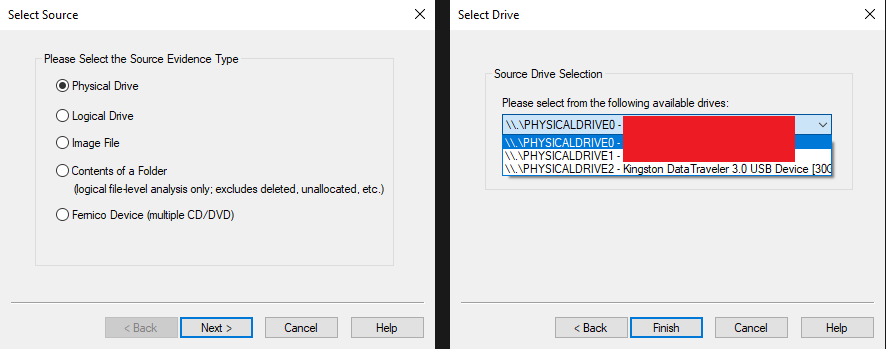
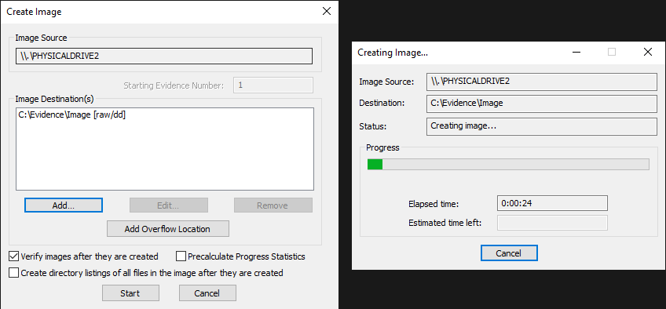
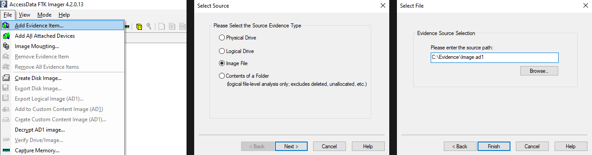
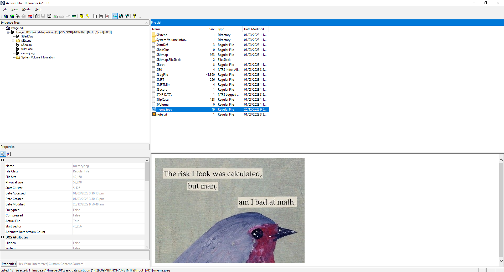

# Εντοπιστική Εικόνας Δίσκου (Disk Image Forensics)

> 🇬🇷 Ελληνική έκδοση του [Lab 06 — Disk Image Forensics](../../Lab%2006/README.md)

Οι ψηφιακές συσκευές αποθήκευσης, όπως οι σκληροί δίσκοι (hard drives), οι δίσκοι στερεής κατάστασης (solid-state drives) και οι συσκευές USB, περιέχουν τεράστιες ποσότητες δεδομένων που μπορεί να αποδειχθούν κρίσιμα για έρευνες ψηφιακής εντοπιστικής. Η εντοπιστική εικόνας δίσκου (disk image forensics) είναι η διαδικασία ανάλυσης αυτών των συσκευών και του περιεχομένου τους με στόχο τον εντοπισμό χρήσιμων πληροφοριών κατά τη διάρκεια μιας έρευνας.

Σε αυτό το εργαστήριο (lab), θα εξερευνήσουμε τα βασικά της εντοπιστικής εικόνας δίσκου, συμπεριλαμβανομένων της βασικής ορολογίας και των βημάτων που περιλαμβάνουν την απόκτηση (acquisition) και την ανάλυση μιας εικόνας δίσκου.

> **Συμβουλή:** Πριν ξεκινήσετε, αξίζει να καταλάβετε τη λογική πίσω από όλη αυτή τη διαδικασία: στην εντοπιστική *δεν* εργαζόμαστε ποτέ απευθείας στην αρχική συσκευή. Αντί γι' αυτό, φτιάχνουμε μια πιστή αντιγραφή και αναλύουμε εκείνη. Έτσι, ακόμη κι αν κάτι πάει στραβά κατά την ανάλυση, το αρχικό στοιχείο (evidence) παραμένει ανέπαφο.

## Βασική Ορολογία (Basic Terminology)

### Εικόνα Δίσκου (Disk Image)

Μια εικόνα δίσκου (disk image) είναι μια αντιγραφή bit προς bit ενός ολόκληρου δίσκου (όπως σκληρού δίσκου, USB κ.λπ.) ή μιας κατάτμησης (partition), η οποία διατηρεί ακριβώς το περιεχόμενο και τη δομή των αρχικών δεδομένων. Περιλαμβάνει όχι μόνο τα αρχεία και τους φακέλους, αλλά και τον κενό χώρο, τα μεταδεδομένα (metadata) και άλλα κρυφά δεδομένα που δεν είναι συνήθως ορατά.

> **Γιατί μετράει στις πραγματικές έρευνες:** Ένα απλό αντίγραφο αρχείων (copy-paste) χάνει τα περισσότερα: τα δεδομένα που έχουν διαγραφεί αλλά δεν έχουν αντικατασταθεί, τις χρονικές στιγμές (timestamps) που ίσως έχουν αλλάξει, και τις εγγραφές του συστήματος αρχείων. Η εικόνα δίσκου, επειδή είναι bit προς bit, κρατά *όλα* αυτά — ακόμη και τον χώρο από διεγραμμένα αρχεία, από τον οποίο συχνά ανακτώνται πολύτιμα στοιχεία.

### Δημιουργία Εικόνας Δίσκου (Disk Imaging)

Η δημιουργία εικόνας δίσκου (disk imaging) είναι η διαδικασία δημιουργίας μιας εντοπιστικής αντιγραφής μιας συσκευής αποθήκευσης, όπως σκληρού δίσκου ή συσκευής USB. Αποτελεί κρίσιμο βήμα στη ψηφιακή εντοπιστική, διότι εγγυάται ότι τα αρχικά δεδομένα παραμένουν ακέραια και αμετάβλητα. Κρυπτογραφικά hashes χρησιμοποιούνται για να επαληθευτεί ότι η αντιγραφή είναι ακριβώς ίδια με το αρχικό, εξασφαλίζοντας ότι δεν έχουν γίνει τροποποιήσεις στα αρχικά δεδομένα. Αυτή η προσέγγιση επιτρέπει στους ερευνητές εντοπιστικής να εργάζονται με την αντιγραφή χωρίς να ανησυχούν ότι θα τροποποιήσουν κατά λάθος το αρχικό.

> **Γιατί τα hashes έχουν τόσο μεγάλη σημασία για την ακεραιότητα των στοιχείων:** Ένα hash (π.χ. MD5 ή SHA1) είναι μια «ψηφιακή δακτυλική αποτύπωση» ενός αρχείου ή ενός ολόκληρου δίσκου: ένας μικρός αριθμός που προκύπτει από τα δεδομένα με τέτοιο τρόπο που *οποιαδήποτε* αλλαγή — ακόμη και ένα μόνο byte — δίνει εντελώς διαφορετικό αποτέλεσμα. Καταγράφοντας το hash της αρχικής συσκευής *πριν* από την αντιγραφή και ξαναϋπολογίζοντάς το στην αντιγραφή *μετά*, μπορούμε να αποδείξουμε ότι οι δύο είναι ταυτικές. Χωρίς αυτή την επαλήθευση, ένας δικαστής ή αντίπαλος δικηγόρος μπορεί να αμφισβητήσει αν τα στοιχεία που παρουσιάζετε είναι όντως αυτά που βρέθηκαν στη συσκευή.

> **Προσοχή:** Συγκρίνετε πάντα τα hashes με το εργαλείο που δημιούργησε την εικόνα, όχι με εμπιστοσύνη. Αν το hash της εικόνας δεν ταιριάζει με το hash της πηγής, η αντιγραφή είναι ελαττωματική ή έχει τροποποιηθεί και δεν πρέπει να χρησιμοποιηθεί ως στοιχείο.

### Εντοπιστική Εικόνας Δίσκου (Disk Image Forensics)

Η εντοπιστική εικόνας δίσκου είναι η διαδικασία ανάλυσης μιας εικόνας δίσκου για την αναζήτηση στοιχείων ενδιαφέροντος. Αυτό περιλαμβάνει τη χρήση εργαλείων όπως Autopsy και FTK Imager για τον εντοπισμό χρήσιμων πληροφοριών και την ανάλυση τεχνουργημάτων συστήματος (system artifacts) όπως το μητρώο των Windows (Windows Registry), οι περιηγητές ιστού (web browsers), τα αρχεία LNK, τα αρχεία καταγραφής γεγονότων (event logs), το ιστορικό της κονσόλας εντολών (command prompt history) κ.λπ.

Υπάρχουν αρκετά εργαλεία που μπορούν να χρησιμοποιηθούν για την εντοπιστική εικόνας δίσκου, όπως το Autopsy και το FTK Imager. Αν και το Autopsy προσφέρει περισσότερες λειτουργίες κατά την ανάλυση, εμείς θα χρησιμοποιήσουμε το FTK Imager λόγω της ελαφρότητάς του.

> **Τι πρέπει να βλέπετε και γιατί:** Διαλέγοντας εργαλεία, σκεφτείτε τι είδους ερώτημα θέλετε να απαντήσετε. Το FTK Imager είναι εξαιρετικό για *γρήγορη περιήγηση* και εξαγωγή αρχείων· το Autopsy είναι καλύτερο για *συστηματική ανάλυση* σε μεγάλες εικόνες, όπου χρειάζεστε αυτόματη κατάταξη χρονικών στιγμών, ανάκτηση διεγραμμένων αρχείων και αναφορές. Στην πραγματικότητα, οι περισσότερες έρευνες χρησιμοποιούν και τα δύο σε διαφορετικά στάδια.

Το εργαλείο μπορεί να κατέβετε από το [https://www.exterro.com/ftk-imager](https://www.exterro.com/ftk-imager), οπότα βεβαιωθείτε ότι έχετε εγκαταστήσει το FTK Imager στον υπολογιστή σας πριν προχωρήσετε στο εργαστήριο.

# Απόκτηση Εικόνας Δίσκου (Acquiring a Disk Image)

Ακολουθεί ένα οδηγός βήμα προς βήμα για τη δημιουργία μιας εικόνας δίσκου με το FTK Imager:

1. Ανοίξτε το FTK Imager, πηγαίνετε στο File → Create Disk Image.
    
    
    
2. Επιλέξτε Physical Drive, στη συνέχεια πατήστε next και επιλέξτε τον δίσκο για τον οποίο θέλετε να δημιουργήσετε εικόνα. Για αυτό το παράδειγμα, θα επιλέξω τη δική μου συσκευή USB.
    
    
    
3. Στη συνέχεια, πατήστε το κουμπί Add κάτω από τις Image Destination(s). Έπειτα, επιλέξτε ως τύπο εικόνα προορισμού το Raw (dd).
    
    
    
4. Εισαγάγετε τα σχετικά στοιχεία του στοιχείου (evidence), επιλέξτε στη συνέχεια έναν φάκελο και ένα όνομα για την αποθήκευση της εικόνας δίσκου.
    
    
    
5. Τέλος, πατήστε start για να ξεκινήσει η διαδικασία δημιουργίας. Μπορεί να χρειαστούν λίγα λεπτά για να ολοκληρωθεί, ανάλογα με το μέγεθος του δίσκου.
    
    
    

> **Συμβουλή:** Κατά τη διάρκεια της δημιουργίας της εικόνας, έχετε δύο σημαντικές ευκαιρίες: πρώτον, να καταγράψετε το hash που υπολογίζει το FTK Imager για την πηγή και για την εικόνα — πρέπει να ταιριάζουν. Δεύτερον, να συμπληρώσετε με ακρίβεια τα στοιχεία απόδειξης (evidence metadata): ποιος την απέκτησε, πότε, από ποια συσκευή. Μια εικόνα χωρίς αξιόπιστη αλυσίδα κράτησης (chain of custody) μπορεί να απορριφθεί ως στοιχείο, όσο καλή κι αν είναι η τεχνική της ανάλυση.

> **Προσοχή:** Μην χρησιμοποιείτε ποτέ τη συσκευή κατά τη διάρκεια της δημιουργίας της εικόνας. Κάθε νέο αρχείο που γράφεται στο δίσκο μπορεί να αντικαταστήσει διεγραμμένα δεδομένα που ακόμη θα μπορούσαν να ανακτηθούν — και τότε η εικόνα θα αντικατοπτρίζει ήδη κατεστραμμένο στοιχείο.

# Ανάλυση Εικόνας Δίσκου (Analyzing a Disk Image)

Αφού έχει αποκτηθεί η εικόνα δίσκου, το επόμενο βήμα είναι η ανάλυσή της για τυχόν στοιχεία που σχετίζονται με την έρευνα.

>💡 Although FTK Imager is lightweight, it requires us to have prior knowledge about the files that are present inside a disk image and their locations. On the other hand, Autopsy automatically parses useful information such as images, internet history, geolocation, timeline, etc. It can also recover deleted files, search for patterns within the disk image, and generate detailed reports. So I'll suggest you to explore it as well.

> **💡 Μετάφραση:** Αν και το FTK Imager είναι ελαφρύ, απαιτεί να γνωρίζουμε εκ των προτέρων ποια αρχεία υπάρχουν μέσα σε μια εικόνα δίσκου και πού βρίσκονται. Αντίθετα, το Autopsy αναλύει αυτόματα χρήσιμες πληροφορίες όπως εικόνες, ιστορικό περιήγησης στον ιστό, γεωγραφική τοποθεσία, χρονολόγιο (timeline) κ.λπ. Μπορεί επίσης να ανακτήσει διεγραμμένα αρχεία, να αναζητήσει μοτίβα μέσα στην εικόνα δίσκου και να δημιουργήσει αναλυτικές αναφορές. Οπότα σας προτείνω να το εξερευνήσετε και εσείς.

Για να κατεβάσετε την εικόνα δίσκου, χρησιμοποιήστε τον σύνδεσμο [https://github.com/vonderchild/digital-forensics-lab/blob/main/Lab 06/files/Image.ad1](https://github.com/vonderchild/digital-forensics-lab/blob/main/Lab%2006/files/Image.ad1).

Για να ανοίξετε μια εικόνα δίσκου στο FTK Imager, πατήστε στο "File" και στη συνέχεια επιλέξτε "Add Evidence Item". Από εκεί, επιλέξτε "Image File" και διαλέξτε την εικόνα δίσκου που θέλετε να αναλύσετε:

Αφού έχετε ανοίξει την εικόνα δίσκου στο FTK Imager, θα μπορείτε να δείτε τέσσερις ενότητες στο πάρελο:

- Το Evidence Tree (δέντρο στοιχείων) στην επάνω αριστερή περιοχή, το οποίο εμφανίζει την ιεραρχική διάταξη της εικόνας δίσκου.
- Το Properties (ιδιότητες) στο κάτω αριστερό, το οποίο εμφανίζει τα μεταδεδομένα που σχετίζονται με το επιλεγμένο αρχείο, όπως το όνομά του, οι ημερομηνίες τελευταίας τροποποίησης και πρόσβασης, τα hashes md5 και sha1 κ.λπ.
- Το File List (λίστα αρχείων) στο κέντρο, προς τα επάνω, το οποίο εμφανίζει τη λίστα των αρχείων και καταλόγων μέσα στην επιλεγμένη κατάτμηση ή εικόνα.
- Το Preview (προεπισκόπηση) στο κάτω μέρος, το οποίο εμφανίζει την προεπισκόπηση ή το hex περιεχόμενο του επιλεγμένου αρχείου.

> **Τι πρέπει να βλέπετε και γιατί:** Το FTK Imager σας δίνει ταυτόχρονα τρεις οπτικές γωνίες για κάθε αρχείο: *πού* βρίσκεται (Evidence Tree), *τι* είναι (Properties) και *τι* περιέχει (Preview). Στην εντοπιστική, η σύνδεση αυτών των τριών απαντήσεων είναι αυτή που μετατρέπει ένα απλό αρχείο σε ένδειξη — για παράδειγμα, ένα `note.txt` που βρέθηκε σε συγκεκριμένο κατάλογο, με συγκεκριμένη ώρα τελευταίας πρόσβασης, μπορεί να δείξει πότε και από ποιον μεταφέρθηκε.

Για να μπορέσετε να εξερευνήσετε το σύστημα αρχείων μέσα στην εικόνα δίσκου, πρέπει να επεκτείνετε το δέντρο στοιχείων που βρίσκεται στην επάνω αριστερή περιοχή:

Εμφανίζεται ο ριζικός κατάλογος (root directory) της απεικονισμένης συσκευής USB, κάτι που μας επιτρέπει να επιλέξουμε και να δούμε το περιεχόμενο οποιουδήποτε αρχείου. Για παράδειγμα, μπορούμε να αποκτήσουμε πρόσβαση και να δούμε τα αρχεία `note.txt` και `meme.jpeg` που αρχικά αποθηκεύτηκαν στη συσκευή USB.

Μπορούμε επίσης να εξάγουμε οποιοδήποτε αρχείο που ενδέχεται να ενδιαφέρει απλώς δεξιοκλικάροντας σε αυτό και επιλέγοντας "Export Files".

### Ορισμένα ουσιώδη αρχεία σε εικόνες δίσκου

- **$MFT** — Το Master File Table (Κύριος Πίνακας Αρχείων) είναι ένα σημαντικό αρχείο στα συστήματα αρχείων NTFS το οποίο αποθηκεύει πληροφορίες για όλα τα αρχεία και τους καταλόγους σε έναν τόμο (volume), συμπεριλαμβανομένων των ονομάτων, των δικαιωμάτων και των ιδιοτήτων τους. Περιέχει επίσης πληροφορίες για τη θέση κάθε αρχείου στον δίσκο.
- **$MFTMirr** — Το αρχείο αυτό σημαίνει MFT Mirror (Καθρέφτης MFT) και λειτουργεί ως αντίγραφο ασφαλείας του $MFT, και είναι κρίσιμο στην περίπτωση που το αρχικό $MFT καταστραφεί.
- **$LogFile** — Το αρχείο αυτό καταγράφει πληροφορίες ημερολογίου συναλλαγών των μεταδεδομένων (περιοχή MFT), και μπορεί να χρησιμοποιηθεί για την ανάκτηση μετά από καταστροφές συστήματος.

> **Τι πρέπει να βλέπετε και γιατί:** Το MFT είναι, με μια έννοια, το «ευρετήριο» ολόκληρου του δίσκου: κάθε αρχείο έχει μια εγγραφή εκεί, ακόμη κι αν το ίδιο το αρχείο έχει διαγραφεί. Γι' αυτό οι ερευνητές κοιτούν το MFT τόσο νωρίς σε μια έρευνα — μπορεί να αποκαλύψει αρχεία, ονόματα και χρονικές στιγμές που δεν «φαίνονται» πουθενά αλλού στο σύστημα.

Για την ανάλυση αυτών των αρχείων, υπάρχουν διαθέσιμα αρκετά εργαλεία, όπως το [analyzeMFT](https://github.com/dkovar/analyzeMFT), ή το [MFTECmd](https://github.com/EricZimmerman/MFTECmd) το οποίο είναι διαθέσιμο για λήψη στο [https://ericzimmerman.github.io/#!index.md](https://ericzimmerman.github.io/#!index.md).

>💡 There may be a lot more files that may be present in a disk image like $Boot, $Secure, $Volume, etc. However, I encourage you to explore these on your own as part of your learning process.

> **💡 Μετάφραση:** Μπορεί να υπάρχουν πολύ περισσότερα αρχεία σε μια εικόνα δίσκου, όπως $Boot, $Secure, $Volume κ.λπ. Ωστόσο, σας ενθαρρύνω να τα εξερευνήσετε μόνοι σας ως μέρος της διαδικασίας μάθησής σας.

# Συμπέρασμα

Σε αυτό το εργαστήριο, καλύψαμε ορισμένη βασική ορολογία και στη συνέχεια προχωρήσαμε στη μάθηση του τρόπου με τον οποίο αποκτάται μια εικόνα δίσκου. Μετά από αυτό, εξερευνήσαμε ορισμένα αρχεία που συχνά συναντώνται σε μια εικόνα δίσκου και πραγματοποιήσαμε ακόμη και μια βασική ανάλυση με το FTK Imager. Ωστόσο, είναι σημαντικό να έχετε υπόψη ότι η εικόνα δίσκου που αναλύσαμε ήταν μια μικρή συσκευή USB και ότι υπάρχει πολύ περισσότερο να αναλυθεί σε μια μεγαλύτερη εικόνα σκληρού δίσκου. Αυτό μπορεί να απαιτεί την αναζήτηση συνηθισμένων τεχνουργημάτων (artifacts), όπως το Windows Registry, το ιστορικό περιήγησης του περιηγητή (Browser History), τα αρχεία καταγραφής γεγονότων (Event Logs), το ιστορικό της κονσόλας (Console History) και οτιδήποτε μπορεί να προσφέρει πολύτιμες πληροφορίες για την έρευνα.

# Ασκήσεις

Χρησιμοποιήστε την εικόνα δίσκου από την ενότητα [Ανάλυση Εικόνας Δίσκου](#ανάλυση-εικόνας-δίσκου-analyzing-a-disk-image) για να απαντήσετε στις ακόλουθες ερωτήσεις:

1. Ποια είναι τα hashes MD5 και SHA1 του αρχείου `note.txt`;
2. Ποιος είναι ο αριθμός εγγραφής MFT του αρχείου `note.txt`; Η απάντηση μπορεί να διαφέρει ανάλογα με τη μέθοδο που χρησιμοποιείται.
3. Μπορείτε να καθορίσετε τον γονικό κατάλογο του αρχείου με όνομα `$Txf`; Μπορείτε να χρησιμοποιήσετε είτε το analyzeMFT είτε το MFTECmd για να ελέγξετε το περιεχόμενο του αρχείου `$MFT` και να απαντήσετε σε αυτή την ερώτηση.
4. Η εικόνα `meme.jpeg` κατέβασε αρχικά από ένα URL του Twitter. Μπορείτε να χρησιμοποιήσετε το MFTECmd για να καθορίσετε το αρχικό URL;
5. Μπορείτε να αναλύσετε το αρχείο `$Boot` και να καθορίσετε τον αριθμό σειριακό αριθμό του τόμου (volume serial number) σε ακατέργαστη δεκαεξαδική μορφή (raw hexadecimal format);
