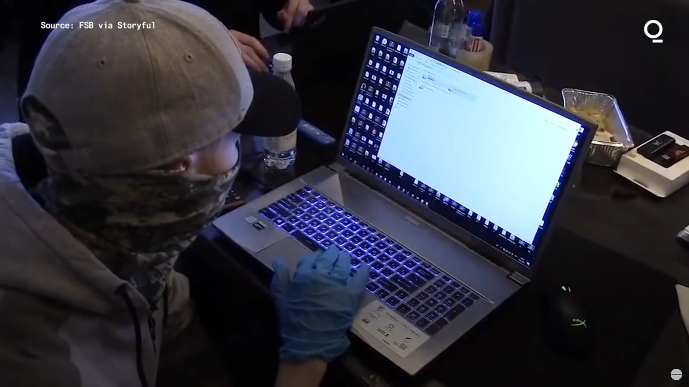
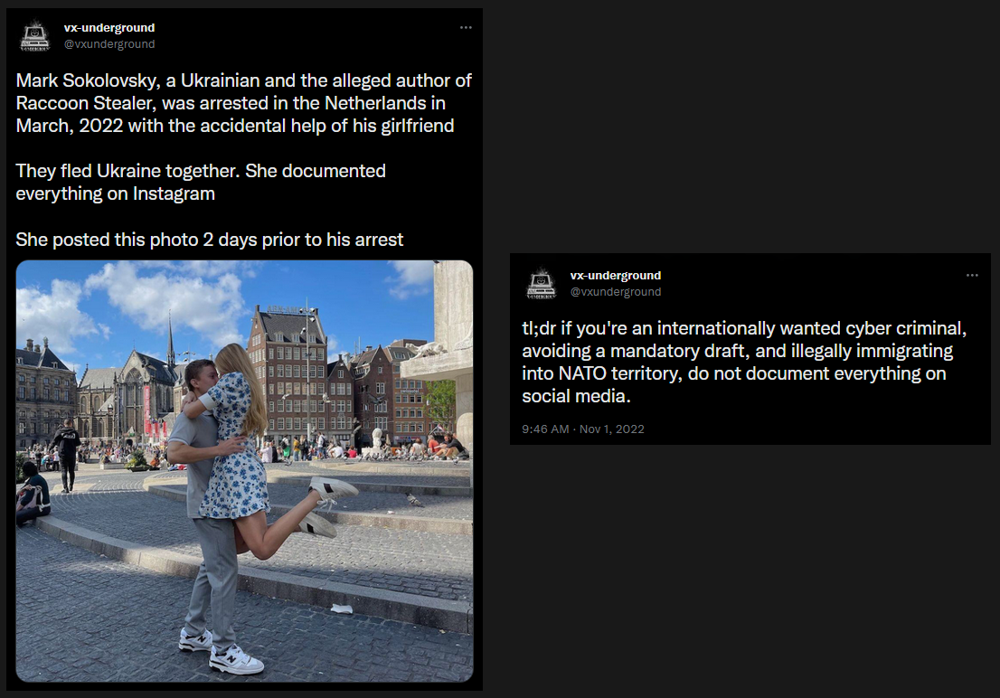

# Introduction to Digital Forensics

> The application of computer science and investigative procedures for a legal purpose involving the analysis of digital evidence after proper search authority, chain of custody, validation with mathematics, use of validated tools, repeatability, reporting, and possible expert presentation.  
> 
> Ken Zatyko

Simply put, digital forensics is a process of using technology to gather evidence, investigate it, and present the findings in a legal case. It can include going through network activity, access logs, search history, and digital storage media like hard disks and mobile devices, as well as the analysis of that data to identify evidence of criminal activity or other wrongdoing.

## Why does this matter?

Digital forensics bridges technology and law. It ensures that evidence collected from digital sources is handled in a forensically sound manner so that it remains admissible in court. This involves key principles such as **chain of custody** (documenting who handled evidence and when), **integrity** (proving evidence hasn't been altered), **repeatability** (others must be able to reproduce results), and **validation** (using tools and techniques that have been tested). 

Understanding these principles is just as important as knowing the technical tools - failing to follow them can render critical evidence inadmissible.

# Some use cases

**Investigating cyber attacks** — In case of a security breach or a cyber attack, digital forensics can be used to determine the scope, as well as the source of the attack. This information can then be used to improve the organization's defenses against future attacks.

**Threat detection and response** — It can be very useful to proactively identify and mitigate security threats. By analyzing logs, artifacts, and file system changes, investigators can spot indicators of compromise (IOCs) early and contain incidents before they escalate.

**Data recovery** — Digital forensics can also be used to recover data that may have been stolen or deleted during an attack. Even when files appear to be removed, remnants often persist in unallocated space, slack space, or backups that can be recovered with proper techniques.

**Criminal Investigations** — The evidence collected can be used to identify suspects, establish motive, and link suspects to specific crimes. From cyberstalking to fraud, digital traces often form a crucial part of modern criminal cases.

The common goal includes collecting evidence that can be used to prosecute suspects in a court of law.

# Motivation

> You are leaving a trail, albeit a digital one; it's a trail nonetheless.  
>
>  John Sammons 

These real cases demonstrate how digital footprints can directly lead to solving crimes:

- **REvil Ransomware Group gets arrested in Russia**
    
    
    
    [Link to video](https://www.youtube.com/watch?v=OqEWuFmzhzs)
    
- **Author of Raccoon Stealer gets arrested in Netherlands**
    
    
    
    [Link to tweet](https://twitter.com/vxunderground/status/1587304651426332673)
    
- **How a Floppy Disk brought the BTK killer down**
    
    [Link to article](https://www.refinery29.com/en-us/2019/08/240899/btk-killer-caught-when-how-floppy-disk-dennis-rader)

# Linux command line fundamentals

This section serves as an introduction to the Linux command line tools which are essential for digital forensics. 

Working from the command line gives investigators precision, speed, and the ability to automate tasks. It also ensures we can work on disk images, raw files, and large datasets without relying solely on graphical tools that may alter evidence. 

There are many Linux commands that can be useful in forensics, but some of the most essential ones include:

## `ls` — used to list the files and directories in a directory

The ls command lets you see a list of all the files and folders in a specific folder. It's often the first step when exploring a mounted image or directory to understand its structure.

```
$ ls
Desktop  Documents  Downloads  Music  Pictures  Public  Videos
```

## `cd` — used to change the current working directory

The cd command lets you change the folder that you are currently working in. Navigating correctly is crucial to ensure tools operate on the intended files and to maintain a clear workflow.

```
$ cd Desktop/
```

## `cat` — used to display the contents of a file

The `cat` command (short for "concatenate") lets you print the contents of a file. It's useful for quickly inspecting configuration files, scripts, logs, or small text artifacts.

```
$ cat file.txt 
Hello World!
```

## `strings` — used to display the printable strings in a file

The `strings` command allows you to see human-readable strings of characters inside a file which is helpful in identifying any suspicious strings. This is especially powerful when analyzing binary files, executables, or memory dumps where readable clues (URLs, IPs, filenames, messages) may be embedded.

```
$ strings file.txt 
Hello World!
```

```
$ strings /bin/bash
/lib64/ld-linux-x86-64.so.2
 $DJ
CDDB
E`% 
`0 	
"BB1
B8: 
0D@kB
) 9E4
NR l
 "?$aD
!A8H
h% H0A
Hap5
($B 
d> 7
<SNIP>
```

## `grep` — used to search for a specific string or a pattern in a file or multiple files

The `grep` command is extremely useful for searching a string in large files, such as log files. It can speed up investigations dramatically by letting you search for patterns like URLs, E-mail addresses, MD5 hashes, and more. Using case-insensitive (`-i`) or recursive (`-r`) flags can be especially helpful when hunting for indicators of compromise.

```
$ grep "Hello" file.txt 
Hello World!
```

## `find` — used to search for files and directories

The `find` command can be used to locate different types of files, directories, files with specific permissions, recently modified files. It's invaluable in forensics for discovering relevant artifacts - for example, files modified around the time of an incident, executables, or files with specific extensions.

```
$ find . -type d
.
./Music
./Public
./Downloads
./Desktop
./.config
./.config/autostart
./.config/xfce4
./.config/xfce4/panel
./.config/cherrytree
./.config/powershell
./Pictures
./Documents
./.java
./.java/.userPrefs
./.java/.userPrefs/burp
./Videos
```

Notice how the output above returns a few more directories than the `ls` command. This is because `ls` typically shows visible entries, while `find` traverses the tree and can reveal hidden directories depending on how it's used.

## `md5sum`, `sha1sum` — used to compute the MD5 and SHA1 hashes of a file

Both of these commands take an input and generate a fixed-length string, also known as a hash or a checksum. If the contents of the file change, even slightly, its hash will be different. This can be useful for detecting if a file has been modified or tampered with. 

**Why hashing matters:** Hashes provide a mathematical fingerprint. In forensics, we use them to verify file integrity (e.g., after imaging a disk), to identify known malicious files by comparing against hash databases, and to demonstrate that evidence hasn't been altered. 

> Note: MD5 and SHA1 are considered cryptographically broken for collision resistance today. For integrity verification during acquisition/imaging, they can still be useful as a quick check; however, modern forensic workflows often prefer stronger hashes like SHA256. The goal here is to understand the concept of hashing and integrity checking.

```
$ md5sum file.txt 
8ddd8be4b179a529afa5f2ffae4b9858  file.txt
```

```
$ sha1sum file.txt 
a0b65939670bc2c010f4d5d6a0b3e4e4590fb92b  file.txt
```

## `netstat` — used to display information about the network connections on a system

This tool provides useful information about active connections on a system. The information displayed by this tool includes local and remote addresses and ports of active connections. 

In a forensic context, `netstat` (and modern replacements like `ss`) can help identify suspicious outbound connections, unusual ports, or processes communicating with known malicious IPs. This is often combined with process analysis to understand what caused a connection.

```
$ netstat
Active Internet connections (w/o servers)
Proto Recv-Q Send-Q Local Address           Foreign Address         State      
tcp        0      0 192.168.0.106:44300     239.237.117.34.bc:https ESTABLISHED
tcp        0      0 192.168.0.106:39884     93.184.220.29:http      ESTABLISHED
tcp        0      0 192.168.0.106:58308     ec2-52-39-122-167:https ESTABLISHED
tcp        0      0 192.168.0.106:56910     static-48-7-129-15:http ESTABLISHED
udp        0      0 192.168.0.106:bootpc    192.168.0.1:bootps      ESTABLISHED
```

## `file` — used to determine the type of a file based on its contents

The `file` command can be used to identify files such as text, image, audio, video, and executable files. It can also be used to identify unknown files that may potentially be malicious. 

Rather than relying on file extensions (which can be trivially renamed), `file` inspects the file's **magic bytes** - unique header signatures that identify the actual file format. This is a fundamental technique in forensics to detect masqueraded files.

```
$ file /etc/passwd
/etc/passwd: ASCII text
```

```
$ file image.png 
image.png: PNG image data, 562 x 424, 8-bit/color RGB, non-interlaced
```

## `xxd` — used to print hex dump of a given file

The `xxd` command is useful to print hex dump of a given file or standard input. It can also convert a hex dump back to its original binary form. 

Hex dumps allow investigators to see raw bytes - including headers, metadata, and embedded data. This is essential when examining corrupted files, identifying file signatures, or uncovering hidden content.

```
$ xxd image.jpg 
00000000: ffd8 ffe0 0010 4a46 4946 0001 0101 0048  ......JFIF.....H
00000010: 0048 0000 ffdb 0043 0005 0304 0404 0305  .H.....C........
00000020: 0404 0405 0505 0607 0c08 0707 0707 0f0b  ................
00000030: 0b09 0c11 0f12 1211 0f11 1113 161c 1713  ................
00000040: 141a 1511 1118 2118 1a1d 1d1f 1f1f 1317  ......!.........
00000050: 2224 221e 241c 1e1f 1eff db00 4301 0505  "$".$.......C...
```

## `hexedit` — used to edit files in hexadecimal format

The `hexedit` tool lets you edit raw bytes of a file in an interactive way. It is often used for repairing corrupted files.

**Forensic caution:** Never edit original evidence. Always work on a copy (working copy) of the file/image. Modifying the original can compromise integrity and break chain of custody. When experimenting, create a duplicate first.

```
$ hexedit image.jpg
```


## `ps` — used to list the process running on the system

The `ps` command lets you see a list of all the processes that are currently running on your computer. The information it provides includes the process ID, user, state, and command that started the process.

From a forensic/incident response standpoint, process listings help identify unusual processes, malware, or suspicious execution. Correlating PIDs with network connections (via `netstat`/`ss`), open files, or parent processes is key to understanding activity.

```
$ ps                    
    PID TTY          TIME CMD
   1824 pts/0    00:00:09 zsh
   2879 pts/0    00:00:05 sublime_text
   2924 pts/0    00:00:00 plugin_host-3.3
   2927 pts/0    00:00:00 plugin_host-3.8
  22666 pts/0    00:00:00 ps
```

# Exercise

For this section, provide the complete commands for all the exercises where asked for the command, and provide a descriptive answer where asked for an explanation. There may be multiple answers/commands for these exercises, so feel free to submit the answer you feel most comfortable with.

## Questions

1. If we wanted to list all the `.txt` files in the current directory, what command would we want to use?
2. What command can we use to read the contents of the file `/etc/passwd`?
3. If we wanted to search for the string `Error` in all files in the `/var/log` directory, what would our command be?
4. What would be the commands to calculate MD5 and SHA1 hashes of the file `/etc/passwd`? 
5. Use the `file` command to determine the type of the file `/usr/bin/cat` and explain the output in 2-3 sentences.
6. What command can we use to display all printable strings of length ≥ 8 in the file `/bin/bash`?
7. Given the following output of the `file` command, can you determine what’s wrong with this file?
    
    ```
    $ file image.jpg
    image.jpg: ELF 64-bit LSB pie executable, x86-64, version 1 (SYSV), dynamically linked, interpreter /lib64/ld-linux-x86-64.so.2, BuildID[sha1]=3ab23bf566f9a955769e5096dd98093eca750431, for GNU/Linux 3.2.0, not stripped
    ```
    
8. If we wanted to look for files modified in the last 30 minutes in `/home` directory, what command would we want to use?  
Hint: Explore how you can use `find` command to achieve this.
9. What command can we use to display information about all active TCP connections on the system?
10. Given [this corrupted image file](files/challenge.png), can you find a way to recover and view its contents?  
Hint 1: A quick google search for “magic bytes” might help.  
Hint 2: Explore how `hexedit` can help you here.  
    
    You may download the image using following command:  
    ```
    curl https://raw.githubusercontent.com/vonderchild/digital-forensics-lab/main/Lab%2001/files/challenge.png -o challenge.png
    ```